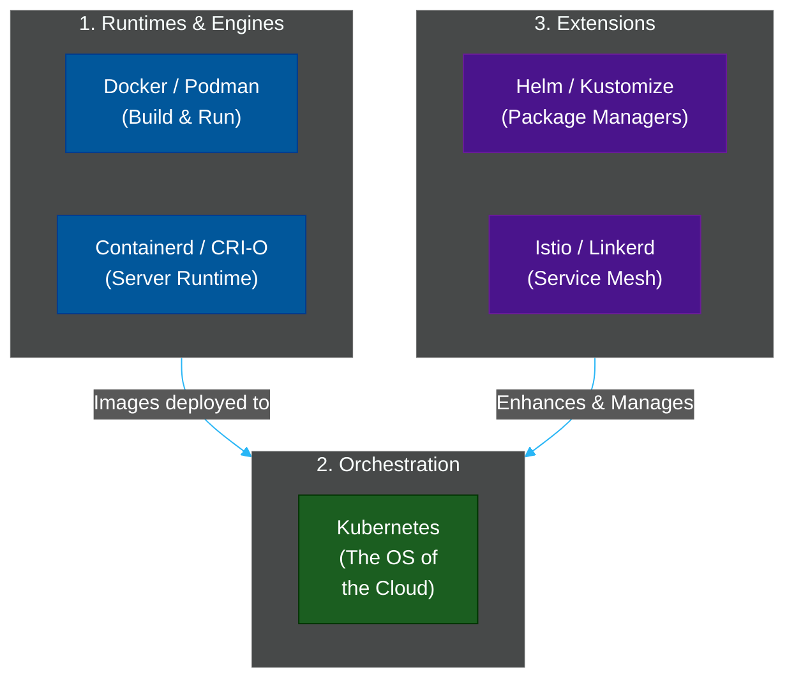

# 🐳 Container Orchestration & Cloud Native

A comprehensive series exploring how modern applications are packaged, deployed, scheduled, and scaled across distributed infrastructure.

---

## 📖 Table of Contents

- [The Container Revolution](#the-container-revolution)
- [📚 Module Index](#module-index)
- [The Cloud Native Landscape](#the-cloud-native-landscape)

---

## The Container Revolution

Before containers, deploying an application meant configuring a Virtual Machine (VM). This was slow, required gigabytes of storage (because every VM included a full Operating System), and suffered from the **"It works on my machine"** problem.

Containers solved this by packaging the application code, its dependencies, and the required system libraries into a single, portable, immutable image that runs identically on a developer's laptop and an AWS production server.

**Container Orchestration** (Kubernetes) is the system that manages *thousands* of these containers—automatically restarting them if they crash, scaling them up when traffic spikes, and load balancing traffic between them.

---

## 📚 Module Index

| Module | Title | Level | Read Time | Key Topics |
| :--- | :--- | :--- | :--- | :--- |
| **01** | [Docker & Container Runtimes](./01-containers-docker.md) | Intermediate | ~10 min | Docker, Podman, Containerd, cgroups |
| **02** | [Kubernetes Architecture](./02-kubernetes-architecture.md) | Advanced | ~12 min | Control Plane, Kubelet, Pods, Deployments |
| **03** | [Helm vs Kustomize](./03-helm-vs-kustomize.md) | Intermediate | ~10 min | Kubernetes package managers, templating |
| **04** | [Service Meshes (Istio)](./04-service-mesh.md) | Advanced | ~10 min | mTLS, Traffic splitting, Sidecars |

---

## The Cloud Native Landscape

