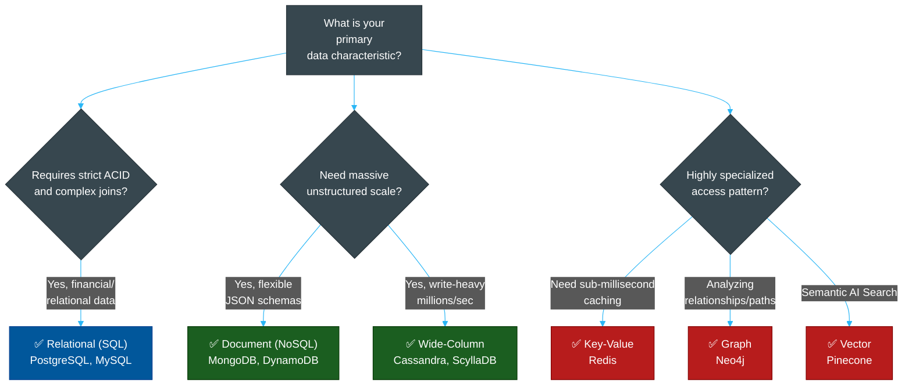

# 📊 Database Comparison Matrix

> **Series:** DevOps › Databases · **Level:** Reference · **Read Time:** ~10 min

---

## 📖 Table of Contents

- [1. CAP Theorem (The Core Tradeoff)](#1-cap-theorem-the-core-tradeoff)
- [2. Database Type Comparison](#2-database-type-comparison)
- [3. Choosing by Workload (Decision Guide)](#3-choosing-by-workload-decision-guide)

---

## 1. CAP Theorem (The Core Tradeoff)

When designing distributed databases, the **CAP Theorem** states that a distributed data store can only simultaneously provide **two of the three** following guarantees:

1. **Consistency (C):** Every read receives the most recent write or an error. (All nodes see the exact same data at the same time).
2. **Availability (A):** Every request receives a non-error response, without the guarantee that it contains the most recent write. (The system stays up even if some nodes fail).
3. **Partition Tolerance (P):** The system continues to operate despite an arbitrary number of messages being dropped/delayed by the network between nodes.

**In the real world, network partitions (P) are unavoidable.** Therefore, distributed databases must choose between **Consistency (CP)** or **Availability (AP)**.

- **CP Databases (MongoDB, PostgreSQL):** If a network link fails, the system stops accepting writes to prevent inconsistent data.
- **AP Databases (Cassandra, DynamoDB):** If a network link fails, the system accepts writes on both sides of the partition, meaning users might read stale data, but the system never goes down (Eventual Consistency).

---

## 2. Database Type Comparison

| Database Type | Primary Data Model | Typical Use Cases | Industry Leaders | Scaling Model |
| :--- | :--- | :--- | :--- | :--- |
| **Relational (SQL)** | Tables (Rows & Columns) | Financial ledgers, ERP systems, strict relationships. | PostgreSQL, MySQL, Oracle | Vertical (Scale Up) |
| **Document (NoSQL)** | JSON / BSON Documents | CMS, E-commerce catalogs, rapid prototyping. | MongoDB, DynamoDB | Horizontal (Scale Out) |
| **Key-Value** | Hash map (Key = Value) | Caching, session management, leaderboards. | Redis, Memcached | In-Memory / Sharding |
| **Wide-Column** | Column Families | Massive write-heavy loads, time-series, IoT logs. | Cassandra, ScyllaDB | Horizontal (Masterless) |
| **Graph** | Nodes & Edges | Recommendation engines, fraud detection rings. | Neo4j, Amazon Neptune | Vertical / Graph-Partition |
| **Time-Series** | Timestamps & Metrics | Server monitoring, stock market prices, IoT telemetry. | InfluxDB, TimescaleDB | High-Ingest / Downsampling |
| **Vector** | High-dimensional floats | AI Embeddings, Retrieval-Augmented Gen (RAG), Semantic Search. | Pinecone, Qdrant, Milvus | Horizontal / HNSW |

---

## 3. Choosing by Workload (Decision Guide)

### Strategic Recommendation
1. **Default to PostgreSQL:** If you are starting a new project and aren't sure what to pick, choose PostgreSQL. Modern PostgreSQL has JSONB support (giving you NoSQL features) and Vector extensions (`pgvector`), making it the ultimate multi-tool.
2. **Add Redis When Slow:** When your SQL database gets slow, don't migrate to NoSQL—just put Redis in front of it to cache heavy read queries.
3. **Use NoSQL for Scale, Not Ease:** Only use MongoDB or Cassandra if you anticipate writing massive amounts of data that would physically overwhelm a single SQL server. Do not use NoSQL just to avoid writing migrations.

## Related

- [Software Architecture Patterns](../../clean-code/software-architecture/README.md)
- [API Gateways & Reverse Proxies](../api-gateways/README.md)
- [Observability & Monitoring](../observability/README.md)
