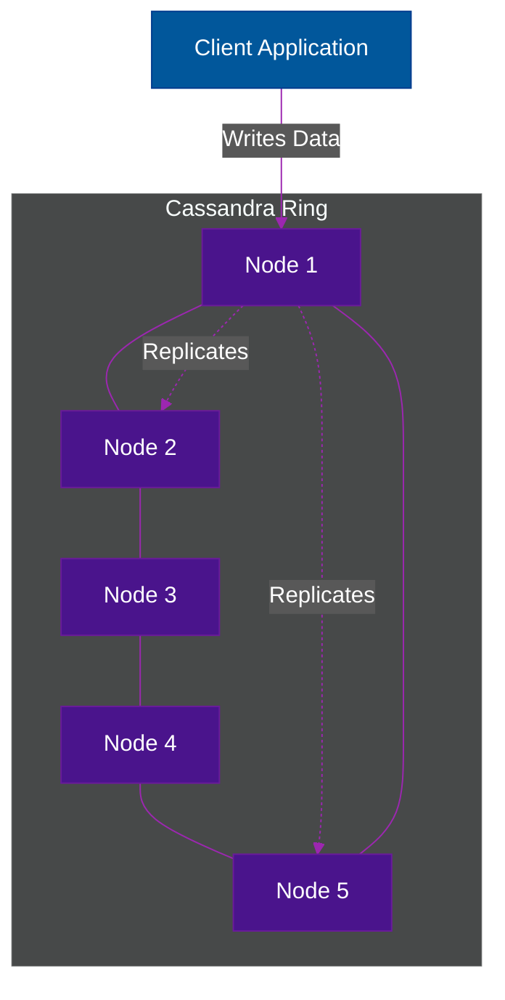

# 🧱 Wide-Column Stores

> **Series:** DevOps › Databases · **Level:** Advanced · **Read Time:** ~10 min

---

## 📖 Table of Contents

- [1. What Is a Wide-Column Store?](#1-what-is-a-wide-column-store)
- [2. The Architecture (Masterless)](#2-the-architecture-masterless)
- [3. Massive Write Throughput](#3-massive-write-throughput)
- [4. Apache Cassandra vs ScyllaDB](#4-apache-cassandra-vs-scylladb)
- [5. When to Use (and Avoid)](#5-when-to-use-and-avoid)

---

## 1. What Is a Wide-Column Store?

A **Wide-Column Store** (sometimes called a Column Family store) looks like a relational database on the surface (it has tables, rows, and columns), but it is entirely different under the hood.

Instead of storing data row-by-row (where empty columns take up space), it groups related data into **Column Families**. A single row can have millions of columns, and different rows in the same table can have completely different column names.

---

## 2. The Architecture (Masterless)

The defining feature of wide-column stores like **Apache Cassandra** is their **Masterless Architecture (Ring Topology)**.

Unlike SQL databases or MongoDB (which use a Primary/Replica model), Cassandra has **no Primary node**. Every node in the cluster is equal and can accept Read and Write requests. 

This provides extreme **Availability (AP)** in the CAP Theorem. If a node dies, the client seamlessly talks to another node.

---

## 3. Massive Write Throughput

Wide-column stores are optimized for **insane write speeds**. Because they append data to an immutable log in memory and periodically flush to disk (using LSM Trees), writing to Cassandra is almost as fast as writing to RAM.

Companies like Apple use Cassandra to store petabytes of iMessage data, accepting millions of writes per second without breaking a sweat.

---

## 4. Apache Cassandra vs ScyllaDB

| Feature | Apache Cassandra | ScyllaDB |
| :--- | :--- | :--- |
| **Language** | Java (JVM) | C++ |
| **Architecture** | Masterless Ring | Masterless Ring (Drop-in replacement) |
| **Performance** | High | Extremely High (10x Cassandra) |
| **Garbage Collection**| Yes (JVM Pauses) | No (Bypasses OS kernel, zero pauses) |

> **Recommendation:** If you are building a new system that requires a wide-column store, look heavily into **ScyllaDB**. It was built to solve the JVM garbage collection latency spikes that plague Cassandra.

---

## 5. When to Use (and Avoid)

### When to Choose Wide-Column Stores
✅ **Time-Series / IoT Data:** Logging thousands of sensor metrics every second.
✅ **Messaging Apps:** Storing billions of chat messages.
✅ **Always-On Requirements:** You cannot afford a single second of downtime, even if an entire AWS Availability Zone goes down.

### When to Avoid Wide-Column Stores
❌ **You need complex querying:** Cassandra does not support `JOIN`s, and `WHERE` clauses are highly restricted (you can basically only query by the Partition Key).
❌ **You have mostly read-heavy traffic:** Wide-column stores excel at writes; if you are mostly reading data, use Redis or PostgreSQL.
❌ **Small Scale:** Do not use Cassandra unless you are storing Terabytes of data across dozens of nodes. The operational overhead is not worth it for small projects.

---

*← [Key-Value Stores](./04-key-value-stores.md) · Next: [Graph Databases](./06-graph-databases.md) →*

## Related

- [Software Architecture Patterns](../../clean-code/software-architecture/README.md)
- [API Gateways & Reverse Proxies](../api-gateways/README.md)
- [Observability & Monitoring](../observability/README.md)
