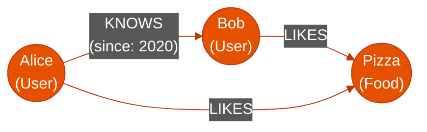

# 🕸️ Graph Databases

> **Series:** DevOps › Databases · **Level:** Advanced · **Read Time:** ~10 min

---

## 📖 Table of Contents

- [1. What Is a Graph Database?](#1-what-is-a-graph-database)
- [2. Nodes, Edges, and Properties](#2-nodes-edges-and-properties)
- [3. The "Join" Problem in SQL](#3-the-join-problem-in-sql)
- [4. Neo4j & Cypher](#4-neo4j-cypher)
- [5. When to Use Graph Databases](#5-when-to-use-graph-databases)

---

## 1. What Is a Graph Database?

A **Graph Database** is specifically designed to store and navigate **relationships**. While Relational (SQL) databases are great at finding specific rows, Graph databases excel at finding how one row connects to another row through complex, multi-hop networks.

---

## 2. Nodes, Edges, and Properties

Graph databases use three core concepts:

1. **Nodes:** The entities (e.g., Users, Products, Locations).
2. **Edges (Relationships):** The connections between Nodes (e.g., "KNOWS", "PURCHASED", "LIVES_IN").
3. **Properties:** Key-value pairs attached to either Nodes or Edges (e.g., A "KNOWS" edge might have a `since: 2023` property).



---

## 3. The "Join" Problem in SQL

Imagine trying to build a feature: *"Find friends of Alice's friends who also like Pizza."*

In SQL, this requires a recursive query or joining the `users`, `friends`, and `likes` tables multiple times.
```sql
SELECT u3.name 
FROM users u1
JOIN friends f1 ON u1.id = f1.user1_id
JOIN users u2 ON f1.user2_id = u2.id
JOIN friends f2 ON u2.id = f2.user1_id
JOIN users u3 ON f2.user2_id = u3.id
JOIN likes l ON u3.id = l.user_id
WHERE u1.name = 'Alice' AND l.item = 'Pizza';
```
As the data grows, this SQL query slows down exponentially because it computes the math for the joins at read-time. Graph databases store relationships natively as physical pointers on disk, making these "hops" execute in milliseconds.

---

## 4. Neo4j & Cypher

**Neo4j** is the absolute leader in Graph databases. It uses a specialized query language called **Cypher**, which uses ASCII-art syntax to visually represent the query.

Here is the Cypher equivalent of the complex SQL join above:

```cypher
MATCH (alice:User {name: "Alice"})-[:KNOWS]->(:User)-[:KNOWS]->(fof:User)
MATCH (fof)-[:LIKES]->(:Food {name: "Pizza"})
RETURN fof.name
```
Notice how `()-[]->()` literally draws a circle (Node) connecting an arrow (Edge) to another circle (Node).

---

## 5. When to Use Graph Databases

### When to Choose Graph (Neo4j)
✅ **Recommendation Engines:** "Customers who bought this also bought..."
✅ **Fraud Detection:** Finding circular rings of money transfers (A sends to B, B to C, C back to A).
✅ **Network/IT Operations:** Modeling how routers, switches, and servers connect to find single points of failure.
✅ **Identity Management:** Managing complex organizational hierarchies and access control lists (ACLs).

### When to Avoid Graph
❌ **Simple CRUD Apps:** If you just need to save and retrieve user profiles, a Graph database is massive overkill and adds unnecessary complexity.
❌ **Time-Series / Logging:** Graph databases are not optimized for massive, high-speed write ingest (use Cassandra or InfluxDB).
❌ **Analytics/Aggregations:** If you need to sum the total revenue of all users, columnar SQL databases are much faster.

---

*← [Wide-Column Stores](./05-wide-column.md) · Next: [Time-Series Databases](./07-time-series.md) →*

## Related

- [Software Architecture Patterns](../../clean-code/software-architecture/README.md)
- [API Gateways & Reverse Proxies](../api-gateways/README.md)
- [Observability & Monitoring](../observability/README.md)
