# 🧠 Vector Databases (AI)

> **Series:** DevOps › Databases · **Level:** Advanced · **Read Time:** ~10 min

---

## 📖 Table of Contents

- [1. What Is a Vector Database?](#1-what-is-a-vector-database)
- [2. The Concept of Embeddings](#2-the-concept-of-embeddings)
- [3. How Vector Search Works (ANN)](#3-how-vector-search-works-ann)
- [4. RAG (Retrieval-Augmented Generation)](#4-rag-retrieval-augmented-generation)
- [5. Dedicated vs Integrated Vectors](#5-dedicated-vs-integrated-vectors)

---

## 1. What Is a Vector Database?

A **Vector Database** is designed to store, manage, and search massive collections of high-dimensional arrays of numbers (called **Vectors**). 

They exploded in popularity alongside Large Language Models (LLMs) like OpenAI's GPT-4, because they provide "long-term memory" and semantic search capabilities for AI applications.

---

## 2. The Concept of Embeddings

To understand Vector Databases, you must understand **Embeddings**. 
AI models (like `text-embedding-ada-002`) can take a sentence, an image, or an audio clip, and translate its *meaning* into an array of floats (e.g., a 1,536-dimensional vector).

```json
{
  "text": "The quick brown fox jumps over the lazy dog.",
  "vector": [0.0023, -0.0541, 0.9932, ... 1533 more numbers]
}
```

If two sentences have a similar meaning—even if they share zero exact keywords—their vectors will be located close to each other in 1,536-dimensional space.

---

## 3. How Vector Search Works (ANN)

Traditional databases search for exact keyword matches. Vector databases search for **nearest neighbors** based on mathematical distance (Cosine Similarity or Euclidean Distance).

Because comparing a query vector against 10 million stored vectors would be incredibly slow, Vector databases use algorithms like **HNSW (Hierarchical Navigable Small World)** to perform Approximate Nearest Neighbor (ANN) search, returning results in milliseconds.

```mermaid
%%{init: {'theme': 'dark', 'themeVariables': {'primaryColor': '#01579b', 'primaryTextColor': '#fff', 'lineColor': '#29b6f6', 'background': '#1e1e1e'},
  'themeCSS': 'svg { background-color: #1e1e1e !important; padding: 1rem !important; border-radius: 8px !important; } .edgeLabel rect { fill: #1e1e1e !important; } text, tspan, .messageText, .signalText, .edgeLabel, .edgeLabel span, .pointLabel, .axisLabel, .quadrantTitle, .quadrantLabel { fill: #ffffff !important; color: #ffffff !important; stroke: none !important; }'
}}%%
graph LR
    classDef ai fill:#01579b,stroke:#003c8f,color:#fff
    classDef db fill:#1b5e20,stroke:#003300,color:#fff

    Q["User Query:<br/>'Cozy winter jacket'"]:::ai --> LLM["Embedding Model<br/>(OpenAI)"]:::ai
    LLM -->|"Returns Vector<br/>[0.1, 0.4, ...]"| VDB["Vector Database<br/>(Pinecone / Qdrant)"]:::db
    VDB -->|"Finds Nearest Neighbors<br/>(Cosine Similarity)"| OUT["Result:<br/>'Thermal Parka'"]:::db
```



---

## 4. RAG (Retrieval-Augmented Generation)

The primary use case for Vector Databases today is **RAG**.

LLMs have a limited context window and are frozen in time (they only know data up to their training date). If you want an AI chatbot to answer questions about your company's private internal wiki, you use a Vector DB:

1. **Ingest:** Convert all your wiki documents into vectors and store them in the database.
2. **Retrieve:** When a user asks a question, embed the question, query the Vector DB, and retrieve the top 5 most relevant paragraphs.
3. **Generate:** Send the user's question *plus* those 5 paragraphs to the LLM as context, allowing it to generate an accurate answer without hallucinating.

---

## 5. Dedicated vs Integrated Vectors

There is a massive debate in the industry: Do you need a dedicated vector database, or should you just use a vector extension on your existing SQL database?

| Type | Examples | Pros | Cons |
| :--- | :--- | :--- | :--- |
| **Dedicated SaaS** | Pinecone, Weaviate | Fully managed, optimized for billion-scale search. | Another service to pay for, data duplication. |
| **Dedicated OSS** | Qdrant, Milvus, Chroma | Open-source, highly performant (Rust/Go). | Requires managing your own infrastructure. |
| **Integrated SQL** | PostgreSQL (`pgvector`) | Single database! ACID compliant, easy joins with user data. | Slower than dedicated DBs at extreme scale (>10M vectors). |
| **Integrated NoSQL**| MongoDB Atlas Vector | Native integration with your document data. | High pricing, tied to Atlas ecosystem. |

> **Recommendation:** Start with **PostgreSQL (`pgvector`)**. For 90% of applications, `pgvector` with HNSW indexing is incredibly fast and saves you from the architectural nightmare of keeping a dedicated vector database perfectly synchronized with your primary relational database. Only move to **Pinecone** or **Qdrant** if you are actively indexing tens of millions of high-dimensional vectors.

---

*← [Time-Series Databases](./07-time-series.md) · [Back to Series Overview](./README.md) →*

## Related

- [Software Architecture Patterns](../../clean-code/software-architecture/README.md)
- [API Gateways & Reverse Proxies](../api-gateways/README.md)
- [Observability & Monitoring](../observability/README.md)
