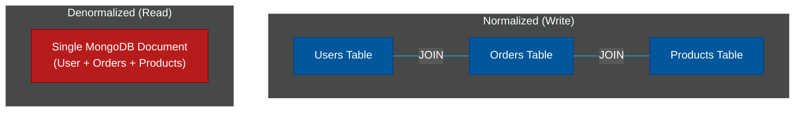

# 📐 Database Modeling: Normalization vs Denormalization

> **Series:** DevOps › Databases · **Level:** Intermediate · **Read Time:** ~12 min

---

## 📖 Table of Contents

- [1. The Core Philosophy](#1-the-core-philosophy)
- [2. Normalization (The SQL Standard)](#2-normalization-the-sql-standard)
- [3. The Normal Forms (1NF, 2NF, 3NF)](#3-the-normal-forms-1nf-2nf-3nf)
- [4. Denormalization (The Performance Hack)](#4-denormalization-the-performance-hack)
- [5. When to Normalize vs Denormalize](#5-when-to-normalize-vs-denormalize)

---

## 1. The Core Philosophy

When designing a database schema, you are constantly fighting a war between **Write Efficiency** and **Read Efficiency**.

- **Normalization** optimizes for **Writes and Data Integrity**. It ensures that if a piece of data changes, you only have to update it in *one single place*.
- **Denormalization** optimizes for **Reads**. It intentionally copies the exact same data into multiple places so that your application can read it instantly without performing complex calculations.

---

## 2. Normalization (The SQL Standard)

**Normalization** is the process of breaking down one large, redundant table into multiple smaller tables and connecting them using Foreign Keys.

**The Problem (Unnormalized Data):**
Imagine a single `Orders` table:
| Order ID | Customer Name | Customer Email | Product | Price |
| :--- | :--- | :--- | :--- | :--- |
| 1 | Alice Smith | alice@email.com | Laptop | $1000 |
| 2 | Alice Smith | alice@email.com | Mouse | $50 |

If Alice gets married and changes her last name, you have to run an `UPDATE` statement that scans and changes *every single order* she has ever made. If you miss one, your database is corrupted (inconsistent).

---

## 3. The Normal Forms (1NF, 2NF, 3NF)

Database architects follow strict mathematical rules called "Normal Forms" to prevent the anomaly above.

### First Normal Form (1NF)
**Rule:** Every column must hold atomic (indivisible) values, and there are no repeating groups.
*Violation:* Storing `["Laptop", "Mouse"]` inside a single `Products` column as a comma-separated string.
*Fix:* Each product gets its own distinct row.

### Second Normal Form (2NF)
**Rule:** It must be in 1NF, and all non-key attributes must depend on the *entire* Primary Key (this usually applies to tables with composite primary keys).
*Fix:* If a table links `StudentID` and `CourseID`, don't put the `CourseName` in that table. The `CourseName` only depends on the `CourseID`, not the `StudentID`. Move `CourseName` to a separate `Courses` table.

### Third Normal Form (3NF)
**Rule:** It must be in 2NF, and there must be no "transitive dependencies" (non-key columns cannot depend on other non-key columns).
*Violation:* A table has `ZipCode` and `City`. `City` actually depends on `ZipCode`, not the Primary Key.
*Fix:* Move `City` and `ZipCode` to a separate `Locations` table, and just store `ZipCode_ID` in the main table.

> **Industry Standard:** Most relational databases are strictly normalized up to **3NF**. Going to 4NF or 5NF usually creates too many tables and destroys read performance.

---

## 4. Denormalization (The Performance Hack)

Normalization is beautiful for data integrity, but it creates a massive problem: **JOINs are slow.**

If a database is perfectly normalized into 3NF, retrieving a user's order history might require joining the `Users`, `Orders`, `Order_Items`, `Products`, and `Shipping_Addresses` tables together. For a website with 10 million users, calculating that 5-table JOIN in real-time takes too long.

**Denormalization** is the intentional act of breaking the 3NF rules to speed up reads.

### Example: The "Total Sales" Hack
Instead of running a massive `SUM(price) FROM orders JOIN users` every time an admin opens a dashboard, you add a `lifetime_spend` column directly to the `Users` table. 
Whenever a new order is placed, you increment `lifetime_spend`. You have introduced redundancy (the total is stored twice), but the dashboard now loads instantly without a JOIN.

---

## 5. When to Normalize vs Denormalize

### 1. OLTP vs OLAP
- **OLTP (Online Transaction Processing):** Systems handling real-time user actions (e.g., placing an Amazon order). **Must be Normalized.** You cannot risk double-charging a credit card due to inconsistent data.
- **OLAP (Online Analytical Processing):** Data warehouses (like Snowflake or BigQuery) used by data scientists. **Must be Denormalized (Star Schema).** Data scientists run massive queries; pre-joining the data saves hours of compute time.

### 2. SQL vs NoSQL
- **PostgreSQL / MySQL:** Assume everything should be Normalized to 3NF unless you have a specific, proven performance bottleneck.
- **MongoDB / DynamoDB / Cassandra:** Assume everything must be Denormalized. Because these databases don't support fast, cross-node JOINs, you *must* duplicate data. If a user changes their name in MongoDB, you must manually run application logic to update their name in the `users` collection, the `comments` collection, and the `orders` collection.

---

*← [Relational (SQL) Databases](./02-relational-sql.md) · [Back to Series Overview](./README.md) →*

## Related

- [Software Architecture Patterns](../../clean-code/software-architecture/README.md)
- [API Gateways & Reverse Proxies](../api-gateways/README.md)
- [Observability & Monitoring](../observability/README.md)
