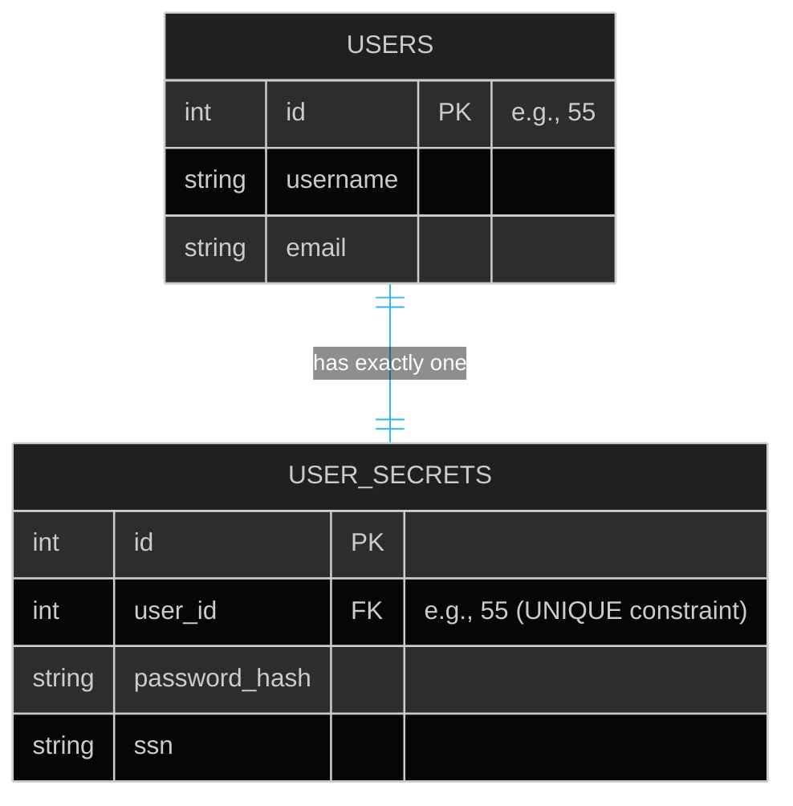
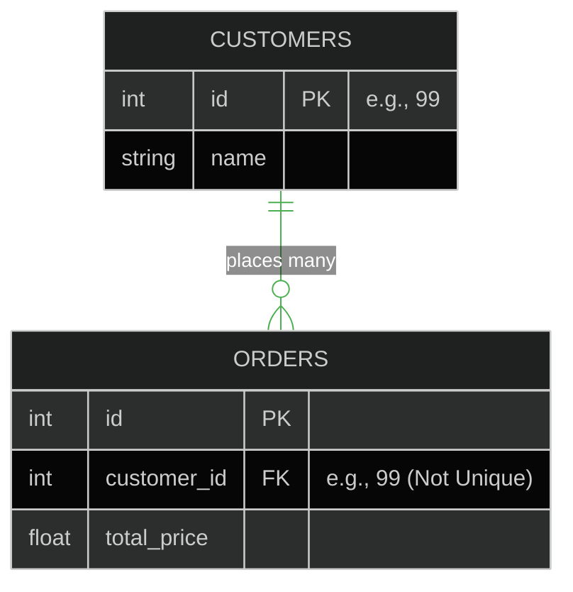
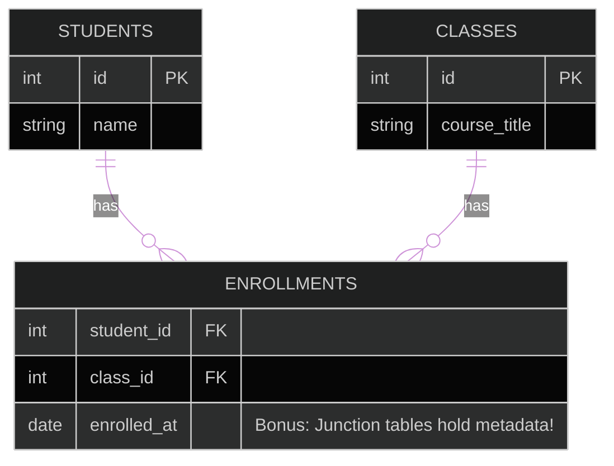
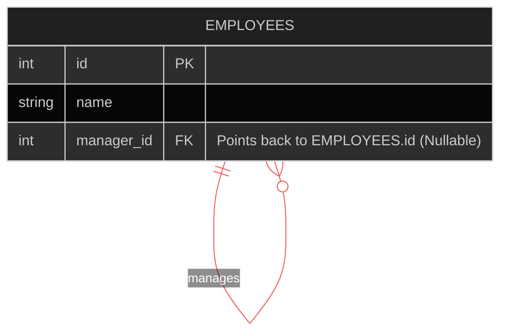
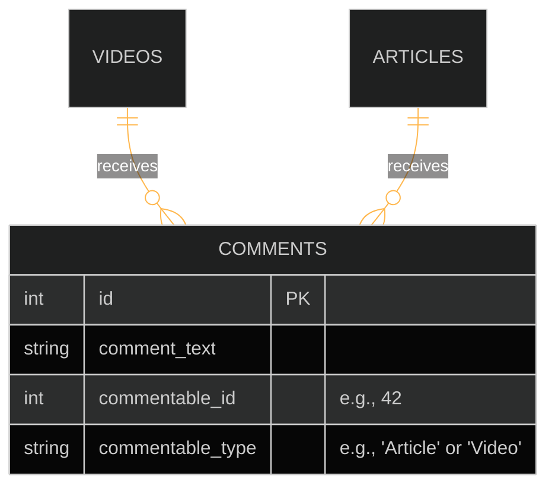

# 🔗 Database Relationships & ERDs

> **Series:** DevOps › Databases · **Level:** Intermediate · **Read Time:** ~15 min

---

## 📖 Table of Contents

- [1. The Relational Foundation (PKs & FKs)](#1-the-relational-foundation-pks-fks)
- [2. One-to-One (1:1)](#2-one-to-one-11)
- [3. One-to-Many (1:N)](#3-one-to-many-1n)
- [4. Many-to-Many (M:N) & Junction Tables](#4-many-to-many-mn-junction-tables)
- [5. Self-Referential (Trees & Hierarchies)](#5-self-referential-trees-hierarchies)
- [6. Polymorphic Associations (Advanced)](#6-polymorphic-associations-advanced)

---

## 1. The Relational Foundation (PKs & FKs)

Relational databases (SQL) derive their entire power from their ability to link tables together mathematically. This is achieved using two fundamental concepts:

1.  **Primary Key (PK):** A unique identifier for a specific row in a table. Usually an auto-incrementing integer (`1`, `2`, `3`) or a UUID.
2.  **Foreign Key (FK):** A column in one table that stores the exact Primary Key of a row in *another* table. This creates the "link".

When you write a SQL `JOIN`, the database engine simply matches the Foreign Key in Table B to the Primary Key in Table A.

---

## 2. One-to-One (1:1)

A One-to-One relationship means that exactly one record in Table A is associated with exactly one record in Table B.

**When to use it:**
Usually, 1:1 data belongs in the *same table*. However, you split them into 1:1 tables for **Security** or **Performance**.
*   *Security:* The `Users` table holds public profiles. The `User_Secrets` table holds SSNs and Password Hashes. They are linked 1:1, but strictly isolated.
*   *Performance:* The `Users` table is tiny and fast to query. The `User_Bios` table contains 5MB of text per user. Splitting them keeps the main table lightning fast.

*Implementation Note: To enforce 1:1, the `user_id` Foreign Key must have a `UNIQUE` index constraint.*

---

## 3. One-to-Many (1:N)

This is the most common relationship in database design. A single record in Table A can be associated with many records in Table B.

**Examples:**
*   One `Author` can write many `Books`.
*   One `Customer` can place many `Orders`.

**Where does the Foreign Key go?**
The Foreign Key *always* goes on the "Many" side. The `Books` table holds the `author_id`.

---

## 4. Many-to-Many (M:N) & Junction Tables

A Many-to-Many relationship happens when multiple records in Table A map to multiple records in Table B.

**Examples:**
*   One `Student` takes many `Classes`.
*   One `Class` has many `Students`.

**The Relational Problem:**
SQL cannot store arrays inside columns natively (unlike MongoDB). You cannot have a `classes_taken` column in `Students` that holds `[101, 102, 105]`.

**The Solution: The Junction Table (Associative Entity)**
You must create a third table sitting in the middle. It holds two Foreign Keys, mapping the relationships together.

*Note: The Primary Key of the `ENROLLMENTS` table is usually a "Composite Key" made by combining `(student_id, class_id)` to prevent duplicate enrollments.*

---

## 5. Self-Referential (Trees & Hierarchies)

What if a row needs to relate to another row in the *exact same table*? This is called an Adjacency List, and it is how you build Hierarchies, Trees, and Organizational Charts in SQL.

**Example:**
An `Employees` table where every employee has a Manager, but the Manager is also an Employee.

If the CEO is row `id: 1`, they will have `manager_id: NULL`. If Bob is managed by the CEO, Bob's row will have `manager_id: 1`. 
*Querying this requires recursive CTEs (Common Table Expressions) in modern SQL.*

---

## 6. Polymorphic Associations (Advanced)

This is an anti-pattern in strict SQL, but incredibly popular in frameworks like Ruby on Rails and Laravel. 

**The Problem:**
You have a `Comments` table. Users can comment on `Videos`, `Articles`, and `Photos`. Do you create `video_id`, `article_id`, and `photo_id` foreign keys in the `Comments` table, leaving 2 of them NULL for every row?

**The Polymorphic Solution:**
You create two columns: `imageable_id` (The Integer ID) and `imageable_type` (A String defining which table to look at).

*Warning: You CANNOT enforce database-level Foreign Key constraints on Polymorphic associations because the ID points to a dynamic table. The database cannot protect your data integrity; your application backend must do it.*

---

## 🔗 External References & Required Reading
- **PostgreSQL Docs:** [Constraints and Foreign Keys](https://www.postgresql.org/docs/current/ddl-constraints.html)
- **Database Design:** [Entity-Relationship Modeling Principles](https://en.wikipedia.org/wiki/Entity%E2%80%93relationship_model)
- **Advanced SQL:** [Recursive Queries (CTEs) for Self-Referencing Tables](https://www.postgresql.org/docs/current/queries-with.html)

---

*← [Data Modeling & Normalization](./09-data-modeling-normalization.md) · [Back to Series Overview](./README.md) →*

## Related

- [Software Architecture Patterns](../../clean-code/software-architecture/README.md)
- [API Gateways & Reverse Proxies](../api-gateways/README.md)
- [Observability & Monitoring](../observability/README.md)
