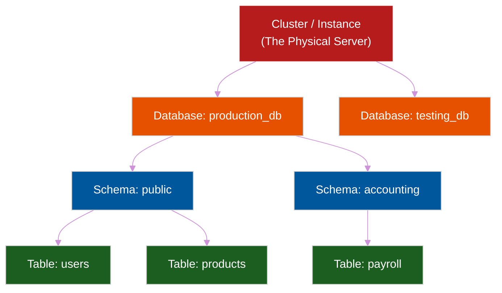
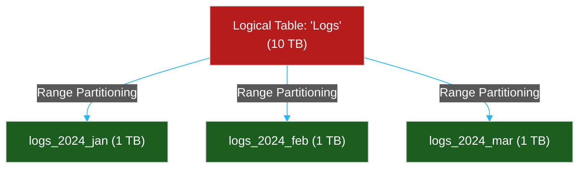

# 🏗️ Database Objects & Components

> **Series:** DevOps › Databases · **Level:** Intermediate · **Read Time:** ~12 min

---

## 📖 Table of Contents

- [1. The Organizational Hierarchy](#1-the-organizational-hierarchy)
- [2. Tables vs. Views](#2-tables-vs-views)
- [3. Indexes (The Search Engine)](#3-indexes-the-search-engine)
- [4. Partitions (Horizontal Scaling)](#4-partitions-horizontal-scaling)
- [5. Programmability (Procedures & Triggers)](#5-programmability-procedures-triggers)
- [6. Constraints & Sequences](#6-constraints-sequences)

---

## 1. The Organizational Hierarchy

When you connect to a PostgreSQL or SQL Server instance, you aren't just connecting to a "table." A relational database has a strict, nested organizational structure.

1. **Cluster / Instance:** The actual software running on the server (e.g., the PostgreSQL process).
2. **Database:** A completely isolated boundary. `testing_db` cannot query tables in `production_db`.
3. **Schema:** A logical folder *inside* a database used to group related tables together (e.g., `accounting.payroll` vs `public.users`).
4. **Table:** The actual physical grid of rows and columns storing the data.

---

## 2. Tables vs. Views

### Base Tables
A standard table. The data is physically written to the hard drive (SSD). When you run `INSERT`, a magnetic disk or flash cell changes state.

### Views (Virtual Tables)
A View is not real data. It is a saved SQL query disguised as a table.
If you constantly run a massive 5-table JOIN to get "Active Premium Users," you can save that query as a View: `CREATE VIEW premium_users AS SELECT ...`
When you query `SELECT * FROM premium_users`, the database secretly executes the massive JOIN in the background. **It takes up 0 bytes of disk space, but it is slow.**

### Materialized Views
A Materialized View actually executes the complex query and **saves the physical results to the hard drive**.
*   **Pro:** Reading from it is lightning fast (it's pre-calculated).
*   **Con:** The data gets stale. If a new premium user signs up, they won't appear in the Materialized View until you manually run `REFRESH MATERIALIZED VIEW`.

---

## 3. Indexes (The Search Engine)

If you have a `users` table with 10 million rows, and you run `SELECT * FROM users WHERE email = 'test@test.com'`, the database must read every single row one by one until it finds the match (a **Sequential Scan**). This is incredibly slow.

An **Index** is a separate data structure (usually a **B-Tree**) created alongside the table that keeps data mathematically sorted.

*   **B-Tree Index:** The standard index. Excellent for equality (`=`) and range queries (`<`, `>`).
*   **Hash Index:** Only good for exact matches (`=`).
*   **GIN / GiST Indexes:** Used for Full-Text Search or JSON arrays.

**The Trade-off:** 
Indexes drastically speed up `SELECT` queries, but they slow down `INSERT`, `UPDATE`, and `DELETE` queries because every time you write data, the database has to update the table *and* mathematically rebalance the B-Tree index. **Do not index every column.**

---

## 4. Partitions (Horizontal Scaling)

When a table reaches 1 Billion rows, even B-Tree indexes start to choke. The table is simply too massive to fit into RAM. 

**Partitioning** is the act of splitting one giant logical table into multiple smaller physical tables.

When a developer runs `SELECT * FROM logs WHERE date = '2024-02-15'`, the database completely ignores 90% of the data and only scans the `logs_2024_feb` physical table.

---

## 5. Programmability (Procedures & Triggers)

You can write actual programming logic (like loops and if-statements) that lives directly inside the database, executing natively in languages like `PL/pgSQL`.

*   **Stored Procedures / Functions:** Code saved in the database. Instead of the backend downloading 100,000 rows, looping over them in Node.js, and sending them back, you tell the database to execute a Function to do the math internally. This saves massive amounts of network latency.
*   **Triggers:** Event listeners. You can tell the database: *"Before an `INSERT` happens on the `Orders` table, automatically check the `Inventory` table, and if stock is 0, throw an error."*

---

## 6. Constraints & Sequences

*   **Constraints:** Strict mathematical rules enforced by the database engine. If a query violates them, the query is rejected.
    *   `NOT NULL`: The column cannot be empty.
    *   `UNIQUE`: No two rows can have the same value (e.g., email addresses).
    *   `CHECK`: Custom rules (e.g., `CHECK (age >= 18)`).
*   **Sequences:** An isolated database object that simply generates unique numbers. When you use an `AUTO_INCREMENT` or `SERIAL` Primary Key, a Sequence object is secretly created in the background, keeping track of the last ID used (e.g., handing out `ID: 55`, then `ID: 56`, even if transactions fail).

---

## 🔗 External References & Required Reading
- **PostgreSQL Docs:** [Table Partitioning](https://www.postgresql.org/docs/current/ddl-partitioning.html)
- **Use The Index, Luke!:** [A Guide to Database Indexing](https://use-the-index-luke.com/)
- **AWS Database Blog:** [Choosing between Views and Materialized Views](https://aws.amazon.com/blogs/database/understanding-views-and-materialized-views-in-amazon-redshift/)

---

*← [Database Relationships & ERDs](./10-database-relationships.md) · [Back to Series Overview](./README.md) →*

## Related

- [Software Architecture Patterns](../../clean-code/software-architecture/README.md)
- [API Gateways & Reverse Proxies](../api-gateways/README.md)
- [Observability & Monitoring](../observability/README.md)
