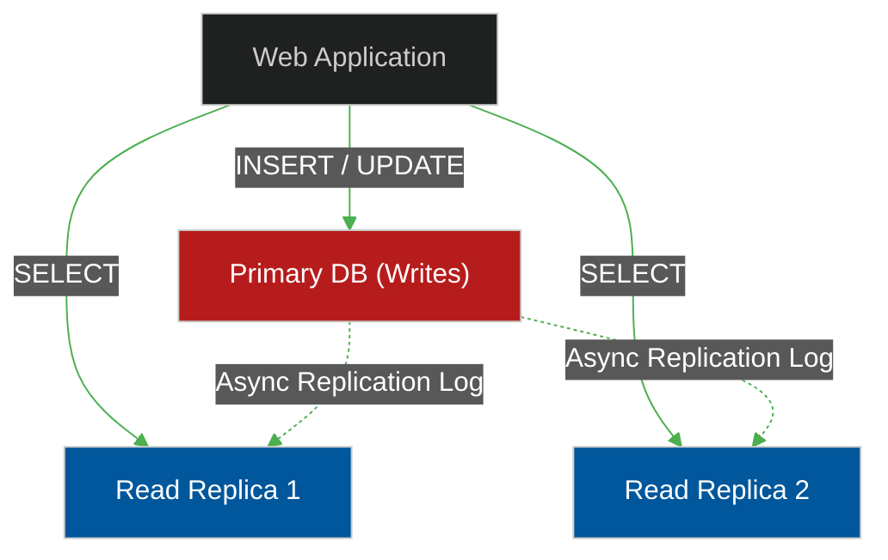
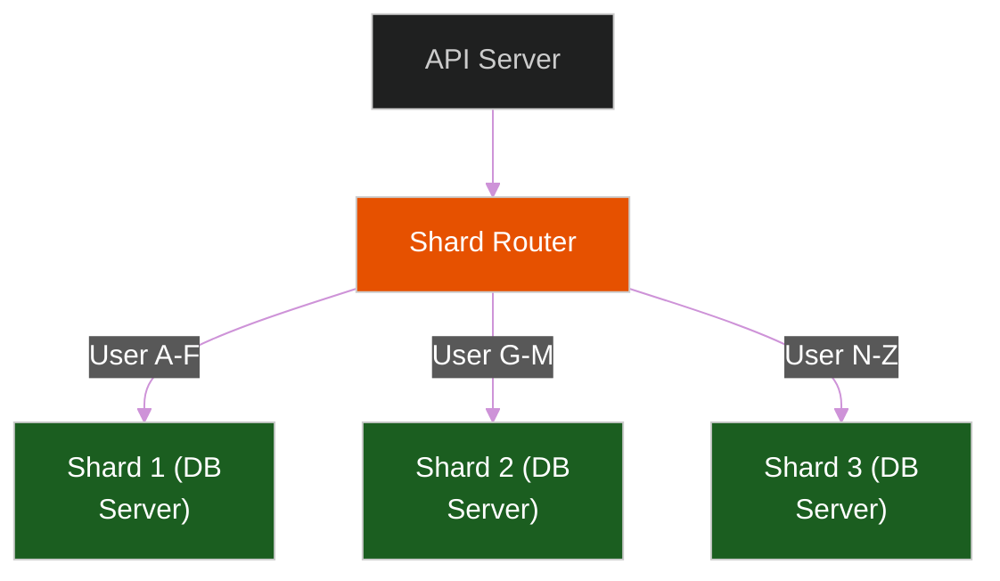

# 🪓 Database Sharding & Replication

> **Series:** DevOps › Databases · **Level:** Advanced · **Read Time:** ~12 min

---

## 📖 Table of Contents

- [1. The Limits of Vertical Scaling](#1-the-limits-of-vertical-scaling)
- [2. Replication (Read Scaling)](#2-replication-read-scaling)
- [3. The Write Bottleneck](#3-the-write-bottleneck)
- [4. Sharding (Write Scaling)](#4-sharding-write-scaling)
- [5. Consistent Hashing](#5-consistent-hashing)

---

## 1. The Limits of Vertical Scaling

When a database runs out of RAM or CPU, the easiest solution is **Vertical Scaling** (buying a bigger server). You upgrade your AWS RDS instance from `db.m5.large` (8GB RAM) to `db.m5.24xlarge` (384GB RAM).
However, hardware has physical limits. Once you hit the biggest server AWS sells, you can no longer scale vertically. You must scale **Horizontally** (adding *more* servers instead of *bigger* servers).

---

## 2. Replication (Read Scaling)

In 90% of web applications, there are far more Reads (users looking at posts) than Writes (users creating posts).
**Replication** solves the Read scaling problem.

1.  You have one **Primary (Master)** database. All `INSERT`, `UPDATE`, and `DELETE` queries MUST go to the Primary.
2.  The Primary streams a log of every change (the WAL - Write Ahead Log) to multiple **Replica (Slave)** databases.
3.  All `SELECT` queries are routed to the Replicas.

*Note: Replication is usually asynchronous. A user might update their profile on the Primary, and if they refresh instantly, the Replica might serve stale data for 50 milliseconds until the log catches up.*

---

## 3. The Write Bottleneck

Replication is amazing, but what happens when you have millions of users uploading photos simultaneously? (e.g., Instagram, Twitter).
The Primary database will hit 100% CPU because it is handling all the Writes. You cannot add more Primary databases in a traditional SQL setup because they would overwrite each other's data and cause conflicts.

---

## 4. Sharding (Write Scaling)

**Sharding** is the ultimate horizontal scaling technique. You chop your massive 10-Terabyte database into ten separate 1-Terabyte databases running on ten entirely different physical servers.

Instead of one Primary, you now have ten Primaries (Shards).

**The Shard Key:**
To make this work, the Router needs to know *which* server holds the data. You must pick a **Shard Key** (e.g., `user_id`). 
When the API requests `user_id: 55`, the Router calculates that User 55 lives on Shard 2, and routes the query there.

**The Danger of Sharding:**
If you run `SELECT * FROM users`, the Router has to send that query to all 10 servers, wait for the responses, stitch them together in memory, and sort them. This is called a **Scatter-Gather** query, and it is brutally slow. Once you shard, cross-shard `JOIN`s become nearly impossible.

---

## 5. Consistent Hashing

If you shard by alphabetical order (A-F, G-M), what happens if 80% of your users have names starting with 'A'? Shard 1 will melt down (a "Hot Shard"), while Shard 2 and 3 do nothing.

To solve this, databases use **Consistent Hashing**. 
The Router takes the `user_id`, runs it through a cryptographic Hash function (like SHA-256), and uses the mathematical output to place the user randomly but deterministically on a server. This guarantees that traffic and storage are perfectly balanced across all shards, regardless of the input data.

---

## 🔗 External References & Required Reading
- **DigitalOcean:** [Understanding Database Sharding](https://www.digitalocean.com/community/tutorials/understanding-database-sharding)
- **AWS Architecture:** [Sharding with Amazon Relational Database Service](https://aws.amazon.com/blogs/database/sharding-with-amazon-relational-database-service/)

---

*← [Database Objects & Components](./11-database-objects-and-components.md) · [Back to Series Overview](./README.md) →*

## Related

- [Software Architecture Patterns](../../clean-code/software-architecture/README.md)
- [API Gateways & Reverse Proxies](../api-gateways/README.md)
- [Observability & Monitoring](../observability/README.md)
