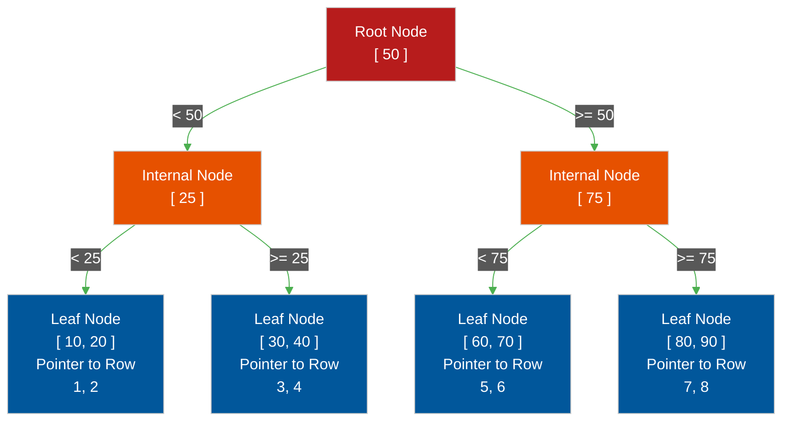

# 🌳 B-Tree Indexing Deep Dive

> **Series:** DevOps › Databases · **Level:** Expert · **Read Time:** ~10 min

---

## 📖 Table of Contents

- [1. What is an Index?](#1-what-is-an-index)
- [2. The B-Tree Structure](#2-the-b-tree-structure)
- [3. Time Complexity: O(log N) vs O(N)](#3-time-complexity-olog-n-vs-on)
- [4. Composite Indexes (The Left-Most Rule)](#4-composite-indexes-the-left-most-rule)
- [5. Clustered vs Non-Clustered Indexes](#5-clustered-vs-non-clustered-indexes)

---

## 1. What is an Index?

If you want to find a specific word in a 1,000-page book, you don't read the book from page 1 to page 1000. You flip to the **Index** at the back of the book, find the word (which is sorted alphabetically), and it tells you exactly which page to turn to.

A database index works the exact same way. It is a separate data structure built alongside the table that keeps a specific column mathematically sorted.

---

## 2. The B-Tree Structure

Almost all default indexes in Relational Databases (PostgreSQL, MySQL) are **B-Trees** (Balanced Trees). A B-Tree is a self-balancing tree data structure that maintains sorted data and allows searches in logarithmic time.

When you query `WHERE id = 30`:
1. The engine checks the Root (`50`). `30` is less than `50`, so it goes left.
2. It checks the Internal Node (`25`). `30` is greater, so it goes right.
3. It hits the Leaf Node containing `30`, which contains a pointer (memory address) directly to the physical row on the hard drive.

---

## 3. Time Complexity: O(log N) vs O(N)

Without an index, finding a user in a 1 Billion row table requires **O(N)** time (a Sequential Scan). The database must check 1,000,000,000 rows.

With a B-Tree index, finding a user takes **O(log N)** time. Because the tree splits the dataset in fractions at each level, the database only has to make roughly **30 mathematical jumps** to find the exact row out of 1 Billion.

---

## 4. Composite Indexes (The Left-Most Rule)

You can create an index on multiple columns simultaneously: `CREATE INDEX idx_name ON users (last_name, first_name)`.

**The Left-Most Prefix Rule:**
A composite index ONLY works if your `WHERE` clause filters by the left-most columns in the index.
*   `WHERE last_name = 'Smith'` -> **INDEX USED** (Lightning Fast)
*   `WHERE last_name = 'Smith' AND first_name = 'John'` -> **INDEX USED** (Lightning Fast)
*   `WHERE first_name = 'John'` -> **INDEX IGNORED** (Full Table Scan). The database cannot use the index because the data is sorted primarily by `last_name`. (Imagine trying to use a phone book to find everyone named "John" without knowing their last name. You have to read the whole book).

---

## 5. Clustered vs Non-Clustered Indexes

*   **Clustered Index:** The index *is* the table. The actual physical rows on the hard drive are sorted and stored in the exact order of the Clustered Index (usually the Primary Key). A table can only have ONE clustered index.
*   **Non-Clustered Index (Secondary Index):** A separate data structure. The Leaf Nodes don't hold the actual data; they hold a pointer to the Clustered Index. This requires an extra "jump" to fetch the data.

---

## 🔗 External References & Required Reading
- **Use The Index, Luke!:** [Anatomy of an Index](https://use-the-index-luke.com/sql/anatomy)
- **PostgreSQL Docs:** [B-Tree Indexes](https://www.postgresql.org/docs/current/btree-intro.html)

---

*← [Sharding & Replication](./12-sharding-and-replication.md) · [Back to Series Overview](./README.md) →*

## Related

- [Software Architecture Patterns](../../clean-code/software-architecture/README.md)
- [API Gateways & Reverse Proxies](../api-gateways/README.md)
- [Observability & Monitoring](../observability/README.md)
