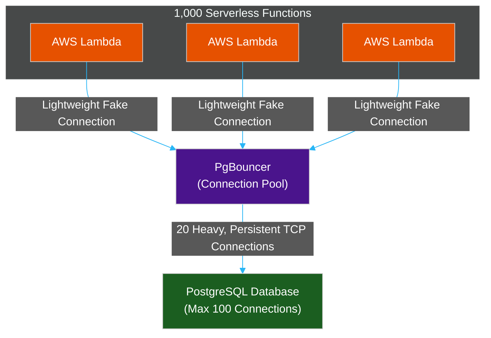

# 🚰 Connection Pooling (PgBouncer)

> **Series:** DevOps › Databases · **Level:** Advanced · **Read Time:** ~8 min

---

## 📖 Table of Contents

- [1. The Cost of a Database Connection](#1-the-cost-of-a-database-connection)
- [2. The Serverless Problem (Lambda Exhaustion)](#2-the-serverless-problem-lambda-exhaustion)
- [3. What is a Connection Pool?](#3-what-is-a-connection-pool)
- [4. PgBouncer Architecture](#4-pgbouncer-architecture)

---

## 1. The Cost of a Database Connection

Connecting to a database is not free. When your backend application (Node.js, Spring Boot, etc.) wants to run a SQL query, it must establish a connection to the database server.

This process involves:
1.  **DNS Resolution:** Finding the IP of the database.
2.  **TCP Handshake:** 3-way network handshake to establish a socket.
3.  **TLS Negotiation:** Cryptographic handshake to encrypt the connection.
4.  **Database Authentication:** The DB verifying the username and password.
5.  **Process Forking:** PostgreSQL literally creates a brand new OS Process (which consumes ~10MB of RAM) just to handle this specific connection.

This entire setup process can take **50ms to 100ms**. If your backend establishes a brand new connection for every single HTTP request, your API will be incredibly slow, and your database will run out of RAM.

---

## 2. The Serverless Problem (Lambda Exhaustion)

Most databases (like PostgreSQL) are configured to accept a maximum of **100 concurrent connections**. 

If you use AWS Lambda (Serverless), and your website suddenly gets a spike of 1,000 users, AWS will instantly spin up 1,000 Lambda functions. 
Each Lambda function tries to open a connection to the database. The database hits its 100-connection limit, rejects the remaining 900 Lambdas, and your entire application crashes with a `FATAL: sorry, too many clients already` error.

---

## 3. What is a Connection Pool?

A **Connection Pool** is a cache of database connections kept alive in memory.

Instead of the backend creating a new connection for every query, the Connection Pool opens 20 connections to the database when the server starts up, and leaves them open forever.

When a user makes an HTTP request:
1. The backend asks the Pool for a connection.
2. The Pool hands over an already-open connection (0ms latency).
3. The backend runs the query.
4. The backend returns the connection to the Pool for the next user to use.

---

## 4. PgBouncer Architecture

In modern microservices or Serverless architectures, you often cannot keep the connection pool inside the application memory (because Lambdas are stateless). 

You must use an external connection pooler like **PgBouncer** (for PostgreSQL) or **ProxySQL** (for MySQL).

PgBouncer sits between your application and the database. It can accept 10,000 lightweight connections from your Serverless functions, but it funnels all of those queries through just 20 heavy, persistent connections to the actual database, saving the database from melting down.

---

## 🔗 External References & Required Reading
- **PgBouncer:** [Official Documentation](https://www.pgbouncer.org/)
- **AWS Architecture:** [Managing PostgreSQL Connections with RDS Proxy](https://aws.amazon.com/blogs/database/managing-postgresql-connections-with-amazon-rds-proxy/)

---

*← [B-Tree Indexing](./13-b-tree-indexing-deep-dive.md) · [Back to Series Overview](./README.md)*

## Related

- [Software Architecture Patterns](../../clean-code/software-architecture/README.md)
- [API Gateways & Reverse Proxies](../api-gateways/README.md)
- [Observability & Monitoring](../observability/README.md)
