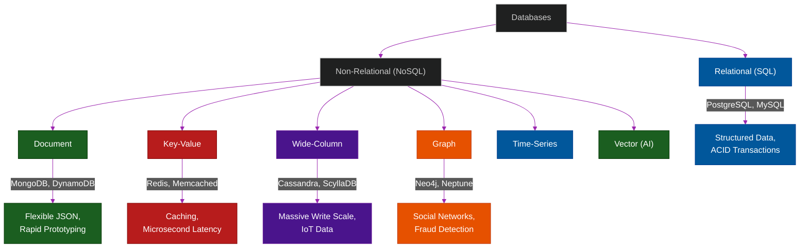

# 🗄️ Database Architecture & Types

A comprehensive series exploring the modern database landscape. There is no "perfect" database—only the right database for your specific data model, access pattern, and scalability requirements.

---

## 📖 Table of Contents

- [The Polyglot Persistence Architecture](#the-polyglot-persistence-architecture)
- [📚 Module Index](#module-index)
- [The Database Landscape](#the-database-landscape)

---

## The Polyglot Persistence Architecture

In the early days of web development, a single Monolithic SQL database (like MySQL or Oracle) was used to store *everything*: user profiles, session tokens, search logs, and financial transactions.

Today, modern systems use **Polyglot Persistence**, meaning they use multiple specialized database technologies to handle different types of workloads within the same application:
- **PostgreSQL:** For strict financial transactions (ACID guarantees).
- **Redis:** For caching temporary user sessions (Speed).
- **Elasticsearch:** For full-text product search (Inverted Index).
- **Neo4j:** For social network friend recommendations (Relationships).

---

## 📚 Module Index

| Module | Title | Level | Read Time | Key Topics |
| :--- | :--- | :--- | :--- | :--- |
| **01** | [Database Comparison Matrix](./01-databases-comparison.md) | Reference | ~10 min | CAP Theorem, Use Cases, Decision Guide |
| **02** | [Relational (SQL) Databases](./02-relational-sql.md) | Intermediate | ~10 min | PostgreSQL, MySQL, ACID, Normalization |
| **03** | [Document (NoSQL) Databases](./03-nosql-document.md) | Intermediate | ~10 min | MongoDB, DynamoDB, JSON, Schemaless |
| **04** | [Key-Value Stores (In-Memory)](./04-key-value-stores.md) | Intermediate | ~8 min | Redis, Memcached, Caching, Pub/Sub |
| **05** | [Wide-Column Stores](./05-wide-column.md) | Advanced | ~10 min | Cassandra, ScyllaDB, Bigtable, High-Write |
| **06** | [Graph Databases](./06-graph-databases.md) | Advanced | ~10 min | Neo4j, Nodes/Edges, Recommendations |
| **07** | [Time-Series Databases](./07-time-series.md) | Advanced | ~8 min | InfluxDB, TimescaleDB, Metrics, IoT |
| **08** | [Vector Databases (AI)](./08-vector-ai.md) | Advanced | ~10 min | Pinecone, Qdrant, Embeddings, RAG |
| **09** | [Data Modeling: Normalization vs Denormalization](./09-data-modeling-normalization.md) | Intermediate | ~12 min | 1NF/2NF/3NF, Data Integrity, JOIN Performance |
| **10** | [Database Relationships & ERDs](./10-database-relationships.md) | Intermediate | ~15 min | 1:1, 1:N, M:N, Polymorphic, Adjacency Lists |
| **11** | [Database Objects & Components](./11-database-objects-and-components.md) | Intermediate | ~12 min | Schemas, Views, Indexes, Partitions, Triggers |
| **12** | [Database Sharding & Replication](./12-sharding-and-replication.md) | Advanced | ~12 min | Horizontal Scaling, Primary/Replica, Consistent Hashing |
| **13** | [B-Tree Indexing Deep Dive](./13-b-tree-indexing-deep-dive.md) | Expert | ~10 min | O(log N), B-Trees, Clustered Indexes, Left-Most Rule |
| **14** | [Connection Pooling (PgBouncer)](./14-connection-pooling.md) | Advanced | ~8 min | TCP Handshakes, Serverless Limits, PgBouncer |

---

## The Database Landscape

