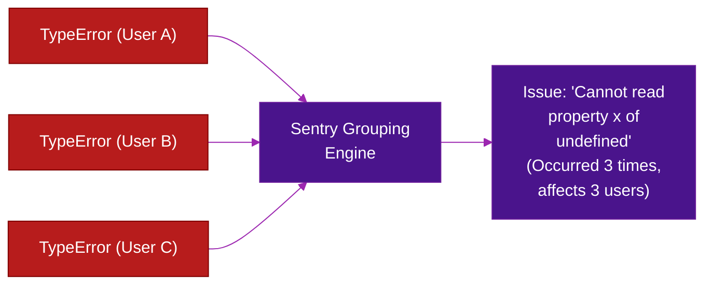
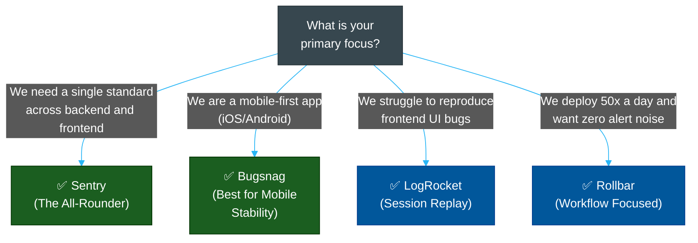

# 🐛 Error Tracking Tool Comparison

> **Series:** DevOps › Error Tracking & Crash Reporting · **Level:** Reference · **Read Time:** ~10 min

---

## 📖 Table of Contents

- [1. The Problem: Logs Are Not Enough](#1-the-problem-logs-are-not-enough)
- [2. Sentry — The Industry Standard](#2-sentry-the-industry-standard)
- [3. Bugsnag — The Mobile Powerhouse](#3-bugsnag-the-mobile-powerhouse)
- [4. Rollbar — The Workflow Specialist](#4-rollbar-the-workflow-specialist)
- [5. LogRocket — The UX Debugger](#5-logrocket-the-ux-debugger)
- [6. Feature Comparison Matrix](#6-feature-comparison-matrix)
- [7. Decision Guide](#7-decision-guide)

---

## 1. The Problem: Logs Are Not Enough

If your application throws an unhandled exception, it will usually be written to standard output and collected by a logging system (like ELK or Datadog). However, logging systems are bad at **triaging errors**:
- **Duplication:** A single bug might generate 10,000 log lines in an hour.
- **Missing Context:** A stack trace in a log file rarely tells you what the user clicked right before the crash, what OS they were on, or what their battery level was.
- **Workflow:** Logs don't have "Resolved", "Ignored", or "Assigned to" states.

Error tracking tools solve this by **intelligently grouping exceptions** by their stack trace signature and collecting deep client-side context.

---

## 2. Sentry — The Industry Standard

**Sentry** is the most widely adopted error tracking tool in the industry. It started as an open-source Python error tracker and has evolved into a full-stack observability platform covering errors, performance, and session replay.

### Key Strengths
- **Breadcrumbs:** Automatically records console logs, HTTP requests, and DOM clicks leading up to a crash.
- **Release Tracking:** Shows exactly which Git commit introduced a specific error.
- **Ecosystem:** SDKs for almost every language, framework, and platform.
- **Open-Source (ish):** You can self-host Sentry using Docker, though its license has evolved (BSL).

### Example: Sentry Error Grouping

---

## 3. Bugsnag — The Mobile Powerhouse

**Bugsnag** (now owned by SmartBear) is traditionally favored by **mobile development teams** (iOS, Android, React Native, Flutter). 

### Key Strengths
- **Stability Score:** A prominent metric showing the percentage of "Crash-Free Sessions". Mobile teams use this to decide whether to pause a staged rollout (e.g., if stability drops below 99.5%).
- **Mobile Context:** Excellent at capturing device-specific context (battery state, screen orientation, jailbreak status, out-of-memory errors).
- **Phased Releases:** Tracks errors across different versions of a mobile app simultaneously.

> [!TIP]
> If your core product is a **native mobile app**, Bugsnag is generally superior to Sentry in its handling of mobile-specific crash types (like ANRs - Application Not Responding) and release monitoring.

---

## 4. Rollbar — The Workflow Specialist

**Rollbar** focuses heavily on being a highly efficient triage tool for teams that practice Continuous Deployment (CD). It aims to reduce noise and alert fatigue.

### Key Strengths
- **Intelligent Grouping:** Known for having very clean grouping algorithms that prevent "noise" (multiple alerts for the same underlying issue).
- **Automation Grade:** High focus on webhooks and integrating tightly with CI/CD to automatically pause deployments if a new error spikes.
- **Simplicity:** A more utilitarian, developer-focused interface compared to Sentry's sprawling observability platform.

---

## 5. LogRocket — The UX Debugger

**LogRocket** operates differently. While Sentry shows you the *stack trace* of what broke, LogRocket shows you a **video replay** of what the user experienced.

### Key Strengths
- **Session Replay:** Pixel-perfect video replay of the user's screen leading up to an error.
- **Redux/State Tracking:** Can record exactly what was in the user's Redux/Vuex state store at the time of the crash.
- **Network Recording:** Captures the exact headers and bodies of all API requests and responses.

> [!NOTE]
> LogRocket is primarily a **frontend** tool. It is often used *in combination* with a backend error tracker like Sentry. (e.g., Sentry catches the backend 500 error; LogRocket shows you the user frantically clicking the "Submit" button).

---

## 6. Feature Comparison Matrix

| Feature | Sentry | Bugsnag | Rollbar | LogRocket |
| :--- | :--- | :--- | :--- | :--- |
| **Best For** | Full-Stack, General Use | Mobile Apps | CI/CD Workflows | Frontend & UX |
| **Error Grouping** | ✅ Excellent | ✅ Excellent | ✅ Excellent | ⚠️ Basic |
| **Session Replay** | ✅ Yes (added recently) | ❌ No | ❌ No | ✅✅ Best-in-class |
| **Performance (APM)** | ✅ Yes | ✅ Yes | ❌ No | ✅ Yes (Frontend) |
| **Mobile Stability Score** | ✅ Yes | ✅✅ Industry standard | ⚠️ Basic | ❌ No |
| **Self-Hosting** | ✅ Yes (Docker) | ❌ SaaS / On-Prem Enterprise | ❌ SaaS | ❌ SaaS |
| **Pricing Model** | Events & Transactions | User Sessions / Events | Events | Sessions |

---

## 7. Decision Guide

### Strategic Recommendation
1. **The Default Choice:** Start with **Sentry**. Its ecosystem is massive, and its integrations with tools like GitHub and Slack are best-in-class.
2. **For Mobile Teams:** Choose **Bugsnag**. The focus on crash-free session metrics perfectly aligns with mobile release cycles.
3. **The Power Combo:** Use **Sentry** for all error tracking (frontend and backend), and integrate it with **LogRocket** for difficult frontend UX bugs.

## Related

- [Observability & Monitoring](../observability/README.md)
- [API Gateways & Reverse Proxies](../api-gateways/README.md)
