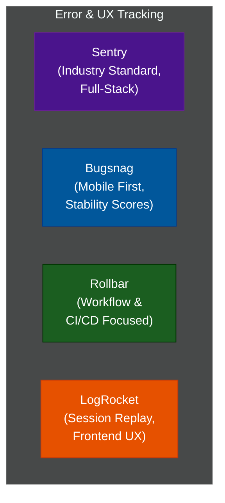

# 🐛 Error Tracking & Crash Reporting

A comprehensive series exploring modern error tracking, crash reporting, and client-side observability platforms like Sentry, Bugsnag, and Rollbar.

---

## 📖 Table of Contents

- [What Is Error Tracking?](#what-is-error-tracking)
- [📚 Module Index](#module-index)
- [The Error Tracking Landscape](#the-error-tracking-landscape)

---

## What Is Error Tracking?

While traditional backend observability (logs, metrics, traces) tells you about the health of your *infrastructure* and *services*, **Error Tracking** focuses on the *application code* and the *user experience*. 

Error tracking tools automatically capture unhandled exceptions, crashes, and performance bottlenecks, grouping them into actionable issues with full stack traces, local variables, and breadcrumbs of what the user did right before the crash.

| Concept | Traditional Logging (ELK, Loki) | Error Tracking (Sentry, Bugsnag) |
| :--- | :--- | :--- |
| **Focus** | Infrastructure and application streams | Application crashes and unhandled exceptions |
| **Data Structure** | Chronological lines of text / JSON | Grouped issues by stack trace signature |
| **Key Metric** | Log volume | Crash-free sessions |
| **Context** | Server state, request IDs | Device state, OS, battery, breadcrumbs |

---

## 📚 Module Index

| Module | Title | Level | Read Time | Key Topics |
| :--- | :--- | :--- | :--- | :--- |
| **01** | [Error Tracking Comparison Matrix](./01-error-tracking-comparison.md) | Reference | ~10 min | Sentry, Bugsnag, Rollbar, LogRocket |

---

## The Error Tracking Landscape

