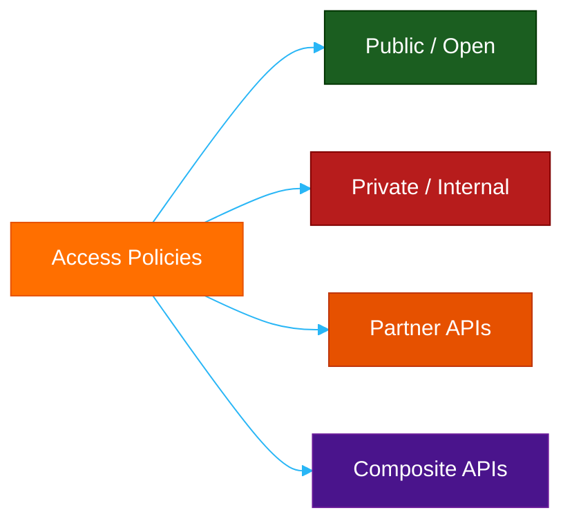
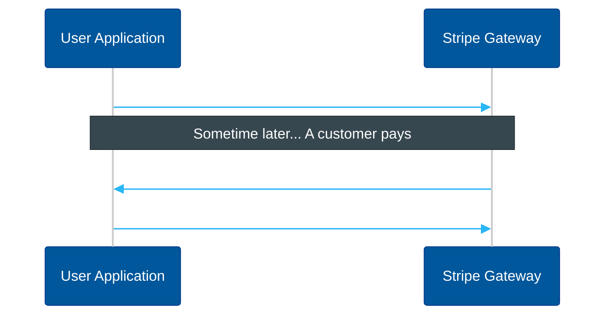
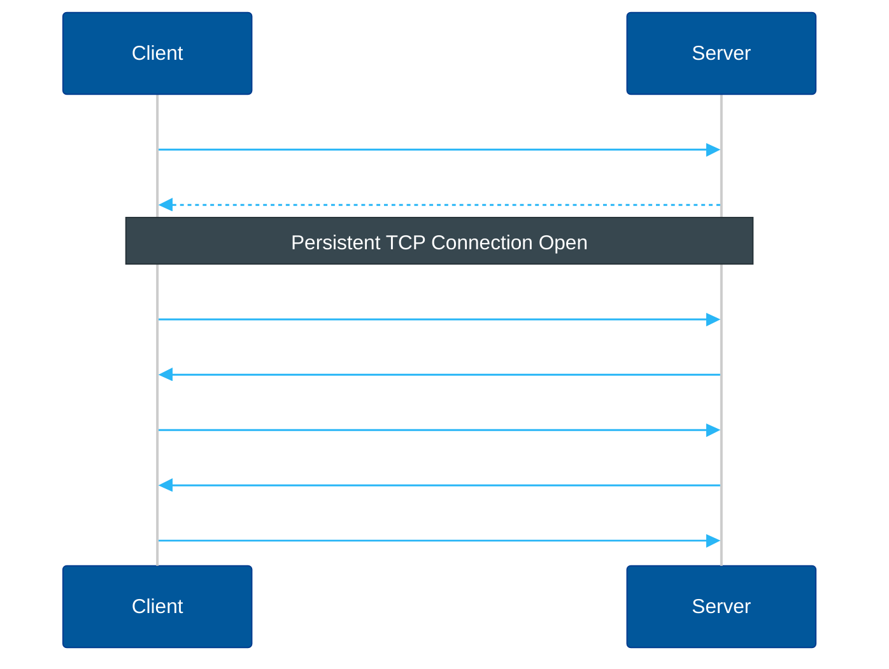
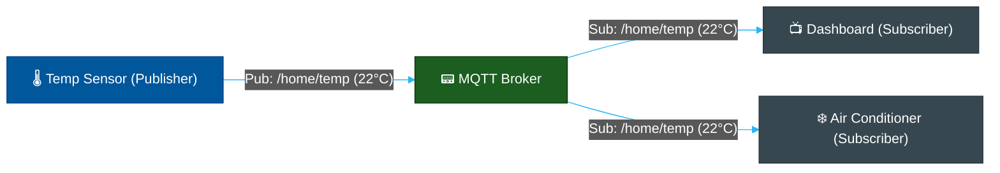
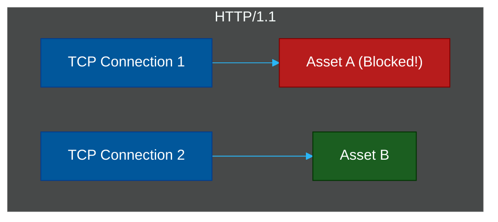
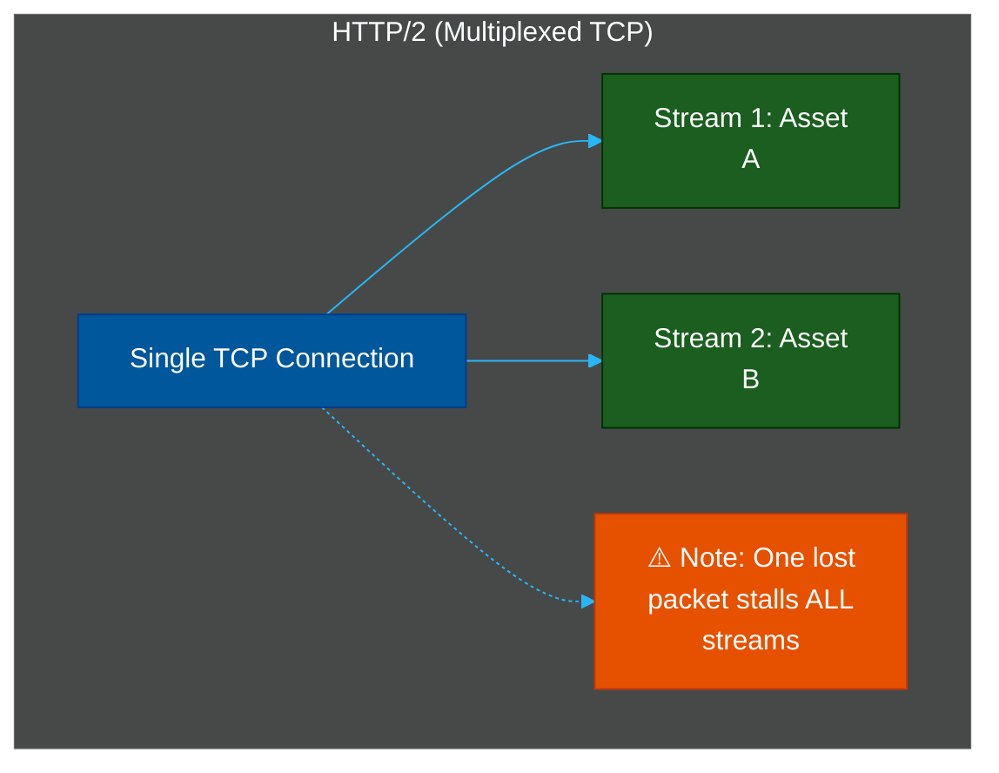
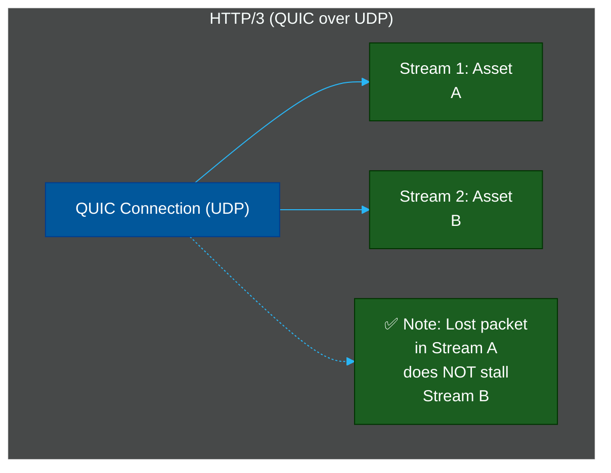
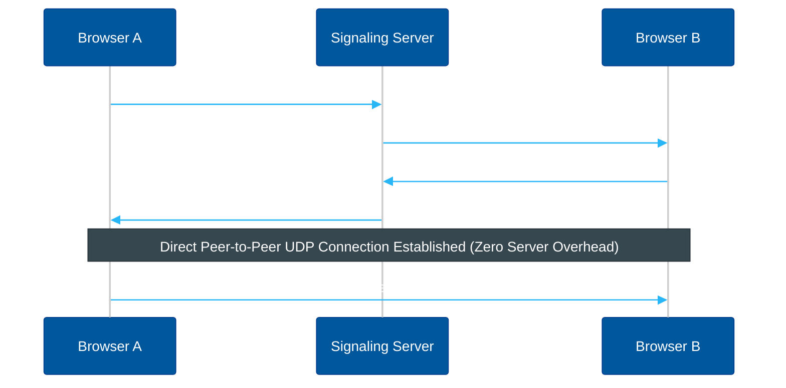

# 📡 Network Protocols & API Architectures: A Comprehensive Guide

An engineering handbook detailing modern web communication protocols, API architectural styles, real-time messaging, and underlying network layers.

---

## 📌 Table of Contents
- [The Big Picture](#the-big-picture)
- [0. Foundations: What is an API?](#0-foundations-what-is-an-api)
  - [Elevator Pitch Cheat Sheet (Interview-Ready)](#elevator-pitch-cheat-sheet-interview-ready)
  - [What is an API?](#what-is-an-api)
  - [How Many Types of APIs?](#how-many-types-of-apis)
    - [1. By Release/Access Policy (Who can access)](#1-by-releaseaccess-policy-who-can-access)
    - [2. By Implementation & System Level (How they are built)](#2-by-implementation-system-level-how-they-are-built)
- [1. API Architectural Styles](#1-api-architectural-styles)
  - [REST (Representational State Transfer)](#rest-representational-state-transfer)
    - [Production Payload Example (JSON)](#production-payload-example-json)
  - [SOAP (Simple Object Access Protocol)](#soap-simple-object-access-protocol)
    - [Production Payload Example (XML SOAP Envelope)](#production-payload-example-xml-soap-envelope)
  - [GraphQL](#graphql)
    - [Production Payload Example (Query & Response)](#production-payload-example-query-response)
  - [gRPC / RPC (Remote Procedure Call)](#grpc-rpc-remote-procedure-call)
    - [Production Proto Definition (`user.proto`)](#production-proto-definition-userproto)
    - [Serialized Payload Representation (Binary Payload Stream)](#serialized-payload-representation-binary-payload-stream)
  - [Webhooks](#webhooks)
- [2. Real-Time & Event-Driven Protocols](#2-real-time-event-driven-protocols)
  - [WebSockets](#websockets)
  - [SSE (Server-Sent Events)](#sse-server-sent-events)
    - [Production Payload Stream Example](#production-payload-stream-example)
  - [MQTT (Message Queuing Telemetry Transport)](#mqtt-message-queuing-telemetry-transport)
- [3. Transport & Network Layers](#3-transport-network-layers)
  - [HTTP/1.1 vs. HTTP/2 vs. HTTP/3](#http11-vs-http2-vs-http3)
  - [Historical Context & Protocol Version Specifications](#historical-context-protocol-version-specifications)
    - [Understanding Head-of-Line (HOL) Blocking:](#understanding-head-of-line-hol-blocking)
  - [Core Evolutionary Roadmap & Mechanisms (HTTP/1.1 ➡️ HTTP/2 ➡️ HTTP/3)](#core-evolutionary-roadmap-mechanisms-http11-️-http2-️-http3)
    - [1. HTTP/1.1 — The Era of Head-of-Line (HOL) Blocking (1997)](#1-http11-the-era-of-head-of-line-hol-blocking-1997)
    - [2. HTTP/2 — Multiplexing & Binary Framing (2015)](#2-http2-multiplexing-binary-framing-2015)
    - [3. HTTP/3 — Zero HOL Blocking & QUIC over UDP (2022)](#3-http3-zero-hol-blocking-quic-over-udp-2022)
    - [Protocol Flow Visualizations](#protocol-flow-visualizations)
  - [TCP vs. UDP](#tcp-vs-udp)
  - [WebRTC](#webrtc)
- [4. Comparison Matrix](#4-comparison-matrix)
- [References](#references)

---

## 📋 Table of Contents

- [The Big Picture](#the-big-picture)
- [0. Foundations: What is an API?](#0-foundations-what-is-an-api)
  - [What is an API?](#what-is-an-api)
  - [How Many Types of APIs?](#how-many-types-of-apis)
  - [Elevator Pitch Cheat Sheet (Interview-Ready)](#elevator-pitch-cheat-sheet-interview-ready)
- [1. API Architectural Styles](#1-api-architectural-styles)
  - [REST (Representational State Transfer)](#rest-representational-state-transfer)
  - [SOAP (Simple Object Access Protocol)](#soap-simple-object-access-protocol)
  - [GraphQL](#graphql)
  - [gRPC / RPC (Remote Procedure Call)](#grpc-rpc-remote-procedure-call)
  - [Webhooks](#webhooks)
- [2. Real-Time & Event-Driven Protocols](#2-real-time-event-driven-protocols)
  - [WebSockets](#websockets)
  - [SSE (Server-Sent Events)](#sse-server-sent-events)
  - [MQTT (Message Queuing Telemetry Transport)](#mqtt-message-queuing-telemetry-transport)
- [3. Transport & Network Layers](#3-transport-network-layers)
  - [HTTP/1.1 vs. HTTP/2 vs. HTTP/3](#http11-vs-http2-vs-http3)
  - [TCP vs. UDP](#tcp-vs-udp)
  - [WebRTC](#webrtc)
- [4. Comparison Matrix](#4-comparison-matrix)
- [References](#references)

---

## The Big Picture

Choosing how services talk to each other is one of the most critical architectural decisions in system design. A bad choice leads to latency bottlenecks, bloated payloads, or unnecessary state management complexity.

```mermaid
%%{init: {
  'theme': 'dark',
  'themeVariables': {
    'primaryColor':    '#01579b',
    'primaryBorderColor': '#003c8f',
    'primaryTextColor': '#ffffff',
    'lineColor':       '#29b6f6',
    'clusterBkg':      '#2d2d2d',
    'background': '#1e1e1e'
  },
  'themeCSS': 'svg { background-color: #1e1e1e !important; padding: 1rem !important; border-radius: 8px !important; } .edgeLabel rect { fill: #1e1e1e !important; } text, tspan, .messageText, .signalText, .edgeLabel, .edgeLabel span, .pointLabel, .axisLabel, .quadrantTitle, .quadrantLabel { fill: #ffffff !important; color: #ffffff !important; stroke: none !important; }'
}}%%
graph TD
    classDef root fill:#ff6f00,stroke:#e65100,color:#fff
    classDef primary fill:#01579b,stroke:#003c8f,color:#fff
    classDef sub fill:#37474f,stroke:#263238,color:#fff

    A["Client-Server Communication"]:::root --> B["API Styles (Request-Response)"]:::primary
    A --> C["Real-Time / Event-Driven"]:::primary
    A --> D["Transport Protocols"]:::primary

    B --> B1["REST (Resource-based)"]:::sub
    B --> B2["SOAP (Strict Contract<br/>XML)"]:::sub
    B --> B3["GraphQL (Client-driven Query)"]:::sub
    B --> B4["gRPC (Binary Protocol<br/>Buffers)"]:::sub
    B --> B5["Webhooks (Reverse API<br/>Push)"]:::sub

    C --> C1["WebSockets (Full-Duplex TCP)"]:::sub
    C --> C2["SSE (Uni-Directional Streaming)"]:::sub
    C --> C3["MQTT (Lightweight IoT<br/>Pub/Sub)"]:::sub

    D --> D1["HTTP/1.1 (Persistent TCP)"]:::sub
    D --> D2["HTTP/2 (Multiplexed TCP)"]:::sub
    D --> D3["HTTP/3 (QUIC over<br/>UDP)"]:::sub
    D --> D4["WebRTC (P2P UDP)"]:::sub
```



---

## 0. Foundations: What is an API?

Before exploring advanced routing and transport handshakes, we must align on the underlying interface that powers them all.

### Elevator Pitch Cheat Sheet (Interview-Ready)

If you are asked to explain these protocols in **one clear sentence** (e.g., during a system design interview or tech lead discussion), use these proven "elevator pitches":

*   **API:** *"An intermediary that lets two distinct applications exchange data securely using a predefined contract."*
*   **REST:** *"A stateless, resource-oriented architectural style using unique URIs and standard HTTP verbs like GET and POST."*
*   **SOAP:** *"A highly secure, XML-only protocol wrapping messages in envelopes under strict contracts (WSDL), ideal for banking."*
*   **GraphQL:** *"A client-driven query language that lets clients request the exact JSON fields they need from a single endpoint."*
*   **gRPC:** *"A high-performance binary RPC framework built on HTTP/2 using Protocol Buffers for fast microservice communication."*
*   **Webhooks:** *"An event-driven reverse API where the server pushes an HTTP POST payload to the client the instant an event occurs."*
*   **WebSockets:** *"A persistent, bidirectional (full-duplex) TCP connection allowing real-time, low-latency communication."*
*   **Server-Sent Events (SSE):** *"A lightweight, one-way HTTP stream where the server pushes constant updates to the client."*
*   **MQTT:** *"An ultra-lightweight publish/subscribe protocol designed for low-power IoT devices on unstable networks."*
*   **HTTP/3:** *"A modern transport protocol running over QUIC (UDP) that eliminates Head-of-Line blocking and latency."*
*   **WebRTC:** *"A peer-to-peer (P2P) protocol enabling direct browser-to-browser voice, video, and data streaming over UDP."*

---

### What is an API?

**ELI5 Analogy:** A waiter in a restaurant. 
*   You are the customer looking at the menu (the **Client**).
*   The kitchen prepares the food (the **Server**).
*   The waiter is the **API**. You don't walk into the kitchen and cook the food yourself. Instead, you give your order to the waiter, the waiter takes it to the kitchen, and brings back the cooked dish. If you order something not on the menu, the waiter returns with an error: *"Sorry, we don't serve that."*

**Technical Definition:** An **Application Programming Interface (API)** is a software intermediary that defines a strict set of rules, operations, and schemas enabling two distinct applications to interact and share data safely without needing to know each other's underlying implementation.

---

### How Many Types of APIs?

APIs are categorized along two distinct dimensions: **Access Policies** (who can call them) and **Architectural Implementations** (how they are built).

#### 1. By Release/Access Policy (Who can access)



*   **Public / Open APIs:** Published publicly on the web for any developer to consume (e.g., OpenWeatherMap, PokéAPI, GitHub REST API). They often feature rate limits and simple API keys to prevent abuse.
*   **Private / Internal APIs:** Strictly hidden from external developers. They are used purely within an enterprise network to connect services (e.g., an internal authentication microservice talking to a billing service).
*   **Partner APIs:** Shared selectively with licensed business partners or integration vendors (e.g., Stripe checkout integrated into a Shopify storefront). Access is regulated through custom authentication tokens and contracts.
*   **Composite APIs:** Design frameworks that bundle multiple service requests into a single client execution. For example, checking out an e-commerce cart requires fetching user credit, updating stock, calculating shipping, and charging a card. A composite API wraps all 4 endpoints into 1 request to avoid high round-trip latency.

#### 2. By Implementation & System Level (How they are built)

*   **Web Services APIs:** Web-based endpoints utilizing standard protocols (REST, SOAP, GraphQL, gRPC) to transfer data across the internet using HTTP.
*   **Operating System APIs:** Interfaces that let software programs make direct system calls to interact with the underlying hardware (e.g., Win32 API on Windows, POSIX on Linux/Unix, Cocoa on macOS).
*   **Library / Class APIs:** Structural interfaces defined inside software packages that tell developers how to interact with an external library (e.g., Java JDK API, C++ Standard Library, Node.js `fs` module).
*   **Hardware APIs:** Low-level programming interfaces that allow software to send instructions directly to physical hardware like graphics cards or chips (e.g., OpenGL/Vulkan for GPUs, CoreBluetooth for wireless components).

---

## 1. API Architectural Styles

API architectures define the rules, contracts, and formats for request-response communication between clients and servers.

### REST (Representational State Transfer)

**ELI5 Analogy:** A public library where books are organized by unique shelves. You use standard verbs to interact: **GET** a book, **POST** a new book to the shelf, **PUT** a replacement copy, or **DELETE** a torn book.

*   **Core Concepts:**
    *   **Resource-Based:** Everything is a resource identified by a unique URI (e.g., `/api/v1/users/42`).
    *   **Stateless:** Every HTTP request contains all the information needed to process it. The server stores no session context.
    *   **Standard HTTP Verbs:** Uses GET, POST, PUT, DELETE, and PATCH.
    *   **Payload Format:** Typically JSON, but can support XML, HTML, or plain text.

#### Production Payload Example (JSON)
```http
GET /api/v1/users/42 HTTP/1.1
Host: api.example.com
Accept: application/json
```

```json
{
  "id": 42,
  "name": "Jane Doe",
  "role": "Administrator",
  "email": "jane.doe@example.com"
}
```

---

### SOAP (Simple Object Access Protocol)

**ELI5 Analogy:** A highly secure, certified postal service. You cannot just send a loose letter; it must be sealed inside an official government envelope with stamped forms and signature certificates. If anything is missing, the post office rejects it immediately.

*   **Core Concepts:**
    *   **Strict Contract (WSDL):** Relies on Web Services Description Language (WSDL), an XML file outlining every available function, parameter, and data type.
    *   **Strict XML Only:** All payloads must be wrapped inside a formal SOAP Envelope consisting of a Header (metadata/security) and a Body.
    *   **Protocol Independent:** Can run over HTTP, SMTP, JMS (Java Message Service), etc.
    *   **Built-in Security & ACID:** WS-Security is highly robust (ideal for banking); supports strict transactions (ACID).

#### Production Payload Example (XML SOAP Envelope)
```http
POST /ws/UserService HTTP/1.1
Host: api.example.com
Content-Type: text/xml; charset=utf-8
```

```xml
<?xml version="1.0"?>
<soap:Envelope xmlns:soap="http://schemas.xmlsoap.org/soap/envelope/"
               xmlns:web="http://www.example.com/webservice">
  <soap:Header>
    <web:AuthHeader>
      <web:Token>SecureTokenXYZ123</web:Token>
    </web:AuthHeader>
  </soap:Header>
  <soap:Body>
    <web:GetUserRequest>
      <web:UserId>42</web:UserId>
    </web:GetUserRequest>
  </soap:Body>
</soap:Envelope>
```

---

### GraphQL

**ELI5 Analogy:** A custom buffet where you hand the chef a list of exactly what foods you want on your plate, down to the gram. The chef returns with *only* those items. No extra food is wasted (no over-fetching), and you don't have to make multiple trips to different stations (no under-fetching).

*   **Core Concepts:**
    *   **Client-Driven Queries:** The client specifies exactly what fields it needs.
    *   **Single Endpoint:** All requests go to a single `/graphql` endpoint (usually via HTTP POST).
    *   **Strongly Typed Schema:** Defined using Schema Definition Language (SDL) with Queries, Mutations, and Subscriptions.
    *   **Solves Over/Under-fetching:** Avoids fetching unnecessary fields or making consecutive requests for nested data.

#### Production Payload Example (Query & Response)
```http
POST /graphql HTTP/1.1
Host: api.example.com
Content-Type: application/json
```

```json
{
  "query": "query { user(id: 42) { name email profile { avatarUrl } } }"
}
```

```json
{
  "data": {
    "user": {
      "name": "Jane Doe",
      "email": "jane.doe@example.com",
      "profile": {
        "avatarUrl": "https://cdn.example.com/avatars/42.jpg"
      }
    }
  }
}
```

---

### gRPC / RPC (Remote Procedure Call)

**ELI5 Analogy:** A custom telephone line between two offices. Instead of sending emails, you press a button on your desk, and a machine instantly executes a task on the computer in the other office as if it were sitting on your own desk.

*   **Core Concepts:**
    *   **Remote Invocation:** Enables a client to call a method on a remote server directly.
    *   **HTTP/2 Under the Hood:** Uses HTTP/2 for bidirectional streaming, multiplexing, and header compression.
    *   **Protocol Buffers (Protobuf):** Uses a binary serialization format instead of text (JSON/XML), making it extremely fast and lightweight.
    *   **Strict Interface (IDL):** System interfaces are defined in `.proto` files, which auto-generate client stubs and server skeletons in multiple programming languages.

#### Production Proto Definition (`user.proto`)
```protobuf
syntax = "proto3";

package user;

service UserService {
  rpc GetUser (UserRequest) returns (UserResponse);
}

message UserRequest {
  int32 id = 1;
}

message UserResponse {
  int32 id = 1;
  string name = 2;
  string email = 3;
}
```

#### Serialized Payload Representation (Binary Payload Stream)
```
[Hex dump: 08 2a 12 08 4a 61 6e 65 20 44 6f 65 1a 15 ... ] (Extremely compressed, non-human readable)
```

---

### Webhooks

**ELI5 Analogy:** Setting up an SMS alert with your bank. Instead of you opening the mobile app every 5 minutes to check if your salary has arrived (polling), you tell the bank, *"Text me the instant money hits my account."* When the event occurs, the bank pushes the SMS directly to your phone.

*   **Core Concepts:**
    *   **Reverse API:** Rather than the client requesting data from the server, the server pushes data to a URL registered by the client.
    *   **Event-Driven:** Triggered strictly by backend events (e.g., payment completed, code pushed, user registered).
    *   **Asynchronous:** Decoupled architecture allowing systems to process events in the background without blocking threads.



---

## 2. Real-Time & Event-Driven Protocols

When latency must be near-zero, or data is constantly changing, traditional request-response architectures fail. Real-time protocols establish persistent, long-lived channels.

### WebSockets

**ELI5 Analogy:** A live phone call. Once the connection is established, both parties can talk and listen at the exact same time. The line stays open until someone hangs up.

*   **Core Concepts:**
    *   **Full-Duplex:** Bidirectional, simultaneous communication over a single TCP connection.
    *   **HTTP Handshake Upgrade:** Starts as a standard HTTP/1.1 request, then upgrades to the binary WebSocket protocol (`ws://` or `wss://`).
    *   **Low Overhead:** Eliminates HTTP header overhead (cookies, user-agents) for subsequent frames, reducing latency drastically.



---

### SSE (Server-Sent Events)

**ELI5 Analogy:** Listening to a live radio broadcast. You tune in to the frequency (HTTP connection), and the DJ streams music and announcements to you continuously. You cannot speak back to the DJ on that frequency; you can only listen.

*   **Core Concepts:**
    *   **Uni-Directional:** Only the server can send data to the client once the connection is established.
    *   **Standard HTTP:** Runs over standard HTTP/1.1 or HTTP/2 without upgrading protocols. Relies on the `text/event-stream` MIME type.
    *   **Automatic Reconnection:** Web browsers automatically attempt to reconnect if the line drops out.

#### Production Payload Stream Example
```http
HTTP/1.1 200 OK
Content-Type: text/event-stream
Cache-Control: no-cache
Connection: keep-alive
```

```
event: message
data: {"ticker": "AAPL", "price": 182.52, "timestamp": 1700000000}

event: message
data: {"ticker": "AAPL", "price": 182.58, "timestamp": 1700000002}
```

---

### MQTT (Message Queuing Telemetry Transport)

**ELI5 Analogy:** A smart bulletin board. A sensor publishes its temperature readings to a topic called `/livingroom/temp`. Any device interested in that temperature subscribes to `/livingroom/temp`. The central coordinator (the broker) automatically copies the temperature card to everyone subscribed to that bulletin board.

*   **Core Concepts:**
    *   **Publish/Subscribe Model:** Decoupled communication through a message broker (e.g., Mosquitto, EMQX).
    *   **Extremely Lightweight:** Minimizes packet overhead (headers can be as small as 2 bytes), making it perfect for battery-powered IoT devices and low-bandwidth networks.
    *   **Quality of Service (QoS):** Defines delivery guarantees:
        *   *QoS 0:* At most once (fire and forget).
        *   *QoS 1:* At least once (guaranteed delivery, potential duplicates).
        *   *QoS 2:* Exactly once (guaranteed delivery, no duplicates).



---

## 3. Transport & Network Layers

Underneath API frameworks and messaging layers run transport protocols that dictate how packets are structured, grouped, and delivered over physical networks.

### HTTP/1.1 vs. HTTP/2 vs. HTTP/3

| Feature | HTTP/1.1 | HTTP/2 | HTTP/3 |
| :--- | :--- | :--- | :--- |
| **Transport Layer** | TCP | TCP | QUIC (UDP) |
| **Multiplexing** | No (HOL Blocking) | Yes (TCP-level HOL remains) | Yes (Zero HOL Blocking) |
| **Header Compression** | No | Yes (HPACK) | Yes (QPACK) |
| **Encryption** | Optional (HTTPS) | Mandatory in practice (TLS 1.2+) | Mandatory built-in (TLS 1.3) |
| **Connection Setup** | Slow (TCP 3-way + TLS) | Slow (TCP 3-way + TLS) | Extremely Fast (1-RTT / 0-RTT QUIC) |

### Historical Context & Protocol Version Specifications

Each version of the HTTP protocol represents a major leap in networking architecture, standardized by the **IETF (Internet Engineering Task Force)** under specific RFC (Request for Comments) documents:

*   **HTTP/0.9 (1991) — The "One-Line" Protocol:**
    *   *Purpose:* The initial prototype designed by Tim Berners-Lee.
    *   *Specification:* Extremely simple. It supported only the `GET` method. The server response was strictly raw HTML with no headers, status codes, or media types. Once the HTML was sent, the server closed the connection.
*   **HTTP/1.0 (1996) — The Plain-Text Header Foundation (RFC 1945):**
    *   *Purpose:* Formalized the request-response pattern for modern web pages.
    *   *Specification:* Introduced HTTP headers (allowing metadata exchange), HTTP status codes (like `200 OK` or `404 Not Found`), and `Content-Type` headers supporting files other than HTML (e.g. images, stylesheets).
    *   *Limitation:* Every single file transfer required a completely new TCP connection handshake, introducing massive overhead.
*   **HTTP/1.1 (1997 / Revised 2014) — Persistent Sequential Connections (RFC 2616 / RFC 7230):**
    *   *Purpose:* The longest-running foundation of the modern World Wide Web.
    *   *Specification:* Introduced **Persistent Connections** (reusing a TCP connection for multiple files), chunked transfers, caching directives (`Cache-Control`), host headers (allowing virtual hosting of multiple sites on one IP), and pipeline support.
*   **HTTP/2 (2015) — The Interleaved Binary Era (RFC 7540):**
    *   *Purpose:* Modernized performance to support complex, asset-heavy web apps.
    *   *Specification:* Discarded the plain-text transfer format for a strict **Binary Framing Layer**. Allowed multiplexing (simultaneous transfer of multiple files over one TCP link) and introduced HPACK compression to save bandwidth on repetitive headers.
*   **HTTP/3 (2022) — The Modern Stream over UDP Era (RFC 9114):**
    *   *Purpose:* Designed for high-speed, cellular, and modern secure-by-default networks.
    *   *Specification:* Completely rebuilt the transport mechanism, abandoning TCP for **QUIC** running over **UDP**. Achieves zero Head-of-Line blocking, direct built-in TLS 1.3 encryption, and IP-agnostic connection migration.

#### Understanding Head-of-Line (HOL) Blocking:
*   **HTTP/1.1:** A browser must open multiple TCP connections (usually capped at 6) to load assets. If one asset takes too long, it blocks everything else on that connection.
*   **HTTP/2:** Solves application-level blocking by multiplexing multiple requests over a single TCP connection. However, if a packet is lost, TCP stalls *all* streams until it retransmits that single lost packet.
*   **HTTP/3 (QUIC):** Moves from TCP to UDP. Since QUIC handles reliability on a stream-by-stream basis, a lost packet only stalls the specific stream it belongs to — leaving all other assets to load at full speed!

### Core Evolutionary Roadmap & Mechanisms (HTTP/1.1 ➡️ HTTP/2 ➡️ HTTP/3)

To fully comprehend modern web engineering, we must explore *how* and *why* each protocol evolved, their core mechanisms, and how they solve the challenges of the previous generation.

---

#### 1. HTTP/1.1 — The Era of Head-of-Line (HOL) Blocking (1997)
*   **The Baseline Mechanism:** HTTP/1.1 introduced **Persistent Connections** (`Connection: keep-alive`), allowing a client to reuse a single TCP connection for multiple sequential requests. Before this, HTTP/1.0 required a brand-new TCP handshake for every single file.
*   **The Flaw — Head-of-Line (HOL) Blocking:** Although connections were persistent, they were strictly **sequential**. A client could only request one asset at a time over a single connection. If a heavy database query or large image stalled on the server, it blocked all subsequent assets behind it.
*   **Engineering Workarounds (The Ugly Hacks):**
    *   **Domain Sharding:** Browsers limit parallel TCP connections to a single domain to 6. To load assets faster, engineers hosted images on `assets1.example.com`, `assets2.example.com`, etc., forcing the browser to open up to 30 parallel TCP connections.
    *   **Image Sprites:** Combining hundreds of small UI icons into a single massive image sheet to minimize request count.
    *   **Concatenation:** Packaging entire frontend apps into one huge `bundle.js` file.

---

#### 2. HTTP/2 — Multiplexing & Binary Framing (2015)
*   **The Solution — Multiplexing:** HTTP/2 completely solved the *application-level* HOL blocking by introducing **Multiplexing** over a **single TCP connection**.
*   **The Core Mechanism — Binary Framing Layer:**
    *   HTTP/2 converts plain-text requests/responses into binary **frames** (Headers frames, Data frames).
    *   These frames are tagged with a unique **Stream ID** and interleaved down a single shared TCP connection simultaneously.
    *   The client and server rebuild the full payloads on the receiving end. Domain sharding, asset bundling, and image sprites became obsolete overnight.
*   **Additional Features:**
    *   **HPACK Header Compression:** Uses static and dynamic dictionaries to compress HTTP headers, saving huge bandwidth on repetitive user-agents and cookies.
    *   **Server Push:** Allowed servers to pre-emptively push critical CSS/JS to the browser's cache before the browser even parsed the HTML and requested them.
*   **The New Flaw — TCP-Level HOL Blocking:**
    *   Because HTTP/2 funnels all streams through a **single TCP connection**, it remains bound to the strict reliability rules of TCP.
    *   If a single IP packet drops in transit, TCP halts **all multiplexed streams** (even unrelated ones) until the dropped packet is retransmitted and acknowledged. A dirty cellular network makes HTTP/2 perform *worse* than HTTP/1.1.

---

#### 3. HTTP/3 — Zero HOL Blocking & QUIC over UDP (2022)
*   **The Solution — Re-architecting the Transport Layer:** HTTP/3 completely discards TCP. Instead, it runs on **QUIC (Quick UDP Internet Connections)**, built directly over **UDP**.
*   **The Core Mechanism — Stream-Level Reliability:**
    *   QUIC handles reliability, congestion control, and packet retransmission **independently for each stream** rather than at the connection level.
    *   If packet 4 drops in Stream A, QUIC stalls *only* Stream A. Streams B, C, and D continue loading uninterrupted. This achieves **True Multiplexing** with zero Head-of-Line blocking under all network conditions.
*   **Additional Breakthroughs:**
    *   **1-RTT & 0-RTT Connection Setup:** In TCP, establishing a secure connection requires a TCP 3-way handshake followed by a TLS handshake (taking 2–3 round trips). QUIC integrates TLS 1.3 directly into its transport layer. The connection and cryptographic keys are established in just **1 Round Trip Time (1-RTT)**, and repeat visits can achieve **0-RTT**.
    *   **Connection Migration (IP-Agnostic):** In TCP, a connection is bound to a 4-tuple (Source IP, Source Port, Destination IP, Destination Port). If you switch from Wi-Fi to mobile data, your IP changes, and your TCP connection dies. QUIC uses a unique **64-bit Connection ID** independent of IP. If you change networks, your connection migrates seamlessly without dropping a single packet.
    *   **QPACK Compression:** A version of HPACK adapted specifically for QUIC's out-of-order packet delivery, ensuring robust header compression even if packets arrive out of sequence.

#### Protocol Flow Visualizations

##### 1. HTTP/1.1 (Persistent TCP - Blocked!)


##### 2. HTTP/2 (Multiplexed TCP)


##### 3. HTTP/3 (QUIC over UDP)


---

### TCP vs. UDP

*   **TCP (Transmission Control Protocol):**
    *   *Analogy:* A certified mail carrier. They knock on the door, verify identity, have you sign the receipt, and confirm back to the sender that the envelope arrived safe and sound.
    *   *Attributes:* Connection-oriented, guarantees packet delivery, orders packets sequentially, performs error checking, and handles congestion control.
    *   *Best for:* Web browsing, APIs, database connections, SSH, and file transfers.

*   **UDP (User Datagram Protocol):**
    *   *Analogy:* Throwing newspapers at front yards from a moving car. You throw them as fast as possible. If one lands in a puddle or misses a house, you don't stop the car to fix it; you just keep throwing.
    *   *Attributes:* Connectionless, fire-and-forget, fast, no ordering guarantees, no recovery overhead.
    *   *Best for:* Live video streaming, online multiplayer gaming, DNS lookup, and VoIP calls.

---

### WebRTC

**ELI5 Analogy:** Passing notes directly to your classmate in school. First, you ask the teacher (the signaling server) to help you locate where your classmate is sitting. Once the teacher tells you, you slide notes directly across the desks to each other without involving the teacher ever again.

*   **Core Concepts:**
    *   **Peer-to-Peer (P2P):** Connects two browsers directly for audio, video, and raw data transfer without passing traffic through a central server.
    *   **Signaling Server Required:** A lightweight server is needed *only* to exchange network details (ICE candidates) and session descriptions (SDP) before the direct connection starts.
    *   **NAT Traversal (STUN/TURN):** Uses STUN servers to discover your public IP address. If both peers are behind symmetric NATs (strict firewalls), traffic fallback routing goes through a TURN server.



---

## 4. Comparison Matrix

| Protocol | Style / Concept | Payload Format | State | Latency | Primary Use Case |
| :--- | :--- | :--- | :--- | :--- | :--- |
| **REST** | Request-Response | JSON / XML | Stateless | Moderate | Standard CRUD, Web Applications |
| **SOAP** | Strict Contract | XML Only | Stateless / Stateful | High | Enterprise Banking, Legacy Integrations |
| **GraphQL** | Client-Driven Query | JSON | Stateless | Moderate | Mobile APIs, Aggregating Microservices |
| **gRPC** | Remote Call (RPC) | Binary (Protobuf) | Stateless / Streaming | Ultra-Low | Microservice-to-Microservice, High-Performance Systems |
| **Webhooks** | Event-Driven Push | JSON | Stateless | Low | Third-party alerts, Payment Gateway updates |
| **WebSockets** | Full-Duplex | Binary / Text | Stateful | Ultra-Low | Real-time chat, multiplayer gaming, financial tickers |
| **SSE** | Uni-Directional | Text stream | Stateful | Low | Real-time stock tickers, social feeds, logs |
| **MQTT** | Pub/Sub Broker | Binary / Text | Stateful | Low | Smart Home IoT, low-power remote sensors |

---

## References

*   **Fielding, R.T.** — *Architectural Styles and the Design of Network-based Software Architectures* (2000). The foundational doctoral dissertation introducing REST.
*   **W3C Working Group** — *Simple Object Access Protocol (SOAP) 1.2 Specification*.
*   **Facebook Open Source** — *GraphQL Specification*.
*   **Google Engineering** — *gRPC Documentation & Protocol Buffers Specification*.
*   **IETF RFC 6455** — *The WebSocket Protocol*.
*   **OASIS Standard** — *MQTT Version 5.0 Specification*.
*   **IETF RFC 9114** — *Hypertext Transfer Protocol Version 3 (HTTP/3)*.

## Related

- [API Gateways & Reverse Proxies](../api-gateways/README.md)
- [Software Architecture Patterns](../../clean-code/software-architecture/README.md)
- [Distributed Architecture Patterns](../../clean-code/software-architecture/distributed-patterns/README.md)
