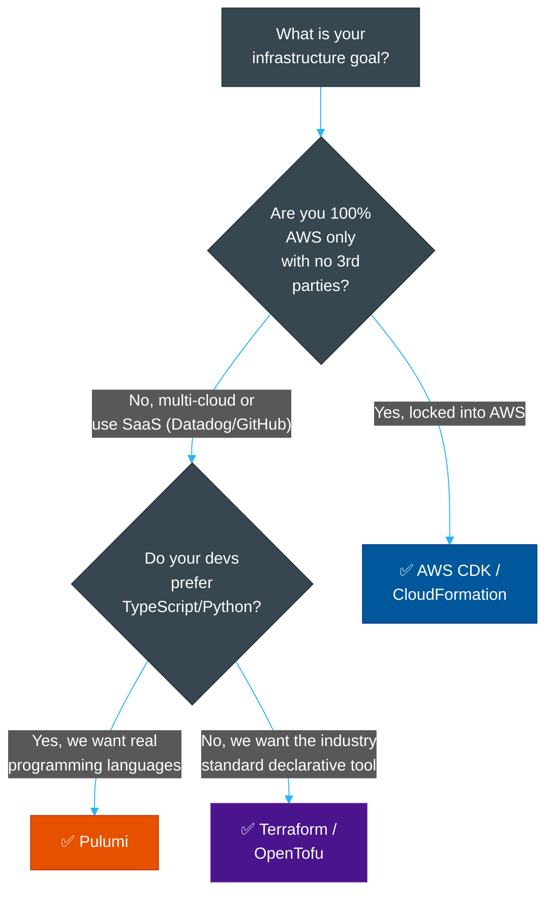

# 🏗️ IaC Tool Comparison Matrix

> **Series:** DevOps › Infrastructure as Code · **Level:** Reference · **Read Time:** ~12 min

---

## 📖 Table of Contents

- [1. Provisioning vs Configuration Management](#1-provisioning-vs-configuration-management)
- [2. Terraform & OpenTofu (The Industry Standard)](#2-terraform-opentofu-the-industry-standard)
- [3. Pulumi (Real Programming Languages)](#3-pulumi-real-programming-languages)
- [4. Cloud-Native (CloudFormation & ARM)](#4-cloud-native-cloudformation-arm)
- [5. Feature Comparison Matrix](#5-feature-comparison-matrix)
- [6. Decision Guide](#6-decision-guide)

---

## 1. Provisioning vs Configuration Management

Before comparing tools, it is critical to understand the two different categories in the IaC space:

1. **Infrastructure Provisioning (Terraform, Pulumi, CloudFormation):** These tools are designed to spin up the actual hardware/services (VPCs, EC2 instances, S3 buckets, Managed Kubernetes clusters). They treat infrastructure as **immutable** (if you need a change, they destroy the old one and create a new one).
2. **Configuration Management (Ansible, Chef, Puppet):** These tools are designed to install software and manage configurations *inside* existing servers (e.g., SSH into an EC2 instance, install Nginx, and start the service). They treat infrastructure as **mutable**.

> **Modern Best Practice:** Use Terraform/Pulumi to provision the server (and inject a startup script), or use them to provision a Kubernetes cluster where Docker containers handle the software layer. Configuration Management tools are slowly being phased out in favor of Docker + Kubernetes.

---

## 2. Terraform & OpenTofu (The Industry Standard)

**Terraform** (created by HashiCorp) is the undisputed industry standard for multi-cloud infrastructure provisioning. It uses a custom declarative language called **HCL (HashiCorp Configuration Language)**.

In 2023, HashiCorp changed Terraform's license from open-source to the Business Source License (BSL). In response, the Linux Foundation forked Terraform to create **OpenTofu**, an open-source, drop-in replacement.

### Key Strengths
- **Ecosystem:** It has "Providers" for literally everything (AWS, GCP, GitHub, Datadog, Stripe). If it has an API, there is a Terraform provider for it.
- **Declarative:** You declare the *end state* you want. Terraform figures out the API calls needed to get there.
- **State File:** It maps your code to real-world resources via a `terraform.tfstate` file, allowing it to accurately track drift and calculate the exact difference before applying changes (`terraform plan`).

### HCL Example:
```hcl
resource "aws_s3_bucket" "my_bucket" {
  bucket = "my-company-assets-2026"
  
  tags = {
    Environment = "Production"
  }
}
```

---

## 3. Pulumi (Real Programming Languages)

**Pulumi** is the modern challenger to Terraform. Instead of forcing you to learn a domain-specific language (HCL), Pulumi lets you write your infrastructure using **real programming languages** (TypeScript, Python, Go, C#).

### Key Strengths
- **Familiar Tooling:** Because you use TypeScript or Python, you can use standard IDE auto-complete, unit testing frameworks (Jest/PyTest), and standard `for` loops and `if` statements.
- **Abstraction:** It is incredibly easy to create reusable classes or functions that encapsulate complex infrastructure patterns (e.g., a `SecureVpc` class).
- **Multi-Cloud:** Like Terraform, it supports AWS, GCP, Azure, and hundreds of others.

### Pulumi TypeScript Example:
```typescript
import * as aws from "@pulumi/aws";

// A standard TypeScript for-loop to create 3 buckets!
const environments = ["dev", "staging", "prod"];

for (const env of environments) {
    new aws.s3.Bucket(`my-app-assets-${env}`, {
        bucket: `my-app-assets-${env}-2026`,
        tags: { Environment: env }
    });
}
```
*(Doing the above in Terraform requires understanding HCL's specific `for_each` meta-arguments, which can be clunky).*

---

## 4. Cloud-Native (CloudFormation & ARM)

**AWS CloudFormation** (and Azure Resource Manager / GCP Deployment Manager) are the native IaC tools provided by the cloud vendors themselves.

### Key Strengths
- **Zero Third-Party Dependencies:** It is deeply integrated into the AWS ecosystem.
- **State Management:** AWS manages the "state file" completely behind the scenes (as "Stacks").

### Drawbacks
- **Vendor Lock-in:** CloudFormation only works for AWS. You cannot use it to provision a Datadog dashboard or a GitHub repository.
- **Syntax:** It forces you to write massive, unreadable JSON or YAML files without the logical constructs of HCL or Pulumi.

> [!NOTE]
> AWS released the **AWS CDK (Cloud Development Kit)**, which allows you to write TypeScript/Python that compiles down into CloudFormation YAML. It is very similar to Pulumi but strictly locked to AWS.

---

## 5. Feature Comparison Matrix

| Feature | Terraform / OpenTofu | Pulumi | AWS CloudFormation | Ansible |
| :--- | :--- | :--- | :--- | :--- |
| **Primary Focus** | Cloud Provisioning | Cloud Provisioning | Cloud Provisioning | Server Configuration |
| **Language** | HCL (Declarative) | TS, Python, Go, C# | YAML / JSON | YAML |
| **Cloud Support** | Multi-Cloud (Thousands) | Multi-Cloud | AWS Only | Multi-Cloud |
| **State Management**| Local or Remote backend | Pulumi Cloud / S3 | Native AWS | Stateless (Mostly) |
| **Learning Curve** | Medium (Learn HCL) | Low (If you know code)| High (YAML hell) | Medium |
| **License** | BSL (Terraform) / OSS (Tofu)| Open Source | Proprietary AWS | Open Source |

---

## 6. Decision Guide



### Strategic Recommendation
1. **The Safe Industry Standard:** Choose **Terraform** (or **OpenTofu** if you care about open-source licensing). 90% of DevOps tutorials, modules, and candidates know Terraform.
2. **The Modern Developer Choice:** Choose **Pulumi** if your team consists of software engineers who want to manage infrastructure using the same TypeScript/Python they use for application code.
3. **The AWS Purist:** Choose **AWS CDK** only if your company strictly mandates using native AWS tools and you have zero plans to provision external resources via IaC.

## Related

- [CI/CD Pipelines](../cicd-pipelines/README.md)
- [Container Orchestration](../container-orchestration/README.md)
- [Observability & Monitoring](../observability/README.md)
