# 🏗️ Terraform & OpenTofu — The IaC Standard

> **Series:** DevOps › Infrastructure as Code · **Level:** Intermediate · **Read Time:** ~10 min

---

## 📖 Table of Contents

- [1. What Is Terraform?](#1-what-is-terraform)
- [2. The Terraform Workflow](#2-the-terraform-workflow)
- [3. HCL (HashiCorp Configuration Language)](#3-hcl-hashicorp-configuration-language)
- [4. State Management (The Holy Grail)](#4-state-management-the-holy-grail)
- [5. Modules — Reusable Code](#5-modules-reusable-code)
- [6. OpenTofu — The Open-Source Fork](#6-opentofu-the-open-source-fork)

---

## 1. What Is Terraform?

**Terraform** is an infrastructure-as-code (IaC) tool that allows you to build, change, and version cloud and on-prem resources safely and efficiently.

Unlike cloud-specific tools (AWS CloudFormation, Azure ARM), Terraform is **cloud-agnostic**. It uses **Providers** (plugins) to interact with cloud APIs. You write declarative code, and Terraform figures out what API calls to make to reach that desired state.

---

## 2. The Terraform Workflow

```mermaid
%%{init: {'theme': 'dark', 'themeVariables': {'primaryColor': '#4a148c', 'primaryTextColor': '#fff', 'lineColor': '#9c27b0', 'background': '#1e1e1e'},
  'themeCSS': 'svg { background-color: #1e1e1e !important; padding: 1rem !important; border-radius: 8px !important; } .edgeLabel rect { fill: #1e1e1e !important; } text, tspan, .messageText, .signalText, .edgeLabel, .edgeLabel span, .pointLabel, .axisLabel, .quadrantTitle, .quadrantLabel { fill: #ffffff !important; color: #ffffff !important; stroke: none !important; }'
}}%%
graph LR
    classDef cmd fill:#4a148c,stroke:#6a1b9a,color:#fff
    classDef act fill:#01579b,stroke:#003c8f,color:#fff

    C1["terraform init"]:::cmd -->|"Downloads<br/>providers"| C2["terraform plan"]:::cmd
    C2 -->|"Shows exact<br/>changes"| C3["terraform apply"]:::cmd
    C3 -->|"Executes API<br/>calls"| CLOUD["Cloud Resources<br/>(AWS/GCP/etc)"]:::act
```



1. `terraform init`: Initializes the directory, downloading required provider plugins (e.g., the AWS provider).
2. `terraform plan`: Reads your code, compares it to the remote state, and outputs a "diff" showing exactly what it will create, modify, or destroy. **No changes are made yet.**
3. `terraform apply`: Executes the plan and builds the infrastructure.

---

## 3. HCL (HashiCorp Configuration Language)

Terraform uses **HCL**, a declarative language designed to be human-readable. You don't write *how* to create something; you just define *what* it should look like.

```hcl
# 1. Define the Provider
provider "aws" {
  region = "us-east-1"
}

# 2. Define a Resource (A real piece of infrastructure)
resource "aws_vpc" "main_vpc" {
  cidr_block = "10.0.0.0/16"
  
  tags = {
    Name = "Production-VPC"
  }
}

# 3. Reference attributes of other resources
resource "aws_subnet" "public_subnet" {
  vpc_id     = aws_vpc.main_vpc.id  # Implicit dependency!
  cidr_block = "10.0.1.0/24"
}
```

Terraform automatically builds a dependency graph. It knows it must create the VPC *before* the Subnet because the Subnet references `aws_vpc.main_vpc.id`.

---

## 4. State Management (The Holy Grail)

Terraform's superpower is the **State File** (`terraform.tfstate`).

When you run `apply`, Terraform writes a JSON mapping of your HCL resources to the actual physical IDs in the cloud (e.g., `aws_vpc.main_vpc` maps to `vpc-0123456789abcde`).

**Why is State critical?**
- **Idempotency:** If you run `apply` again without changing code, Terraform checks the state, sees the VPC already exists, and does nothing.
- **Drift Detection:** If an engineer manually deletes the VPC in the AWS console, the next `terraform plan` will notice the VPC is missing from the real world but exists in the code, and will plan to recreate it.

> [!WARNING]
> **Never commit your `.tfstate` file to Git!** It contains unencrypted passwords and secrets. Always use a "Remote Backend" (like an AWS S3 bucket with DynamoDB locking) so your whole team can share the state file securely.

---

## 5. Modules — Reusable Code

As your infrastructure grows, you don't want a 5,000-line `main.tf` file. You use **Modules** to create reusable blocks of code.

**Creating a module (e.g., a standard secure S3 bucket):**
You place your code in a `modules/secure-s3/` folder and define input variables.

**Using a module:**
```hcl
module "app_assets_bucket" {
  source      = "./modules/secure-s3"
  bucket_name = "my-company-assets"
  environment = "prod"
}

module "app_backups_bucket" {
  source      = "./modules/secure-s3"
  bucket_name = "my-company-backups"
  environment = "prod"
}
```
This is how organizations enforce infrastructure standards without copying and pasting code.

---

## 6. OpenTofu — The Open-Source Fork

In August 2023, HashiCorp changed Terraform's license from the open-source Mozilla Public License (MPL) to the Business Source License (BSL). This prevented competitors from using Terraform as a backend for their SaaS products.

In response, the Linux Foundation created **OpenTofu**.

| Feature | Terraform | OpenTofu |
| :--- | :--- | :--- |
| **Creator** | HashiCorp (IBM) | Linux Foundation |
| **License** | BSL (Commercial restriction) | MPL 2.0 (True Open Source) |
| **Compatibility**| Terraform 1.6.x | 100% compatible with TF 1.5.x |
| **CLI Command** | `terraform apply` | `tofu apply` |

> **Recommendation:** If you are a startup or independent developer, standard Terraform is still free to use and perfectly fine. If you represent an enterprise heavily invested in open-source purity or building infrastructure automation tools, adopt **OpenTofu**. The code (HCL) is exactly the same for both.

---

*← [IaC Comparison Matrix](./01-iac-comparison.md) · Next: [Pulumi](./03-pulumi.md) →*

## Related

- [CI/CD Pipelines](../cicd-pipelines/README.md)
- [Container Orchestration](../container-orchestration/README.md)
- [Observability & Monitoring](../observability/README.md)
