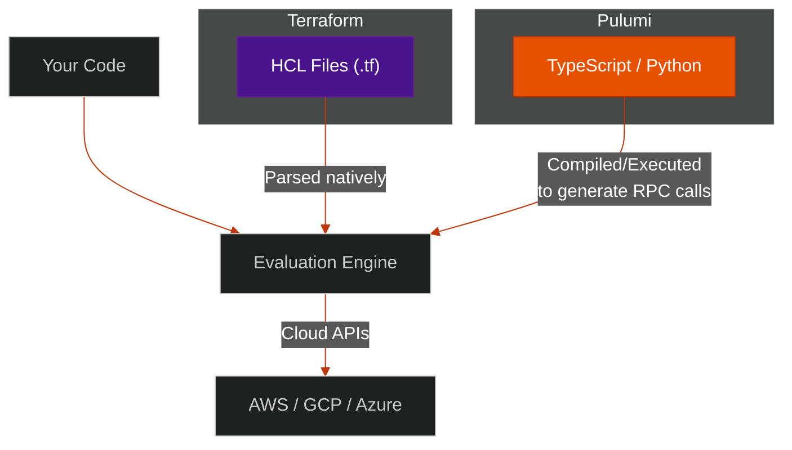

# 🚀 Pulumi — Code-First Infrastructure

> **Series:** DevOps › Infrastructure as Code · **Level:** Intermediate · **Read Time:** ~8 min

---

## 📖 Table of Contents

- [1. What Is Pulumi?](#1-what-is-pulumi)
- [2. Terraform vs Pulumi](#2-terraform-vs-pulumi)
- [3. Code Example (TypeScript)](#3-code-example-typescript)
- [4. The Power of Real Code](#4-the-power-of-real-code)
- [5. State Management](#5-state-management)
- [6. When to Choose Pulumi](#6-when-to-choose-pulumi)

---

## 1. What Is Pulumi?

**Pulumi** is a modern Infrastructure as Code platform that allows you to define cloud resources using **general-purpose programming languages** like TypeScript, Python, Go, C#, and Java, rather than a domain-specific language like Terraform's HCL or AWS's YAML.

Pulumi bridges the gap between application developers (who know TypeScript/Python) and infrastructure (which traditionally required learning specialized tooling).

---

## 2. Terraform vs Pulumi



Both tools use a state file. Both tools calculate a "plan" before applying. The primary difference is the **authoring experience**. 

Under the hood, Pulumi actually uses "Terraform Providers" to talk to the cloud. They built a bridge that allows Python/TypeScript to execute Terraform-compatible API calls.

---

## 3. Code Example (TypeScript)

Here is how you create an AWS S3 bucket and an EC2 instance in Pulumi using TypeScript:

```typescript
import * as aws from "@pulumi/aws";
import * as pulumi from "@pulumi/pulumi";

// 1. Create an S3 Bucket
const bucket = new aws.s3.Bucket("my-app-assets");

// 2. Look up the latest Amazon Linux AMI
const ami = aws.ec2.getAmiOutput({
    mostRecent: true,
    owners: ["amazon"],
    filters: [{ name: "name", values: ["amzn2-ami-hvm-*"] }],
});

// 3. Create an EC2 instance
const server = new aws.ec2.Instance("web-server", {
    instanceType: "t3.micro",
    ami: ami.id,
    tags: { Name: "WebServer" }
});

// 4. Export the Bucket URL and Server IP so we can see them after deployment
export const bucketName = bucket.id;
export const serverIp = server.publicIp;
```

---

## 4. The Power of Real Code

Why use TypeScript over Terraform's HCL?

### A. Standard Control Flow (Loops & If-Statements)
In Terraform, looping over arrays requires learning specific syntax (`count`, `for_each`, `dynamic` blocks). In Pulumi, you just use a standard `for` loop:

```typescript
const environments = ["dev", "staging", "prod"];

for (const env of environments) {
    new aws.s3.Bucket(`assets-${env}`);
}
```

### B. Standard Testing (Jest / PyTest)
Because Pulumi is just TypeScript, you can use `Jest` to write unit tests for your infrastructure. You can literally mock the cloud and assert that "No S3 bucket should have public read access enabled."

### C. Superior Abstractions (Classes)
You can create a `SecureVPC` class that automatically bundles a VPC, Subnets, Internet Gateway, and Route Tables. Developers just instantiate `new SecureVPC("my-vpc")` without worrying about the underlying 20 resources.

---

## 5. State Management

Like Terraform, Pulumi uses a state file to track what it has built.

1. **Pulumi Cloud (Default):** A fully managed SaaS product by Pulumi. It stores your state, provides a beautiful web UI to see deployment history, and manages concurrency locks. (Free for individuals, paid for teams).
2. **Self-Managed (S3 / GCS):** You can opt out of Pulumi Cloud and tell Pulumi to store the state file in your own AWS S3 bucket, just like Terraform.

---

## 6. When to Choose Pulumi

| Scenario | Recommendation |
| :--- | :--- |
| **Team of Software Engineers** | ✅ Pulumi (Leverages existing TS/Python skills) |
| **Complex infrastructure logic** | ✅ Pulumi (Classes, loops, interfaces) |
| **Looking for DevOps hires** | ❌ Terraform (90% of DevOps market knows TF) |
| **Need maximum open-source purity**| ❌ OpenTofu |
| **Using AWS only (no cross-cloud)** | ⚠️ Consider AWS CDK as an alternative to Pulumi |

> [!TIP]
> If your company has distinct "Developers" and "DevOps Ops" teams, Terraform is usually the safe bet. If your company practices "You build it, you run it," where developers provision their own infrastructure, Pulumi provides a much smoother developer experience.

---

*← [Terraform & OpenTofu](./02-terraform-opentofu.md) · Next: [Ansible](./04-ansible.md) →*

## Related

- [CI/CD Pipelines](../cicd-pipelines/README.md)
- [Container Orchestration](../container-orchestration/README.md)
- [Observability & Monitoring](../observability/README.md)
