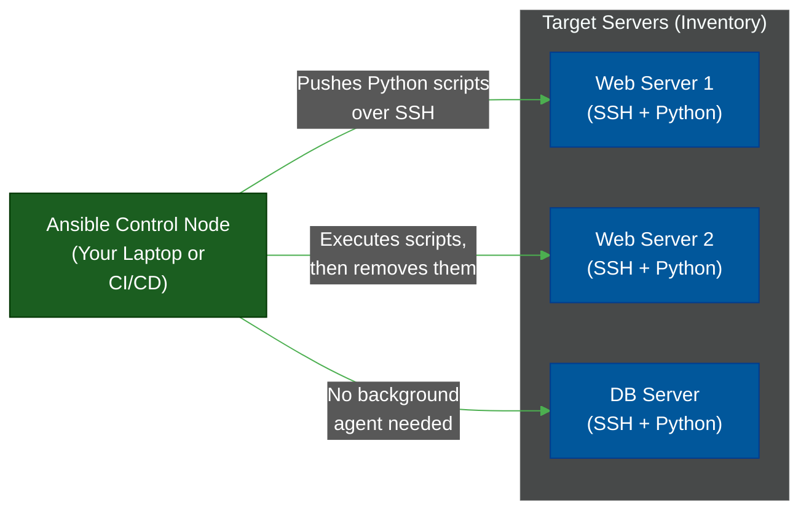

# ⚙️ Ansible — Configuration Management

> **Series:** DevOps › Infrastructure as Code · **Level:** Intermediate · **Read Time:** ~8 min

---

## 📖 Table of Contents

- [1. Configuration Management vs Provisioning](#1-configuration-management-vs-provisioning)
- [2. What Is Ansible?](#2-what-is-ansible)
- [3. How Ansible Works (Agentless)](#3-how-ansible-works-agentless)
- [4. Playbooks & Roles](#4-playbooks-roles)
- [5. When to Use Ansible Today](#5-when-to-use-ansible-today)

---

## 1. Configuration Management vs Provisioning

If **Terraform** is the tool that *buys* the house (creates the EC2 server, assigns the IP address, attaches the hard drive), then **Ansible** is the tool that *furnishes* the house (installs Nginx, copies the website files, starts the database service).

Terraform provisions **immutable infrastructure**. Ansible provisions **mutable configuration**.

---

## 2. What Is Ansible?

**Ansible** (owned by Red Hat) is an open-source IT automation engine that automates cloud provisioning, configuration management, application deployment, and intra-service orchestration.

It uses **YAML** to describe automation jobs (called "Playbooks").

**Key Competitors:** Chef, Puppet, SaltStack.

---

## 3. How Ansible Works (Agentless)

The most defining feature of Ansible compared to Chef or Puppet is that it is **Agentless**.

You do not need to install an "Ansible Agent" background daemon on your web servers. Ansible simply requires **SSH** (for Linux) or **WinRM** (for Windows) and Python installed on the target machine.



When you run an Ansible playbook, the Control Node generates a small Python script, SSHes into the target server, executes the script to apply the configuration, and then deletes the script.

---

## 4. Playbooks & Roles

Ansible code is structured into **Playbooks** (YAML files).

### An Example Playbook
This playbook connects to all `webservers`, installs Nginx, copies an HTML file, and ensures the service is running.

```yaml
---
- name: Setup Web Servers
  hosts: webservers
  become: yes  # Run as root (sudo)

  tasks:
    - name: Ensure Nginx is installed
      apt:
        name: nginx
        state: present
        update_cache: yes

    - name: Copy custom index.html
      copy:
        src: ./files/index.html
        dest: /var/www/html/index.html
        mode: '0644'

    - name: Ensure Nginx is running and enabled on boot
      service:
        name: nginx
        state: started
        enabled: yes
```

### Idempotency
Notice the `state: present` and `state: started`. Ansible is **idempotent**. If you run this playbook 10 times, it will only install Nginx the first time. On the next 9 runs, it checks if Nginx is already installed and, if so, does nothing (returns `ok`).

---

## 5. When to Use Ansible Today

With the rise of **Docker** and **Kubernetes**, the need for Configuration Management has drastically decreased. Today, instead of booting an empty Ubuntu server and using Ansible to install Node.js and pull code, we simply build a Docker container that already contains everything.

| Use Case | Ansible Relevance | Modern Alternative |
| :--- | :--- | :--- |
| **Application Deployment** | ⚠️ Declining | Docker / Kubernetes |
| **Bare-Metal / On-Premise** | ✅ Highly Relevant | N/A |
| **Building AMI / VM Images** | ✅ Very Popular | Packer + Ansible |
| **Network Automation** | ✅ Excellent | (Managing Cisco routers over SSH) |

> [!TIP]
> The most modern way to use Ansible is alongside **Packer**. You use Packer to spin up a temporary AWS VM, use Ansible to configure it (install dependencies), and then use Packer to save that VM as an **AMI (Amazon Machine Image)**. You then use Terraform to deploy that pre-configured AMI. This ensures your production servers boot instantly without running configuration scripts at startup.

---

*← [Pulumi](./03-pulumi.md) · [Back to Series Overview](./README.md) →*

## Related

- [CI/CD Pipelines](../cicd-pipelines/README.md)
- [Container Orchestration](../container-orchestration/README.md)
- [Observability & Monitoring](../observability/README.md)
