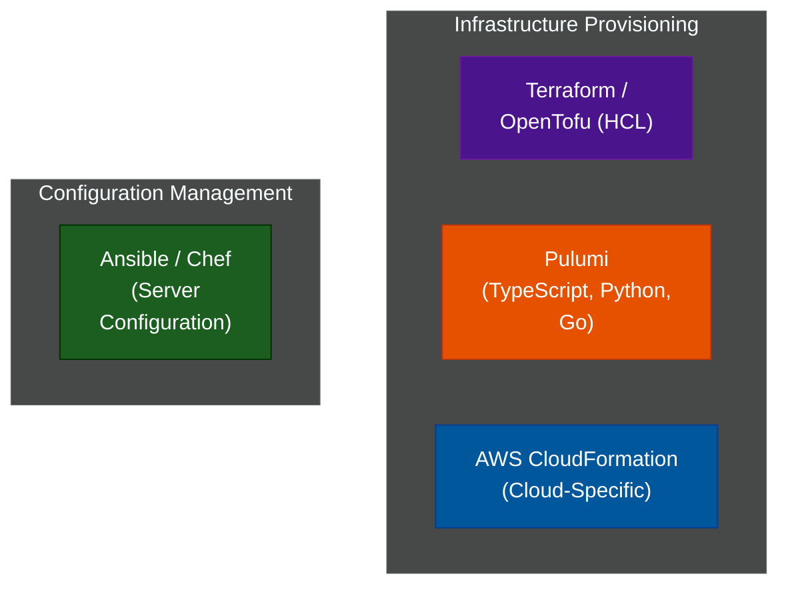

# 🏗️ Infrastructure as Code (IaC)

A comprehensive series exploring how to provision, manage, and version-control cloud infrastructure using code rather than clicking through web consoles.

---

## 📖 Table of Contents

- [What Is Infrastructure as Code?](#what-is-infrastructure-as-code)
- [📚 Module Index](#module-index)
- [The IaC Landscape](#the-iac-landscape)

---

## What Is Infrastructure as Code?

Infrastructure as Code (IaC) is the practice of managing and provisioning computing data centers through machine-readable definition files, rather than physical hardware configuration or interactive configuration tools (like the AWS Web Console).

**Why use IaC?**
1. **Reproducibility:** You can destroy an entire environment and recreate an identical one from scratch in minutes.
2. **Version Control:** Infrastructure changes go through the same Git pull-request review process as application code.
3. **Drift Detection:** Tools can detect if someone manually changed a setting in the cloud console that deviates from the code.

---

## 📚 Module Index

| Module | Title | Level | Read Time | Key Topics |
| :--- | :--- | :--- | :--- | :--- |
| **01** | [IaC Comparison Matrix](./01-iac-comparison.md) | Reference | ~12 min | Terraform, OpenTofu, Pulumi, CloudFormation, Ansible |
| **02** | [Terraform & OpenTofu](./02-terraform-opentofu.md) | Intermediate | ~10 min | HCL, State files, Provisioning, Drift |
| **03** | [Pulumi — Code-First IaC](./03-pulumi.md) | Intermediate | ~8 min | TypeScript, Real code abstraction, vs Terraform |
| **04** | [Ansible — Configuration Mgmt](./04-ansible.md) | Intermediate | ~8 min | Agentless, Playbooks, Idempotency, Mutable |

---

## The IaC Landscape

