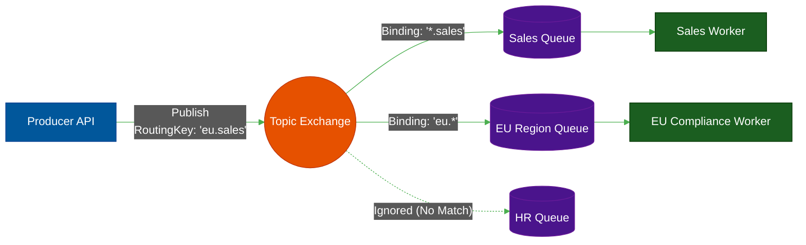

# 🐇 Message Queues (RabbitMQ)

> **Series:** DevOps › Message Brokers & Integration · **Level:** Intermediate · **Read Time:** ~10 min

---

## 📖 Table of Contents

- [1. What Is a Message Broker?](#1-what-is-a-message-broker)
- [2. The Push Architecture (Smart Broker / Dumb Consumer)](#2-the-push-architecture-smart-broker-dumb-consumer)
- [3. RabbitMQ & The AMQP Standard](#3-rabbitmq-the-amqp-standard)
- [4. Exchanges, Routing Keys, and Queues](#4-exchanges-routing-keys-and-queues)
- [5. RabbitMQ vs AWS SQS](#5-rabbitmq-vs-aws-sqs)

---

## 1. What Is a Message Broker?

A **Message Broker** is a dedicated server that temporarily stores messages between applications. It guarantees that if an application crashes while processing a job, the job is not lost forever.

Common use cases:
- Sending password reset emails (the web server puts the job in a queue and instantly returns the webpage; a background worker processes the queue and talks to the slow SMTP server).
- Image processing (resizing user uploads into thumbnails).
- Distributing financial transactions.

---

## 2. The Push Architecture (Smart Broker / Dumb Consumer)

Traditional message brokers like **RabbitMQ** or **ActiveMQ** use a **"Push"** model. 

1. **Smart Broker:** The broker keeps track of exactly which consumer has read which message.
2. **Acknowledgment (ACK):** When a consumer receives a message, it works on it. When finished, it sends an `ACK` to the broker.
3. **Deletion:** As soon as the broker receives the `ACK`, it physically deletes the message from the queue forever.

If the consumer crashes before sending the `ACK`, the smart broker notices the connection died, puts the message back in the queue, and pushes it to a different consumer.

---

## 3. RabbitMQ & The AMQP Standard

**RabbitMQ** is the most popular open-source message broker. It was built using Erlang (a language designed for telecom switches, making it incredibly resilient).

It strictly follows **AMQP (Advanced Message Queuing Protocol)**. Unlike a simple Redis list, AMQP provides an incredibly rich, complex routing system built right into the broker.

---

## 4. Exchanges, Routing Keys, and Queues

In RabbitMQ, producers **never** send messages directly to a Queue. They send messages to an **Exchange**.

1. **Exchange:** Receives the message and looks at the routing rules.
2. **Binding:** A rule that connects an Exchange to a Queue (e.g., "If the message is about sales, copy it into this queue").
3. **Queue:** The physical buffer that stores the message until a consumer reads it.

This means a single message published by a producer can be intelligently duplicated and routed to 5 different microservices simultaneously without the producer knowing who is listening.

---

## 5. RabbitMQ vs AWS SQS

| Feature | RabbitMQ | AWS SQS |
| :--- | :--- | :--- |
| **Hosting** | Self-Hosted / Managed SaaS | AWS Fully Managed Cloud |
| **Routing** | Extremely complex (Exchanges, Topics) | None (It is literally just a queue) |
| **Latency** | Sub-millisecond | Variable (Cloud network overhead) |
| **Pricing** | Free (Pay for your own servers) | Pay-per-request (Extremely cheap at low volume) |

> **Recommendation:** If you are fully deployed in AWS and just need a simple background job queue, use **AWS SQS** + **AWS SNS** (for fan-out routing). It requires zero maintenance. If you have complex, on-premise microservices that require sub-millisecond, highly intelligent message routing, use **RabbitMQ**.

---

*← [Apache Camel](./01-enterprise-integration-camel.md) · Next: [Event Streaming (Kafka)](./03-event-streaming-kafka.md) →*

## Related

- [Distributed Architecture Patterns](../../clean-code/software-architecture/distributed-patterns/README.md)
- [API Gateways & Reverse Proxies](../api-gateways/README.md)
- [Observability & Monitoring](../observability/README.md)
