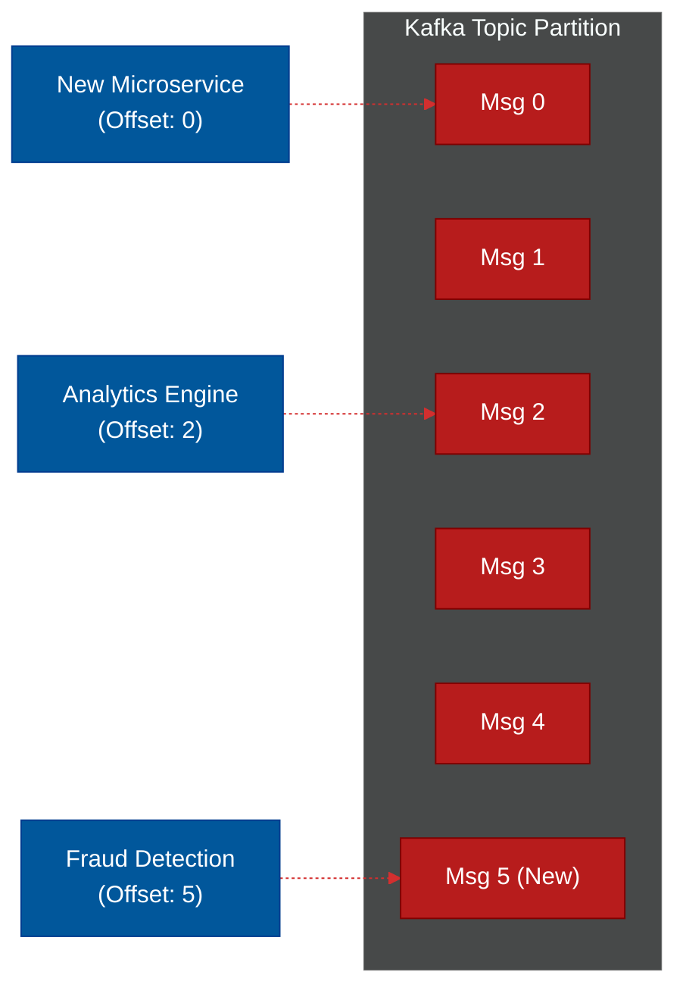

# ⚡ Event Streaming (Apache Kafka)

> **Series:** DevOps › Message Brokers & Integration · **Level:** Advanced · **Read Time:** ~12 min

---

## 📖 Table of Contents

- [1. What Is Event Streaming?](#1-what-is-event-streaming)
- [2. The Pull Architecture (Dumb Broker / Smart Consumer)](#2-the-pull-architecture-dumb-broker-smart-consumer)
- [3. The Immutable Log](#3-the-immutable-log)
- [4. Event Sourcing Paradigm](#4-event-sourcing-paradigm)
- [5. Kafka vs RabbitMQ](#5-kafka-vs-rabbitmq)

---

## 1. What Is Event Streaming?

While RabbitMQ was built for moving "Jobs" (like sending an email), **Apache Kafka** was built by LinkedIn to move massive, continuous "Streams of Reality" (like tracking every single mouse click of 500 million users in real-time).

Kafka is not a queue; it is a **Distributed Commit Log**.

---

## 2. The Pull Architecture (Dumb Broker / Smart Consumer)

Kafka flips the RabbitMQ architecture upside down.

1. **Dumb Broker:** Kafka does not care who reads a message. It does not wait for an `ACK`. It does not delete messages when they are read. It just appends messages to a disk as fast as possible.
2. **Smart Consumer:** The consumer is responsible for remembering its **Offset** (e.g., "I am currently reading message #4,002"). The consumer constantly *pulls* from Kafka.

If a consumer crashes, it wakes back up, checks its database, says "I was on message #4,002", and asks Kafka for message #4,003. 

---

## 3. The Immutable Log

Because Kafka doesn't delete messages when read, messages stay on disk until a retention policy is hit (e.g., "Delete messages older than 7 days").

**The Superpower:** Because the messages are still on disk, you can introduce a brand new microservice today, point it at offset 0, and **replay history**. It can read every event that happened over the last 7 days and build its own database from scratch!

---

## 4. Event Sourcing Paradigm

Kafka enables **Event Sourcing**, an architectural pattern where the database does not store the "Current State" of an object, but instead stores an immutable log of every *action* that ever happened to the object.

Think of a Bank Account:
- **Traditional SQL (State):** `Balance = $50`
- **Event Sourcing (Kafka):** `[Deposit $100] -> [Withdraw $20] -> [Withdraw $30]`. 

If you want the current balance, you sum up the events. If you discover a bug in your withdrawal logic, you fix the bug and replay the entire history to calculate the correct balance.

---

## 5. Kafka vs RabbitMQ

| Feature | RabbitMQ (Message Queue) | Apache Kafka (Event Stream) |
| :--- | :--- | :--- |
| **Model** | Push to Consumer | Consumer Pulls |
| **Persistence** | Messages deleted after `ACK` | Messages kept for X days (Immutable) |
| **Replayability** | Impossible (Data is gone) | Native (Just reset the consumer offset) |
| **Throughput** | ~50K messages per second | ~Millions of messages per second |
| **Complexity** | Easy to manage | Extremely complex (Requires Zookeeper/KRaft) |

### Strategic Recommendation
- **Use RabbitMQ** for background tasks, email sending, PDF generation, or microservice communication where you want the message to disappear once it is processed successfully.
- **Use Kafka** for real-time analytics, logging, tracking user behavior, or building Event Sourced architectures where multiple independent microservices need to read the exact same massive stream of historical data at their own pace.

---

*← [Message Queues (RabbitMQ)](./02-message-queues-rabbitmq.md) · [Back to Series Overview](./README.md) →*

## Related

- [Distributed Architecture Patterns](../../clean-code/software-architecture/distributed-patterns/README.md)
- [API Gateways & Reverse Proxies](../api-gateways/README.md)
- [Observability & Monitoring](../observability/README.md)
