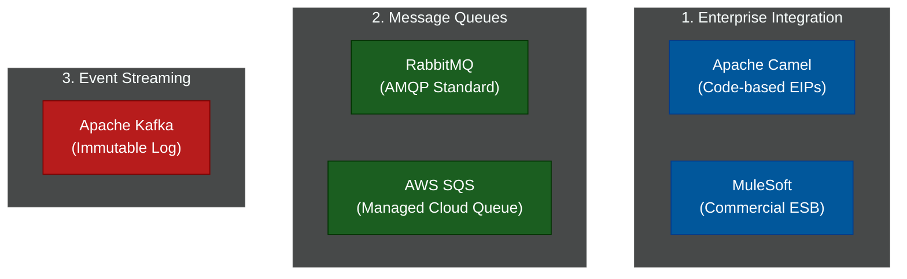

# 📨 Message Brokers & Integration

A comprehensive series exploring how distributed systems, microservices, and legacy mainframes securely and reliably exchange data using message queues, event streams, and Enterprise Integration Patterns.

---

## 📖 Table of Contents

- [The Need for Asynchronous Communication](#the-need-for-asynchronous-communication)
- [📚 Module Index](#module-index)
- [The Integration Landscape](#the-integration-landscape)

---

## The Need for Asynchronous Communication

If Service A needs to send data to Service B, it could just make a synchronous HTTP REST call. However, if Service B is offline or overwhelmed with traffic, the HTTP call fails, and data is lost. 

To solve this, we introduce **Middleware** (Brokers, Queues, and ESBs). Service A instantly writes the message to the Middleware and forgets about it. The Middleware holds the message safely on disk until Service B is online and ready to process it. This guarantees delivery and entirely decouples the services.

---

## 📚 Module Index

| Module | Title | Level | Read Time | Key Topics |
| :--- | :--- | :--- | :--- | :--- |
| **01** | [Enterprise Integration (Apache Camel)](#) | Advanced | ~10 min | EIPs, ESBs, Camel, MuleSoft, Routing |
| **02** | [Message Queues (RabbitMQ)](#) | Intermediate | ~10 min | AMQP, Exchanges, Dead Letter Queues |
| **03** | [Event Streaming (Apache Kafka)](#) | Advanced | ~12 min | Distributed logs, Event Sourcing, Real-time |

---

## The Integration Landscape

