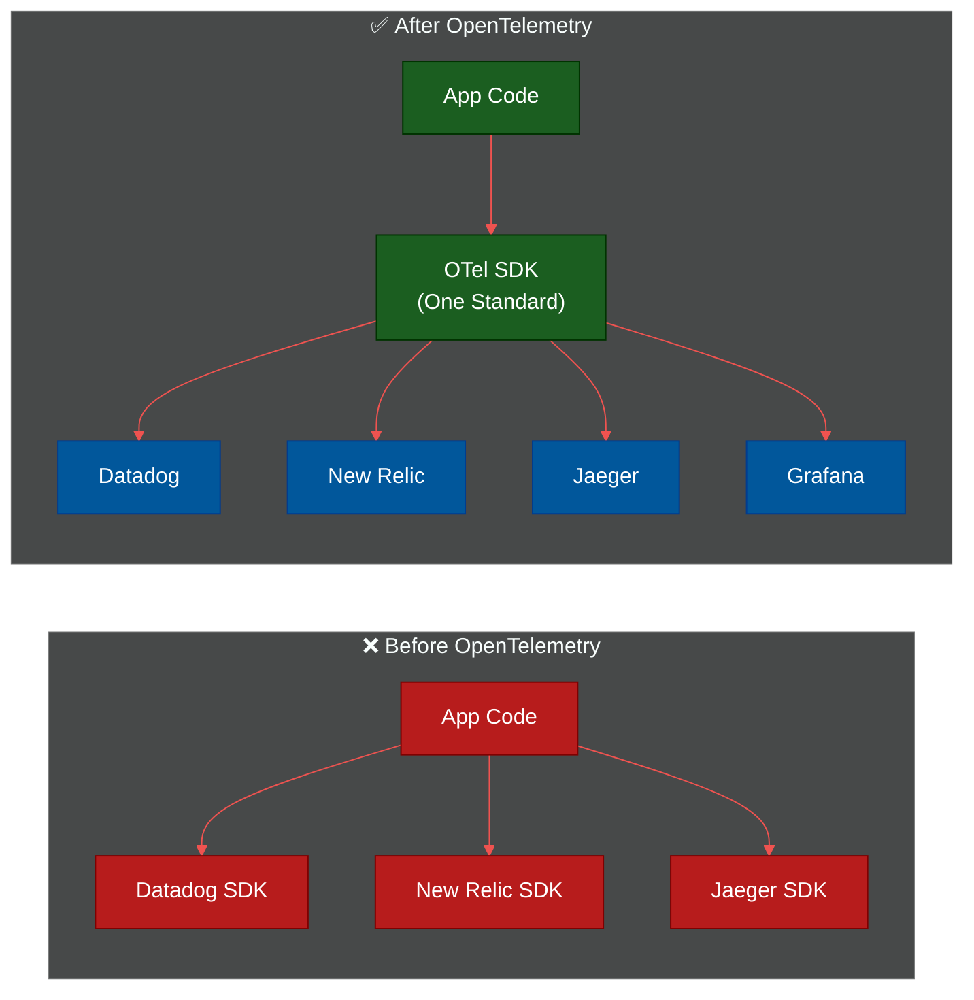
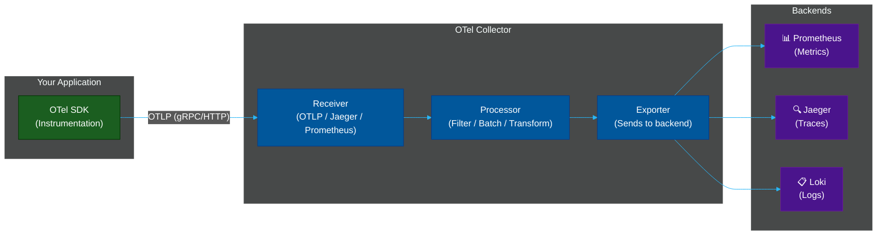

# 🧩 OpenTelemetry — The Universal Instrumentation Standard

> **Series:** Observability Engineering › Pillar 1 — Instrumentation & Collection
> **Level:** Intermediate · **Read Time:** ~12 min

---

## 📖 Table of Contents

- [🧩 OpenTelemetry — The Universal Instrumentation Standard](#opentelemetry-the-universal-instrumentation-standard)
  - [📖 Table of Contents](#table-of-contents)
  - [1. What Is OpenTelemetry?](#1-what-is-opentelemetry)
  - [2. The Problem It Solves](#2-the-problem-it-solves)
  - [3. Core Architecture](#3-core-architecture)
  - [4. The Three Signals](#4-the-three-signals)
    - [4.1 Traces](#41-traces)
    - [4.2 Metrics](#42-metrics)
    - [4.3 Logs](#43-logs)
  - [5. The Collector — The Central Hub](#5-the-collector-the-central-hub)
  - [6. Auto-Instrumentation vs Manual](#6-auto-instrumentation-vs-manual)
  - [7. Supported Languages](#7-supported-languages)
  - [8. Quick Start Example (Java)](#8-quick-start-example-java)
  - [9. When to Use OpenTelemetry](#9-when-to-use-opentelemetry)
  - [10. Key Takeaways](#10-key-takeaways)

---

## 1. What Is OpenTelemetry?

**OpenTelemetry (OTel)** is a **vendor-neutral, open-source observability framework** for generating, collecting, and exporting telemetry data — logs, metrics, and traces — from your applications.

It is a **CNCF (Cloud Native Computing Foundation)** graduated project and has become the **de facto industry standard** for instrumenting distributed systems. It was formed by the merger of **OpenCensus** (Google) and **OpenTracing** (Uber/CNCF) in 2019.

> **The core promise:** Instrument your application **once**, and route the data to **any** backend (Jaeger, Prometheus, Datadog, Grafana, New Relic, etc.) without changing your code.

---

## 2. The Problem It Solves

Before OpenTelemetry, each observability vendor provided its own proprietary SDK. Switching vendors meant **rewriting all your instrumentation code**.



---

## 3. Core Architecture

OpenTelemetry has three main components:



| Component | Role |
| :--- | :--- |
| **API** | Language-specific interfaces for instrumentation (spans, metrics, baggage) |
| **SDK** | Concrete implementation of the API with configuration, sampling, and export |
| **Collector** | A standalone proxy/pipeline that receives, processes, and exports telemetry |

---

## 4. The Three Signals

### 4.1 Traces

A **trace** is the end-to-end journey of a single request through your system.

```
Trace ID: abc123
├── Span: API Gateway (200ms)
│   ├── Span: Auth Service (15ms)
│   ├── Span: Order Service (170ms)
│   │   ├── Span: DB Query (120ms) ← slow!
│   │   └── Span: Cache Write (20ms)
│   └── Span: Notification Service (10ms)
```

Key concepts:
- **Trace** — the full journey (has a unique Trace ID)
- **Span** — one unit of work within a trace (has a Span ID + Parent Span ID)
- **Context Propagation** — passing Trace IDs across service boundaries via HTTP headers (`traceparent`)

### 4.2 Metrics

**Metrics** are numerical measurements sampled over time.

| Metric Type | Description | Example |
| :--- | :--- | :--- |
| `Counter` | Monotonically increasing count | `http_requests_total` |
| `Gauge` | Point-in-time value | `cpu_usage_percent` |
| `Histogram` | Distribution of values in buckets | `http_request_duration_ms` |
| `Summary` | Pre-computed quantiles | `p99 latency` |

### 4.3 Logs

OTel **Logs** are structured, contextual event records that are automatically **correlated with trace and span IDs**, making it possible to jump from a log line directly to the trace that produced it.

```json
{
  "timestamp": "2026-05-17T11:10:24Z",
  "severity": "ERROR",
  "body": "Order payment failed",
  "attributes": {
    "trace_id": "abc123",
    "span_id":  "def456",
    "service":  "order-service",
    "user_id":  "usr_9981"
  }
}
```

---

## 5. The Collector — The Central Hub

The **OTel Collector** is a standalone binary that acts as a central telemetry pipeline. It decouples your application from your backends.

```yaml
# otel-collector.yaml
receivers:
  otlp:
    protocols:
      grpc:
        endpoint: 0.0.0.0:4317
      http:
        endpoint: 0.0.0.0:4318

processors:
  batch:
    timeout: 5s
  filter/drop_health:
    spans:
      exclude:
        match_type: strict
        attributes:
          - key: http.route
            value: /health

exporters:
  prometheus:
    endpoint: "0.0.0.0:8889"
  jaeger:
    endpoint: "jaeger:14250"
  loki:
    endpoint: "http://loki:3100/loki/api/v1/push"

service:
  pipelines:
    traces:
      receivers: [otlp]
      processors: [batch]
      exporters: [jaeger]
    metrics:
      receivers: [otlp]
      processors: [batch]
      exporters: [prometheus]
    logs:
      receivers: [otlp]
      processors: [batch, filter/drop_health]
      exporters: [loki]
```

---

## 6. Auto-Instrumentation vs Manual

| Approach | How | Best For |
| :--- | :--- | :--- |
| **Auto-Instrumentation** | Java agent / Python monkey-patching / Node.js `--require` | Quick wins, no code changes, frameworks (Spring, Express, Django) |
| **Manual Instrumentation** | Using the OTel SDK API directly | Custom business logic spans, high-precision control |
| **Hybrid** | Auto for framework, manual for business logic | Production-grade microservices |

**Auto-instrumentation (Java):**
```bash
java -javaagent:opentelemetry-javaagent.jar \
     -Dotel.service.name=order-service \
     -Dotel.exporter.otlp.endpoint=http://otel-collector:4317 \
     -jar order-service.jar
```

---

## 7. Supported Languages

| Language | Status | Auto-Instrumentation |
| :--- | :--- | :--- |
| **Java** | ✅ Stable | ✅ Yes (Java agent) |
| **Go** | ✅ Stable | ✅ Partial |
| **Python** | ✅ Stable | ✅ Yes |
| **Node.js** | ✅ Stable | ✅ Yes |
| **Rust** | ✅ Stable | ⚠️ Limited |
| **PHP** | ✅ Stable | ✅ Yes |
| **Ruby** | ✅ Stable | ✅ Yes |
| **.NET** | ✅ Stable | ✅ Yes |

---

## 8. Quick Start Example (Java)

```java
// 1. Add dependency (build.gradle)
implementation("io.opentelemetry:opentelemetry-api:1.36.0")
implementation("io.opentelemetry:opentelemetry-sdk:1.36.0")
implementation("io.opentelemetry:opentelemetry-exporter-otlp:1.36.0")

// 2. Initialize SDK
OpenTelemetrySdk sdk = OpenTelemetrySdk.builder()
    .setTracerProvider(
        SdkTracerProvider.builder()
            .addSpanProcessor(BatchSpanProcessor.builder(
                OtlpGrpcSpanExporter.builder()
                    .setEndpoint("http://otel-collector:4317")
                    .build()
            ).build())
            .build()
    )
    .build();

// 3. Create spans
Tracer tracer = sdk.getTracer("order-service");

Span span = tracer.spanBuilder("processOrder")
    .setAttribute("order.id", orderId)
    .setAttribute("user.id", userId)
    .startSpan();

try (Scope scope = span.makeCurrent()) {
    // your business logic
    processPayment(orderId);
} catch (Exception e) {
    span.recordException(e);
    span.setStatus(StatusCode.ERROR, e.getMessage());
} finally {
    span.end();
}
```

---

## 9. When to Use OpenTelemetry

| Scenario | Recommendation |
| :--- | :--- |
| Greenfield microservices | ✅ Always — instrument from Day 1 |
| Migrating from proprietary SDK | ✅ Migrate gradually, service by service |
| Monolith with one backend | ⚠️ Fine to skip; revisit when scaling |
| Multi-cloud / hybrid | ✅ Essential for unified visibility |
| Considering switching backends | ✅ OTel protects your instrumentation investment |

---

## 10. Key Takeaways

> [!IMPORTANT]
> OpenTelemetry is not a backend — it is a **collection and instrumentation framework**. You still need a backend (Jaeger, Prometheus, Loki, Datadog, etc.) to store and query the data.

> [!TIP]
> Start with **auto-instrumentation** to get 80% of the value with 0% code changes. Add **manual spans** only for business-critical code paths where you need precise context.

> [!NOTE]
> The OTel Collector is optional but **strongly recommended** for production — it decouples your app from your backend, enables batching, filtering, and allows you to swap backends without any code changes.

---

*← Previous: [Observability Overview](./README.md) · Next: [Agents, Collectors & Sidecars](./02-agents-and-collectors.md) →*

## Related

- [Network Protocols & API Architectures](../fundamentals/01-network-protocols-and-api-architectures.md)
- [API Gateways & Reverse Proxies](../api-gateways/README.md)
- [Error Tracking](../error-tracking/README.md)
- [Enterprise Security](../../security/README.md)
