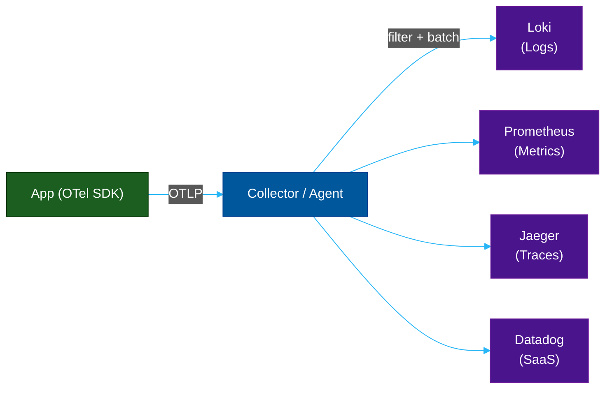
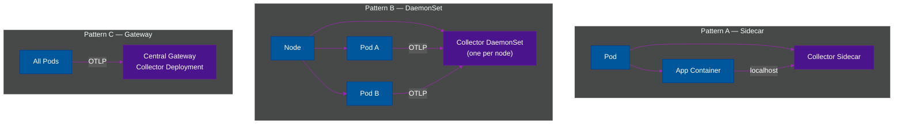

# 🧩 Agents, Collectors & Sidecars — Telemetry Collection Patterns

> **Series:** Observability Engineering › Pillar 1 — Instrumentation & Collection · **Level:** Advanced · **Read Time:** ~10 min

---

## 📖 Table of Contents

- [1. Why You Need a Collection Layer](#1-why-you-need-a-collection-layer)
- [2. The Three Patterns](#2-the-three-patterns)
- [3. OTel Collector — The Universal Hub](#3-otel-collector-the-universal-hub)
- [4. Grafana Alloy — The Modern Agent](#4-grafana-alloy-the-modern-agent)
- [5. Fluent Bit — Lightweight Log Shipper](#5-fluent-bit-lightweight-log-shipper)
- [6. Filebeat — Elastic's Log Shipper](#6-filebeat-elastics-log-shipper)
- [7. Sidecar vs DaemonSet vs Gateway](#7-sidecar-vs-daemonset-vs-gateway)
- [8. Agent Comparison Matrix](#8-agent-comparison-matrix)

---

## 1. Why You Need a Collection Layer

Instrumenting your application with an OTel SDK is only half the job. You still need to **route, buffer, filter, and forward** that telemetry to one or more backends. Doing this directly in your application creates tight coupling — if the backend is slow or down, your app suffers.

A **collection layer** decouples your application from its backends:



**Benefits of a collection layer:**
- **Buffering** — absorbs bursts; retries on backend failures
- **Filtering** — drop health-check spans, sample traces, redact PII
- **Fan-out** — send data to multiple backends simultaneously
- **Protocol translation** — receive OTLP, export as Prometheus/Jaeger/etc.
- **Decoupling** — swap backends without touching application code

---

## 2. The Three Patterns



| Pattern | Resource use | Isolation | Best For |
| :--- | :--- | :--- | :--- |
| **Sidecar** | High (one collector per pod) | Strongest | Multi-tenant, per-service config |
| **DaemonSet** | Medium (one per node) | Good | Standard Kubernetes setup |
| **Gateway** | Low (shared) | Weakest | Centralized filtering + fan-out |

> [!TIP]
> The **recommended production pattern** is **DaemonSet** (for collection) + **Gateway** (for central fan-out and backend routing). This balances resource efficiency with flexibility.

---

## 3. OTel Collector — The Universal Hub

The **OpenTelemetry Collector** is the most flexible collection component. It is built around a pipeline of **Receivers → Processors → Exporters**.

```yaml
# otel-collector-config.yaml
receivers:
  otlp:
    protocols:
      grpc:  { endpoint: "0.0.0.0:4317" }
      http:  { endpoint: "0.0.0.0:4318" }
  prometheus:
    config:
      scrape_configs:
        - job_name: "otel-collector"
          static_configs:
            - targets: ["localhost:8888"]

processors:
  batch:
    timeout: 5s
    send_batch_size: 1000
  memory_limiter:
    limit_mib: 512
  filter/drop_healthchecks:
    spans:
      exclude:
        match_type: strict
        attributes:
          - key: http.route
            value: /health
  resourcedetection:
    detectors: [env, system, docker]

exporters:
  loki:
    endpoint: "http://loki:3100/loki/api/v1/push"
  prometheusremotewrite:
    endpoint: "http://mimir:9090/api/v1/push"
  otlp/tempo:
    endpoint: "tempo:4317"
    tls: { insecure: true }
  datadog:
    api:
      key: "${DD_API_KEY}"

service:
  pipelines:
    logs:
      receivers:  [otlp]
      processors: [memory_limiter, batch, filter/drop_healthchecks]
      exporters:  [loki]
    metrics:
      receivers:  [otlp, prometheus]
      processors: [memory_limiter, resourcedetection, batch]
      exporters:  [prometheusremotewrite]
    traces:
      receivers:  [otlp]
      processors: [memory_limiter, batch]
      exporters:  [otlp/tempo, datadog]
```

---

## 4. Grafana Alloy — The Modern Agent

**Grafana Alloy** is the modern successor to **Promtail**, **Grafana Agent**, and **Agent Flow**. It is a single binary that can collect **logs, metrics, and traces** using a declarative River configuration language, with native OTel support.

```hcl
// alloy-config.alloy

// Collect logs from Kubernetes pods
loki.source.kubernetes "pods" {
  targets    = discovery.kubernetes.pods.targets
  forward_to = [loki.write.default.receiver]
}

// Write logs to Loki
loki.write "default" {
  endpoint {
    url = "http://loki:3100/loki/api/v1/push"
  }
}

// Receive OTLP traces
otelcol.receiver.otlp "default" {
  grpc { endpoint = "0.0.0.0:4317" }
  output {
    traces = [otelcol.exporter.otlp.tempo.input]
  }
}

// Forward traces to Tempo
otelcol.exporter.otlp "tempo" {
  client {
    endpoint = "tempo:4317"
    tls { insecure = true }
  }
}
```

**Why Alloy over Promtail?**
- Single agent for logs + metrics + traces (replaces 3 agents)
- Native OTel receiver/exporter support
- Kubernetes autodiscovery built-in
- UI for pipeline visualization

---

## 5. Fluent Bit — Lightweight Log Shipper

**Fluent Bit** is a **ultra-lightweight** (< 1 MB binary) log processor and forwarder, written in C. It is the preferred log shipper for **Kubernetes DaemonSet** deployments.

```yaml
# fluent-bit-config.yaml
[SERVICE]
    Flush        1
    Log_Level    info
    Parsers_File parsers.conf

[INPUT]
    Name              tail
    Path              /var/log/containers/*.log
    multiline.parser  docker, cri
    Tag               kube.*
    Mem_Buf_Limit     5MB

[FILTER]
    Name                kubernetes
    Match               kube.*
    Kube_URL            https://kubernetes.default.svc:443
    Merge_Log           On
    Keep_Log            Off
    K8S-Logging.Parser  On

[OUTPUT]
    Name            loki
    Match           kube.*
    Host            loki
    Port            3100
    Labels          job=fluentbit, namespace=$kubernetes['namespace_name']
    Label_Keys      $kubernetes['pod_name'],$kubernetes['container_name']
    Auto_kubernetes_labels On
```

---

## 6. Filebeat — Elastic's Log Shipper

**Filebeat** is Elastic's lightweight log shipper, optimized for the ELK stack. It is part of the **Elastic Beats** family.

```yaml
# filebeat.yml
filebeat.inputs:
  - type: container
    paths:
      - /var/log/containers/*.log
    processors:
      - add_kubernetes_metadata:
          host: ${NODE_NAME}
          matchers:
            - logs_path:
                logs_path: "/var/log/containers/"

output.logstash:
  hosts: ["logstash:5044"]

# OR send directly to Elasticsearch
output.elasticsearch:
  hosts: ["https://elasticsearch:9200"]
  username: "elastic"
  password: "${ELASTIC_PASSWORD}"
  index: "filebeat-%{+yyyy.MM.dd}"
```

---

## 7. Sidecar vs DaemonSet vs Gateway

**When to use Sidecar:**
- You need per-service collector configuration
- Strong isolation between tenant data is required
- Each service has vastly different sampling or export requirements

**When to use DaemonSet (most common):**
- Standard Kubernetes cluster setup
- You want one collector per node (shares resources across pods)
- Collecting node-level metrics (CPU, memory, disk) alongside app telemetry

**When to use Gateway:**
- Central authentication / credential management for backends
- Global sampling decisions
- Fan-out to multiple backends (Loki + Datadog simultaneously)
- Tail-based sampling (needs all spans of a trace to decide)

---

## 8. Agent Comparison Matrix

| Agent | Language | Memory | Logs | Metrics | Traces | Best For |
| :--- | :--- | :--- | :--- | :--- | :--- | :--- |
| **OTel Collector** | Go | ~50–200 MB | ✅ | ✅ | ✅ | Universal, flexible pipelines |
| **Grafana Alloy** | Go | ~50–150 MB | ✅ | ✅ | ✅ | LGTM stack, modern replacement |
| **Fluent Bit** | C | ~1–10 MB | ✅ | ⚠️ | ❌ | Lightweight Kubernetes log shipping |
| **Fluentd** | Ruby | ~40–80 MB | ✅ | ⚠️ | ❌ | Rich plugin ecosystem |
| **Filebeat** | Go | ~20–60 MB | ✅ | ❌ | ❌ | ELK stack log shipping |
| **Promtail** | Go | ~30–80 MB | ✅ | ❌ | ❌ | Loki-only (legacy, use Alloy) |
| **Datadog Agent** | Go/Python | ~150–300 MB | ✅ | ✅ | ✅ | Datadog ecosystem |

> [!NOTE]
> For **new Kubernetes deployments**, the recommended stack is: **OTel Collector** (DaemonSet) for traces + metrics, and **Grafana Alloy** (DaemonSet) for logs — or use **Alloy alone** for all three signals.

---

*← [OpenTelemetry](./01-opentelemetry.md) · Next: [Grafana Loki](./03-grafana-loki.md) →*

## Related

- [Network Protocols & API Architectures](../fundamentals/01-network-protocols-and-api-architectures.md)
- [API Gateways & Reverse Proxies](../api-gateways/README.md)
- [Error Tracking](../error-tracking/README.md)
- [Enterprise Security](../../security/README.md)
