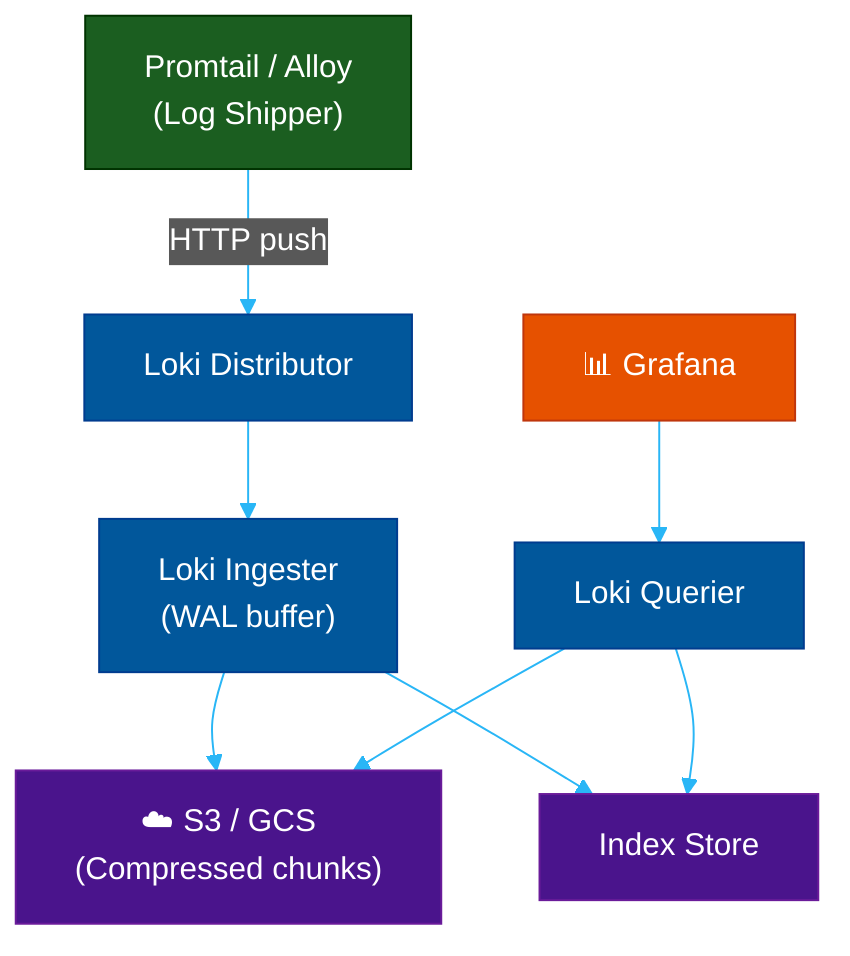

# 📋 Grafana Loki — Label-Based Log Aggregation

> **Series:** Observability Engineering › Pillar 2 — Logging · **Level:** Intermediate · **Read Time:** ~10 min

---

## 📖 Table of Contents

- [1. What Is Loki?](#1-what-is-loki)
- [2. How Loki Differs from Elasticsearch](#2-how-loki-differs-from-elasticsearch)
- [3. Core Architecture](#3-core-architecture)
- [4. The LGTM Stack](#4-the-lgtm-stack)
- [5. Labels — The Key Concept](#5-labels-the-key-concept)
- [6. LogQL — Querying Logs](#6-logql-querying-logs)
- [7. Deployment Modes](#7-deployment-modes)
- [8. Cost Comparison](#8-cost-comparison)
- [9. When to Use Loki](#9-when-to-use-loki)

---

## 1. What Is Loki?

**Grafana Loki** is a horizontally scalable log aggregation system inspired by **Prometheus**. Unlike traditional log systems, Loki **indexes only metadata (labels)**, not the full log content, and stores raw log chunks compressed in object storage (S3, GCS, etc.).

> **Core promise:** Logs as cheap as object storage. Query as fast as Prometheus labels.

---

## 2. How Loki Differs from Elasticsearch

| Feature | Grafana Loki | Elasticsearch (ELK) |
| :--- | :--- | :--- |
| **Indexing** | Labels only (metadata) | Full-text, all fields |
| **Storage** | Object storage (S3 / GCS) | Lucene index on local disk |
| **Cost** | Very low (80–90% cheaper) | High (compute + disk) |
| **Query Language** | LogQL | Lucene / ES Query DSL |
| **Full-text search** | ⚠️ Line-based, not field-based | ✅ Extremely powerful |
| **Ops Complexity** | Low | High (shards, replicas, JVM tuning) |

---

## 3. Core Architecture



---

## 4. The LGTM Stack

Loki is the **L** in Grafana Labs' modern **LGTM** observability stack:

| Letter | Tool | Signal |
| :--- | :--- | :--- |
| **L** | Loki | Logs |
| **G** | Grafana | Visualization (all signals) |
| **T** | Tempo | Traces |
| **M** | Mimir | Metrics (long-term Prometheus) |

---

## 5. Labels — The Key Concept

Labels are **key-value pairs indexed in Loki**. They are the primary query mechanism. Queries start by selecting a stream using labels.

```yaml
# Promtail label config
relabel_configs:
  - source_labels: [__meta_kubernetes_pod_label_app]
    target_label: app
  - source_labels: [__meta_kubernetes_namespace]
    target_label: namespace
```

> [!WARNING]
> **High cardinality labels kill Loki.** Never use `user_id`, `request_id`, or IP addresses as labels — keep those in the log body.

| ✅ Good Labels | ❌ Bad Labels |
| :--- | :--- |
| `app="order-service"` | `user_id="usr_9981"` |
| `env="production"` | `request_id="abc-123"` |
| `level="error"` | `ip="192.168.1.100"` |

---

## 6. LogQL — Querying Logs

```logql
# Filter: all errors from the payment service
{app="payment-service", env="production"} |= "ERROR"

# Parse JSON and filter by status code
{app="api-gateway"} | json | status_code >= 500

# Rate metric — error rate per minute
rate({app="payment-service"} |= "ERROR" [5m])
```

---

## 7. Deployment Modes

| Mode | Best For | Scale |
| :--- | :--- | :--- |
| **Monolithic** | Development / small teams | < 100 GB/day |
| **Simple Scalable** | Medium teams | 100 GB – 1 TB/day |
| **Microservices** | Enterprise | > 1 TB/day |

**Quick Docker Compose setup:**
```yaml
services:
  loki:
    image: grafana/loki:3.0.0
    ports: ["3100:3100"]
  promtail:
    image: grafana/promtail:3.0.0
    volumes:
      - /var/log:/var/log
  grafana:
    image: grafana/grafana:latest
    ports: ["3000:3000"]
```

---

## 8. Cost Comparison

For **100 GB/day ingestion**, 30-day retention:

| Solution | Est. Monthly Cost | Complexity |
| :--- | :--- | :--- |
| **Grafana Loki (S3)** | ~$70–$150 | Low |
| **ELK Stack (self-hosted)** | ~$500–$2,000 | High |
| **Datadog Logs** | ~$1,000–$3,000+ | Very low |
| **Splunk** | ~$2,000–$5,000+ | Medium |

---

## 9. When to Use Loki

| Use Case | Recommendation |
| :--- | :--- |
| Already using Grafana + Prometheus | ✅ Perfect fit |
| Kubernetes-native logging | ✅ Excellent |
| Need deep full-text search | ❌ Use Elasticsearch |
| SIEM / security analytics | ❌ Use Splunk / OpenSearch |
| Budget-constrained | ✅ Best cost-effectiveness |

> [!TIP]
> Use **Grafana Alloy** (the modern successor to Promtail) — it collects logs, metrics, and traces in a single agent with native OTel support.

---

*← [Observability README](./README.md) · Next: [ELK Stack](./04-elk-stack.md) →*

## Related

- [Network Protocols & API Architectures](../fundamentals/01-network-protocols-and-api-architectures.md)
- [API Gateways & Reverse Proxies](../api-gateways/README.md)
- [Error Tracking](../error-tracking/README.md)
- [Enterprise Security](../../security/README.md)
