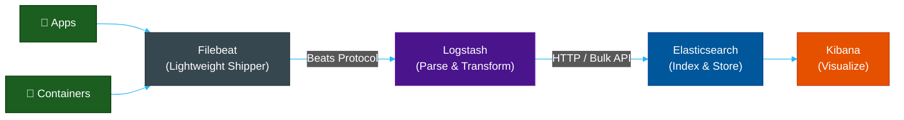

# 🔍 ELK Stack — Elasticsearch, Logstash & Kibana

> **Series:** Observability Engineering › Pillar 2 — Logging · **Level:** Advanced · **Read Time:** ~12 min

---

## 📖 Table of Contents

- [1. What Is the ELK Stack?](#1-what-is-the-elk-stack)
- [2. Core Components](#2-core-components)
- [3. Architecture](#3-architecture)
- [4. The Modern EFK Stack](#4-the-modern-efk-stack)
- [5. Elasticsearch — The Search Engine](#5-elasticsearch-the-search-engine)
- [6. Logstash Pipeline](#6-logstash-pipeline)
- [7. Kibana — Visualization](#7-kibana-visualization)
- [8. Strengths and Weaknesses](#8-strengths-and-weaknesses)
- [9. When to Use ELK](#9-when-to-use-elk)

---

## 1. What Is the ELK Stack?

The **ELK Stack** is a trio of open-source tools for collecting, processing, storing, and visualizing log data at scale:

| Tool | Role |
| :--- | :--- |
| **E**lasticsearch | Distributed search and analytics engine |
| **L**ogstash | Data collection and transformation pipeline |
| **K**ibana | Web UI for visualization and dashboarding |

All three are maintained by **Elastic** and are the **gold standard for full-text log search**.

---

## 2. Core Components



---

## 3. Architecture

Elasticsearch is a **distributed document store** built on top of **Apache Lucene**. Data is organized as:

- **Index** — a collection of documents (like a database table)
- **Shard** — a single Lucene index (Elasticsearch distributes shards across nodes)
- **Document** — a JSON object (one log line)
- **Field** — a key in the JSON document
- **Mapping** — the schema definition for fields (like a DB schema)

```
                   ┌─────────────────────────┐
                   │   Elasticsearch Cluster  │
  ┌─────────┐      │  ┌────────┐ ┌────────┐  │
  │ Logstash│─────▶│  │ Node 1 │ │ Node 2 │  │
  └─────────┘      │  │ Shard 0│ │ Shard 1│  │
                   │  │ Shard 2│ │ Shard 3│  │
                   │  └────────┘ └────────┘  │
                   └─────────────────────────┘
```

---

## 4. The Modern EFK Stack

In Kubernetes environments, **Logstash** is often replaced by **Fluent Bit** (lightweight) or **Fluentd**. This is called the **EFK Stack**:

| Stack | Collection | Processing | Storage | Visualization |
| :--- | :--- | :--- | :--- | :--- |
| **ELK** | Filebeat | Logstash | Elasticsearch | Kibana |
| **EFK** | Fluent Bit | Fluentd | Elasticsearch | Kibana |

**Fluent Bit** is preferred for Kubernetes because:
- ~450 KB memory footprint (vs ~600 MB for Logstash)
- Runs as a DaemonSet on each node
- Native Kubernetes pod metadata enrichment

---

## 5. Elasticsearch — The Search Engine

Elasticsearch's inverted index makes it unparalleled for full-text search:

```json
// Example document
{
  "@timestamp": "2026-05-17T11:10:24Z",
  "level": "ERROR",
  "service": "payment-service",
  "message": "Payment failed: insufficient funds",
  "user_id": "usr_9981",
  "transaction_id": "txn_abc123",
  "duration_ms": 245
}
```

**Query DSL example:**
```json
// Find all payment failures in the last hour
POST /logs-*/_search
{
  "query": {
    "bool": {
      "must": [
        { "match": { "level": "ERROR" } },
        { "match": { "service": "payment-service" } }
      ],
      "filter": {
        "range": {
          "@timestamp": { "gte": "now-1h" }
        }
      }
    }
  },
  "aggs": {
    "errors_per_minute": {
      "date_histogram": {
        "field": "@timestamp",
        "fixed_interval": "1m"
      }
    }
  }
}
```

---

## 6. Logstash Pipeline

Logstash processes data through three stages:

```ruby
# logstash.conf
input {
  beats {
    port => 5044
  }
}

filter {
  # Parse JSON log lines
  if [message] =~ "^{" {
    json { source => "message" }
  }

  # Parse Apache/NGINX access logs
  grok {
    match => {
      "message" => '%{COMBINEDAPACHELOG}'
    }
  }

  # Enrich with GeoIP
  geoip { source => "client_ip" }

  # Drop health checks
  if [request] == "/health" {
    drop {}
  }

  # Add processing timestamp
  mutate {
    add_field => { "processed_at" => "%{@timestamp}" }
  }
}

output {
  elasticsearch {
    hosts => ["https://elasticsearch:9200"]
    index => "logs-%{+YYYY.MM.dd}"
    user => "elastic"
    password => "${ELASTIC_PASSWORD}"
  }
}
```

---

## 7. Kibana — Visualization

Kibana's key features:

| Feature | Description |
| :--- | :--- |
| **Discover** | Ad-hoc log exploration and filtering |
| **Dashboards** | Pre-built and custom metric dashboards |
| **Lens** | Drag-and-drop chart builder |
| **Alerts** | Threshold-based and ML anomaly alerts |
| **SIEM / Security** | Security events, threat hunting, timeline |
| **APM** | Application performance monitoring (with Elastic APM agent) |
| **Maps** | GeoIP visualization |

---

## 8. Strengths and Weaknesses

**✅ Strengths:**
- **Unmatched full-text search** — query any field, any value, with Lucene
- **Rich query language** — KQL (Kibana Query Language) is intuitive
- **Elastic APM** — native application tracing if you go all-in on Elastic
- **SIEM / Security** — industry leader for security event analysis
- **Machine learning** — built-in anomaly detection (paid tier)

**❌ Weaknesses:**
- **Operational complexity** — shard management, index lifecycle policies, JVM heap tuning
- **Cost** — compute and disk-heavy; expensive at scale
- **License** — advanced features (ML, SIEM) require Elastic's commercial license (SSPL / Elastic License 2.0)
- **Cardinality** — high-cardinality fields can cause "mapping explosion"

---

## 9. When to Use ELK

| Use Case | Recommendation |
| :--- | :--- |
| Complex full-text log search | ✅ Best-in-class |
| Security / SIEM use cases | ✅ Excellent (with Elastic Security) |
| Kubernetes cost-effective logging | ❌ Use Loki instead |
| Budget-constrained team | ❌ High TCO |
| Deep analytics on structured data | ✅ Powerful aggregation engine |
| Team without ops capacity | ❌ High maintenance burden |

> [!TIP]
> Consider **Elastic Cloud** (managed) to avoid the operational overhead. It is more expensive than self-hosted but significantly reduces engineering time.

> [!NOTE]
> **OpenSearch** (an AWS-maintained Elasticsearch fork) is a fully open-source (Apache 2.0) alternative if you want to avoid Elastic's dual-licensing. It maintains near-100% API compatibility.

---

*← [Grafana Loki](./03-grafana-loki.md) · Next: [Graylog & OpenSearch](./05-graylog-opensearch.md) →*

## Related

- [Network Protocols & API Architectures](../fundamentals/01-network-protocols-and-api-architectures.md)
- [API Gateways & Reverse Proxies](../api-gateways/README.md)
- [Error Tracking](../error-tracking/README.md)
- [Enterprise Security](../../security/README.md)
