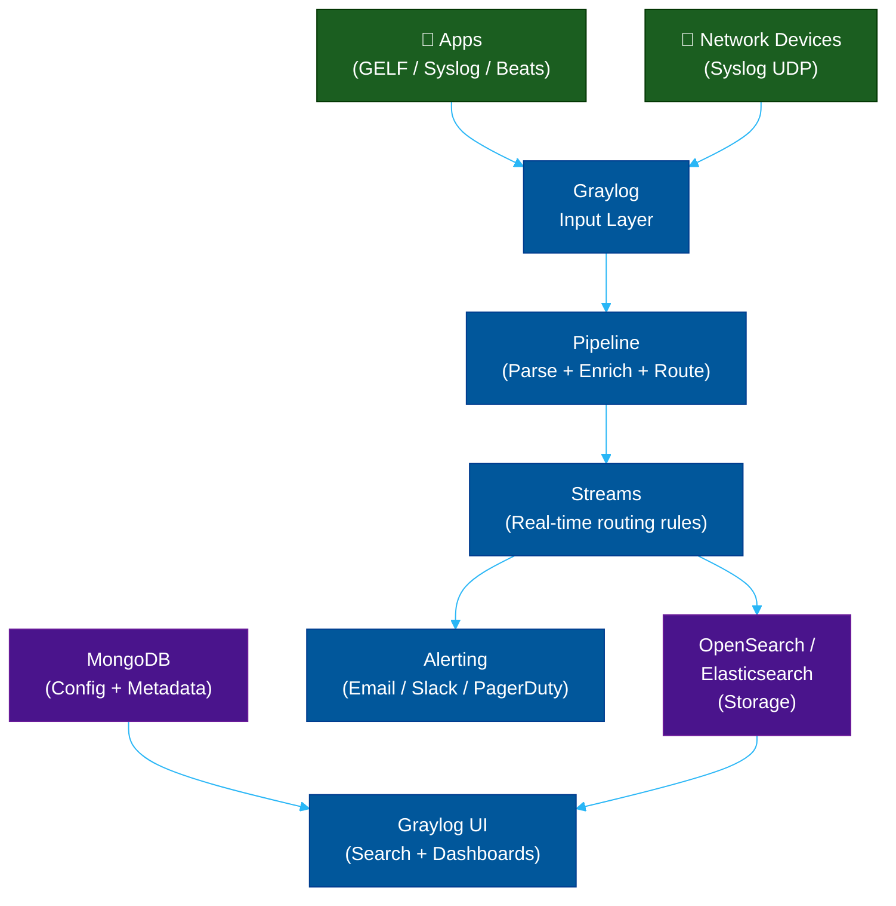

# 🔍 Graylog & OpenSearch — Open-Source Log Alternatives

> **Series:** Observability Engineering › Pillar 2 — Logging · **Level:** Intermediate · **Read Time:** ~10 min

---

## 📖 Table of Contents

- [1. Graylog — Structured Log Management](#1-graylog-structured-log-management)
- [2. OpenSearch — The Open-Source Elasticsearch Fork](#2-opensearch-the-open-source-elasticsearch-fork)
- [3. Graylog Architecture](#3-graylog-architecture)
- [4. GELF — Graylog's Log Format](#4-gelf-graylogs-log-format)
- [5. OpenSearch vs Elasticsearch](#5-opensearch-vs-elasticsearch)
- [6. When to Choose Graylog or OpenSearch](#6-when-to-choose-graylog-or-opensearch)

---

## 1. Graylog — Structured Log Management

**Graylog** is an open-source log management platform built on top of **Elasticsearch/OpenSearch** and **MongoDB**. It was designed specifically for **operational log management** — especially syslog, network device logs, and application logs.

**What sets Graylog apart:**
- Built-in **GELF** (Graylog Extended Log Format) protocol
- Native **syslog** and **GELF UDP/TCP** ingestion (no Logstash needed)
- **Streams** — real-time log routing rules
- **Pipelines** — multi-stage log processing
- **Alerting** built into the core UI
- Much simpler ops than a full ELK stack

**Editions:**
| Edition | Features | Cost |
| :--- | :--- | :--- |
| **Open** | Core log management, community support | Free (OSS) |
| **Operations** | Anomaly detection, compliance reports | Paid |
| **Security** | SIEM, threat intelligence, SOC features | Paid |

---

## 2. OpenSearch — The Open-Source Elasticsearch Fork

**OpenSearch** is a fully open-source (Apache 2.0) search and analytics engine forked from **Elasticsearch 7.10** by **Amazon Web Services** in 2021, after Elastic changed Elasticsearch's license to SSPL (Server Side Public License).

> **Why it exists:** Many organizations using Elasticsearch on AWS (via Amazon OpenSearch Service) wanted a truly open-source, royalty-free alternative that Elastic's licensing change threatened to remove.

**Key facts:**
- Near **100% API compatible** with Elasticsearch 7.x — existing clients, SDKs, and Logstash/Filebeat outputs work without changes
- Licensed **Apache 2.0** — can be used freely in any product, including commercial SaaS
- Maintained by AWS with active community contributions
- **OpenSearch Dashboards** = Kibana fork (same interface, open-source)

---

## 3. Graylog Architecture



| Component | Role |
| :--- | :--- |
| **Graylog Server** | Input processing, pipeline execution, stream routing |
| **OpenSearch / Elasticsearch** | Log storage and full-text indexing |
| **MongoDB** | Configuration, user accounts, dashboard definitions |
| **Graylog UI** | Web interface for search, dashboards, alerts |

---

## 4. GELF — Graylog's Log Format

**GELF (Graylog Extended Log Format)** is a structured JSON log format designed to overcome the limitations of plain syslog (no structured fields, 1024-byte limit).

```json
{
  "version":       "1.1",
  "host":          "order-service-pod-7f9d",
  "short_message": "Payment failed",
  "full_message":  "Payment failed for order #4421: card declined",
  "timestamp":     1716000624.123,
  "level":         3,
  "_order_id":     "ord_4421",
  "_user_id":      "usr_9981",
  "_amount":       99.95,
  "_currency":     "USD",
  "_service":      "payment-service",
  "_env":          "production"
}
```

**Sending GELF from your app (Java / Logback):**
```xml
<!-- logback.xml -->
<appender name="GELF" class="de.siegmar.logbackgelf.GelfUdpAppender">
    <graylogHost>graylog</graylogHost>
    <graylogPort>12201</graylogPort>
    <encoder class="de.siegmar.logbackgelf.GelfEncoder">
        <includeRawMessage>false</includeRawMessage>
        <staticField>service:order-service</staticField>
        <staticField>env:production</staticField>
    </encoder>
</appender>
```

---

## 5. OpenSearch vs Elasticsearch

| Feature | OpenSearch | Elasticsearch |
| :--- | :--- | :--- |
| **License** | Apache 2.0 (truly open) | SSPL + Elastic License 2.0 |
| **API Compatibility** | ~100% with ES 7.x | Native |
| **Cloud Managed** | AWS OpenSearch Service | Elastic Cloud |
| **ML / AI** | ✅ ML Commons (open) | ⚠️ Elastic ML (commercial tier) |
| **Security** | ✅ Full security plugin (open) | ⚠️ Basic security free, advanced paid |
| **Dashboards** | OpenSearch Dashboards (Kibana fork) | Kibana |
| **Performance** | Comparable | Slightly ahead on latest features |
| **Community** | AWS-backed + community | Elastic-backed |

---

## 6. When to Choose Graylog or OpenSearch

**Choose Graylog when:**
- Your primary log sources are **syslog, network devices, or Windows Event Log**
- You want a single-purpose log management UI (simpler than full ELK)
- You need built-in stream-based routing and alerting without extra tooling
- Your team doesn't have expertise in Logstash pipeline configuration

**Choose OpenSearch when:**
- You want to **escape Elastic's dual licensing** while keeping full ES compatibility
- You are already running on **AWS** (OpenSearch Service is deeply integrated)
- You need advanced **security features for free** (RBAC, field-level security, audit logging)
- You are building on top of Elasticsearch 7.x and want a sustainable open-source path

> [!NOTE]
> Both Graylog and OpenSearch can be combined: **Graylog** as the ingestion + management layer, with **OpenSearch** as the storage backend. This gives you Graylog's excellent UX with OpenSearch's licensing freedom.

> [!TIP]
> If you are starting fresh and don't need deep full-text search, **Grafana Loki** is significantly cheaper and simpler to operate. Prefer Graylog/OpenSearch only when complex full-text search or syslog/SIEM capabilities are required.

---

*← [ELK Stack](./04-elk-stack.md) · Next: [Cloud Logging](./06-cloud-logging.md) →*

## Related

- [Network Protocols & API Architectures](../fundamentals/01-network-protocols-and-api-architectures.md)
- [API Gateways & Reverse Proxies](../api-gateways/README.md)
- [Error Tracking](../error-tracking/README.md)
- [Enterprise Security](../../security/README.md)
