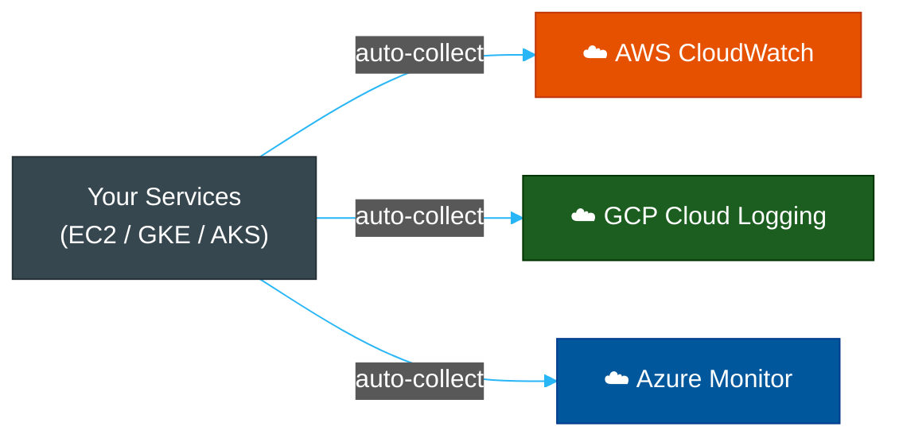

# ☁️ Cloud Logging — AWS CloudWatch, GCP Cloud Logging & Azure Monitor

> **Series:** Observability Engineering › Pillar 2 — Logging · **Level:** Intermediate · **Read Time:** ~10 min

---

## 📖 Table of Contents

- [1. Overview](#1-overview)
- [2. AWS CloudWatch](#2-aws-cloudwatch)
- [3. Google Cloud Logging & Monitoring](#3-google-cloud-logging-monitoring)
- [4. Azure Monitor & Log Analytics](#4-azure-monitor-log-analytics)
- [5. Cloud Logging Comparison](#5-cloud-logging-comparison)
- [6. When to Use vs When to Escape](#6-when-to-use-vs-when-to-escape)

---

## 1. Overview

Every major cloud provider offers a native logging and monitoring service. These are the **lowest-friction path** to getting started — they integrate automatically with every cloud service, require zero infrastructure setup, and bill on consumption.



**The tradeoff is always the same:**

| Benefit | Drawback |
| :--- | :--- |
| Zero setup | Vendor lock-in |
| Auto-integration with cloud services | Limited query power vs Elasticsearch |
| Consolidated billing | Expensive at high volume |
| Built-in IAM/security | Hard to use cross-cloud or on-prem |

---

## 2. AWS CloudWatch

**Amazon CloudWatch** is AWS's unified observability service covering logs, metrics, alarms, dashboards, and synthetic monitoring.

### Core Components

| Component | Purpose |
| :--- | :--- |
| **CloudWatch Logs** | Log storage, search, and retention |
| **Log Groups** | Logical grouping (one per service/lambda) |
| **Log Streams** | One stream per instance / container |
| **CloudWatch Metrics** | Time-series metrics from AWS services |
| **CloudWatch Alarms** | Threshold-based alerts → SNS / Auto Scaling |
| **CloudWatch Dashboards** | Visual dashboards |
| **CloudWatch Insights** | Log analytics query language |

### CloudWatch Logs Insights — Query Language

```sql
-- Find error rate per service in the last hour
fields @timestamp, @message, service
| filter @message like /ERROR/
| stats count() as error_count by service
| sort error_count desc

-- Parse JSON logs and compute p99 latency
fields @timestamp
| filter ispresent(duration_ms)
| stats pct(duration_ms, 99) as p99_ms by bin(5m)

-- Find slow requests
fields @timestamp, requestId, @duration
| filter @duration > 3000
| sort @duration desc
| limit 20
```

### Sending Custom Logs (Lambda / EC2)

```python
import boto3
import json
import time

client = boto3.client('logs', region_name='ap-southeast-1')

def log_event(log_group, log_stream, message):
    client.put_log_events(
        logGroupName=log_group,
        logStreamName=log_stream,
        logEvents=[{
            'timestamp': int(time.time() * 1000),
            'message': json.dumps(message)
        }]
    )

log_event(
    '/app/payment-service',
    'production',
    {'level': 'ERROR', 'msg': 'Payment failed', 'user_id': 'usr_9981'}
)
```

### Pricing (ap-southeast-1 region)
| Feature | Price |
| :--- | :--- |
| Log ingestion | $0.57 / GB |
| Log storage | $0.03 / GB / month |
| Insights queries | $0.0057 / GB scanned |
| Custom metrics | $0.30 / metric / month |

---

## 3. Google Cloud Logging & Monitoring

**Google Cloud Logging** (formerly Stackdriver Logging) automatically collects logs from all GCP services — GKE, Cloud Run, App Engine, Compute Engine — with zero configuration.

### Core Features

| Feature | Description |
| :--- | :--- |
| **Cloud Logging** | Log storage, search, and export |
| **Log Explorer** | Web UI with advanced filtering |
| **Log-Based Metrics** | Create metrics from log patterns |
| **Log Router** | Route logs to BigQuery, Pub/Sub, GCS, Splunk |
| **Cloud Monitoring** | Metrics, dashboards, alerting (PromQL-compatible) |
| **Cloud Trace** | Distributed tracing (OTel-compatible) |
| **Cloud Profiler** | Continuous CPU/memory profiling |

### Logging Query Language (LQL)

```
-- Find all errors in payment service
resource.type="k8s_container"
resource.labels.namespace_name="production"
resource.labels.container_name="payment-service"
severity=ERROR

-- Find 5xx HTTP responses
httpRequest.status>=500
timestamp>="2026-05-17T00:00:00Z"

-- Exclude health checks
NOT httpRequest.requestUrl=~".*\/health.*"
```

### Export to BigQuery for Analysis

```bash
# Create a log sink to BigQuery
gcloud logging sinks create payment-errors \
  bigquery.googleapis.com/projects/my-project/datasets/logs \
  --log-filter='resource.labels.container_name="payment-service" severity=ERROR'
```

---

## 4. Azure Monitor & Log Analytics

**Azure Monitor** is Microsoft's unified observability platform covering logs (Log Analytics), metrics, alerts, and Application Insights (APM).

### Core Components

| Component | Purpose |
| :--- | :--- |
| **Log Analytics Workspace** | Central log storage and query engine |
| **Azure Monitor Logs** | Structured log collection from all Azure resources |
| **Application Insights** | Full APM — traces, exceptions, dependencies |
| **Azure Monitor Metrics** | Time-series metrics from Azure resources |
| **Azure Alerts** | Rule-based alerting on logs and metrics |
| **Workbooks** | Interactive dashboards and reports |

### KQL — Kusto Query Language

Azure uses **KQL (Kusto Query Language)** — a powerful, SQL-like language optimized for log analytics:

```kql
// Find all errors in the last 24 hours grouped by service
ContainerLog
| where TimeGenerated > ago(24h)
| where LogEntrySource == "stderr"
| where LogEntry contains "ERROR"
| extend parsed = parse_json(LogEntry)
| project TimeGenerated,
          service = parsed.service,
          message = parsed.msg,
          user_id = parsed.user_id
| summarize error_count = count() by service, bin(TimeGenerated, 5m)
| render timechart

// Find slow API calls
AppRequests
| where TimeGenerated > ago(1h)
| where DurationMs > 2000
| project TimeGenerated, Name, DurationMs, ResultCode, UserAgent
| order by DurationMs desc
| take 50

// Alert query: error rate above 5%
requests
| where timestamp > ago(5m)
| summarize
    total = count(),
    errors = countif(resultCode startswith "5")
| extend error_rate = errors * 100.0 / total
| where error_rate > 5
```

---

## 5. Cloud Logging Comparison

| Feature | AWS CloudWatch | GCP Cloud Logging | Azure Monitor |
| :--- | :--- | :--- | :--- |
| **Query Language** | CloudWatch Logs Insights | Log Explorer (LQL) | KQL |
| **Query Power** | Medium | Good | ✅ Excellent (KQL) |
| **Auto-collection** | ✅ AWS services | ✅ GCP services | ✅ Azure services |
| **Retention (default)** | 1–3 days (configurable) | 30 days (_Default bucket) | 30–730 days |
| **Log ingestion cost** | $0.57/GB | $0.50/GB (first 50GB free) | $2.76/GB |
| **Long-term export** | S3 | BigQuery / GCS | Storage Account |
| **APM** | X-Ray (separate) | Cloud Trace + Profiler | Application Insights |
| **Metrics** | CloudWatch Metrics | Cloud Monitoring | Azure Monitor Metrics |
| **Alerting** | CloudWatch Alarms → SNS | Cloud Monitoring Alerts | Azure Alerts |
| **Best for** | AWS-native teams | GCP / GKE teams | Azure / .NET teams |

---

## 6. When to Use vs When to Escape

**Use cloud-native logging when:**
- Your entire stack lives in **one cloud provider**
- You want **zero operational overhead** for your logging infrastructure
- You are early-stage and **speed > cost optimization**
- Your log volume is **low-to-medium** (< 50 GB/day)

**Consider migrating to self-hosted when:**
- Log costs are **exceeding $1,000+/month** and growing
- You need **multi-cloud or hybrid** visibility
- You need **deep full-text search** beyond what cloud UIs offer
- You want to **combine logs + metrics + traces** in one Grafana view

> [!TIP]
> A common cost-optimization pattern: use **cloud-native logging** for short retention (7–14 days) and export older logs to **S3 / GCS (object storage)** at $0.023/GB instead of paying $0.03/GB for CloudWatch long-term storage.

---

*← [Graylog & OpenSearch](./05-graylog-opensearch.md) · Next: [Logging Comparison Matrix](./07-logging-comparison.md) →*

## Related

- [Network Protocols & API Architectures](../fundamentals/01-network-protocols-and-api-architectures.md)
- [API Gateways & Reverse Proxies](../api-gateways/README.md)
- [Error Tracking](../error-tracking/README.md)
- [Enterprise Security](../../security/README.md)
