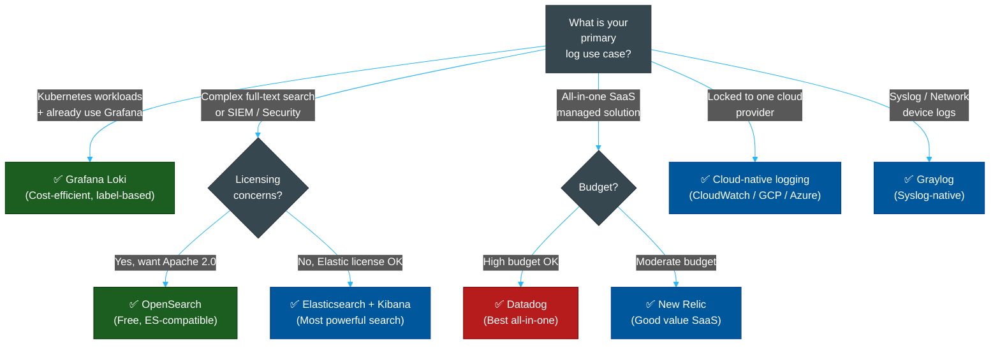
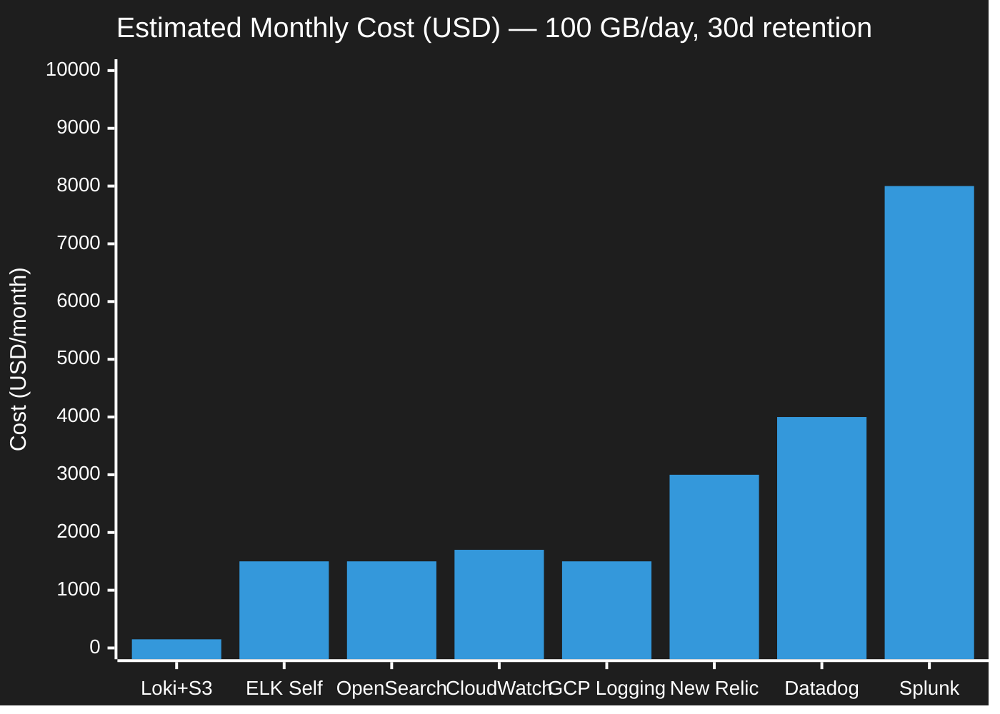

# 📊 Logging Tool Comparison Matrix

> **Series:** Observability Engineering › Pillar 2 — Logging · **Level:** Reference · **Read Time:** ~8 min

---

## 📖 Table of Contents

- [1. Full Comparison Table](#1-full-comparison-table)
- [2. Decision Flowchart](#2-decision-flowchart)
- [3. Cost at Scale](#3-cost-at-scale)
- [4. Quick Summary](#4-quick-summary)

---

## 1. Full Comparison Table

| Tool | Type | Indexing | Storage Backend | Query Language | Full-Text Search | Multi-tenant | Kubernetes Native | Cost (100 GB/day) |
| :--- | :--- | :--- | :--- | :--- | :--- | :--- | :--- | :--- |
| **Grafana Loki** | OSS | Labels only | Object (S3/GCS) | LogQL | ⚠️ Line-based | ✅ Native | ✅ Excellent | ~$100–$150/mo |
| **Elasticsearch** | OSS / SSPL | Full inverted | Local SSD / Cloud | Lucene / KQL | ✅ Excellent | ✅ Via index patterns | ✅ Good | ~$800–$2,000/mo |
| **OpenSearch** | OSS (Apache 2.0) | Full inverted | Local SSD / Cloud | Lucene / DQL | ✅ Excellent | ✅ Via index patterns | ✅ Good | ~$800–$2,000/mo |
| **Graylog** | OSS + Enterprise | Full (via ES/OS) | Elasticsearch / OpenSearch | GELF Query | ✅ Good | ✅ Enterprise tier | ✅ Good | ~$800–$2,000/mo |
| **Splunk** | Commercial | Proprietary | Proprietary | SPL | ✅ Excellent | ✅ Excellent | ✅ Good | ~$4,000–$10,000/mo |
| **Datadog Logs** | SaaS | Full | Managed | Datadog QL | ✅ Good | ✅ Managed | ✅ Excellent | ~$2,000–$5,000/mo |
| **AWS CloudWatch** | SaaS | Log groups | AWS-managed | CloudWatch Insights | ⚠️ Limited | ⚠️ Per account | ✅ EKS integration | ~$1,700/mo |
| **GCP Cloud Logging** | SaaS | Managed | Google-managed | LQL | ⚠️ Limited | ✅ Per project | ✅ GKE auto-collect | ~$1,500/mo |
| **Azure Monitor** | SaaS | Log Analytics | Microsoft-managed | KQL | ✅ Good (KQL) | ✅ Per workspace | ✅ AKS auto-collect | ~$1,800/mo |
| **New Relic Logs** | SaaS | Full | Managed | NRQL | ✅ Good | ✅ Managed | ✅ Excellent | ~$2,000–$4,000/mo |

---

## 2. Decision Flowchart

---

## 3. Cost at Scale

Estimated monthly cost for **100 GB/day ingestion**, **30-day retention** (~3 TB total):

| Tool | Storage Model | Est. Monthly Cost | Notes |
| :--- | :--- | :--- | :--- |
| **Grafana Loki + S3** | Object storage | ~$150 | Cheapest; label-only index |
| **Self-hosted ELK** | Local SSD + compute | ~$1,200–$2,000 | High ops complexity |
| **AWS CloudWatch** | Managed | ~$1,700 | $0.57/GB ingest + $0.03/GB storage |
| **GCP Cloud Logging** | Managed | ~$1,500 | First 50 GB/mo free |
| **New Relic** | SaaS | ~$2,000–$4,000 | Per GB ingested |
| **Datadog Logs** | SaaS | ~$3,000–$5,000 | Per GB + retention tier |
| **Splunk** | Enterprise | ~$5,000–$10,000 | Per GB indexed |

---

## 4. Quick Summary

| Need | Best Tool |
| :--- | :--- |
| **Lowest cost** | Grafana Loki |
| **Best full-text search** | Elasticsearch / OpenSearch |
| **Best Kubernetes integration** | Grafana Loki or Datadog |
| **SIEM / Security analytics** | Splunk or Elastic Security |
| **Zero setup (AWS)** | AWS CloudWatch |
| **Zero setup (GCP)** | GCP Cloud Logging |
| **Zero setup (Azure)** | Azure Monitor |
| **Open-source, no licensing risk** | Loki or OpenSearch |
| **Best managed SaaS** | Datadog |
| **Best value SaaS** | New Relic |
| **Syslog / network devices** | Graylog |

---

*← [Cloud Logging](./06-cloud-logging.md) · Next: [Prometheus](./08-prometheus.md) →*

## Related

- [Network Protocols & API Architectures](../fundamentals/01-network-protocols-and-api-architectures.md)
- [API Gateways & Reverse Proxies](../api-gateways/README.md)
- [Error Tracking](../error-tracking/README.md)
- [Enterprise Security](../../security/README.md)
