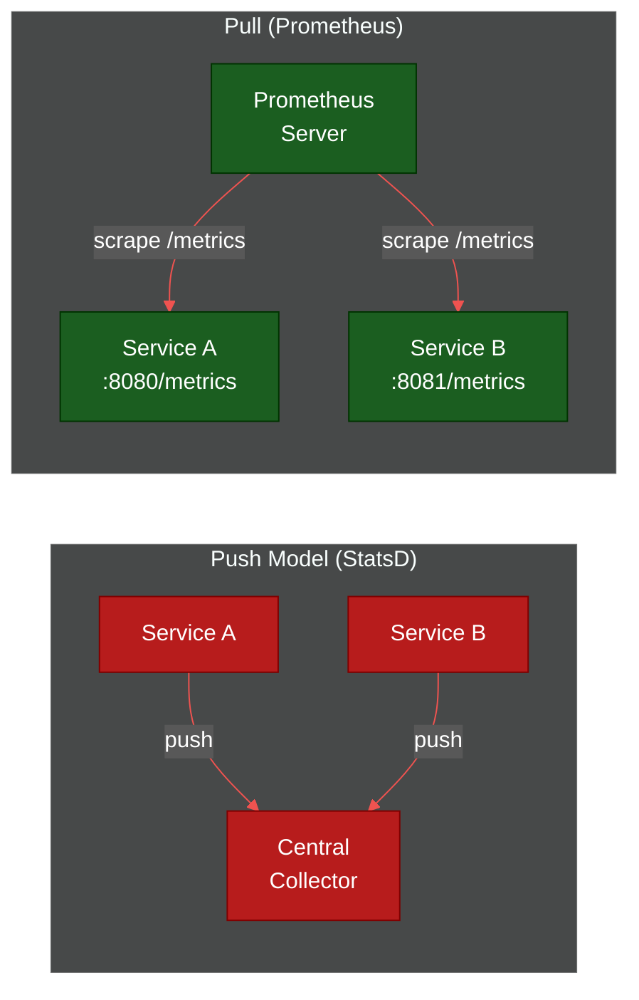
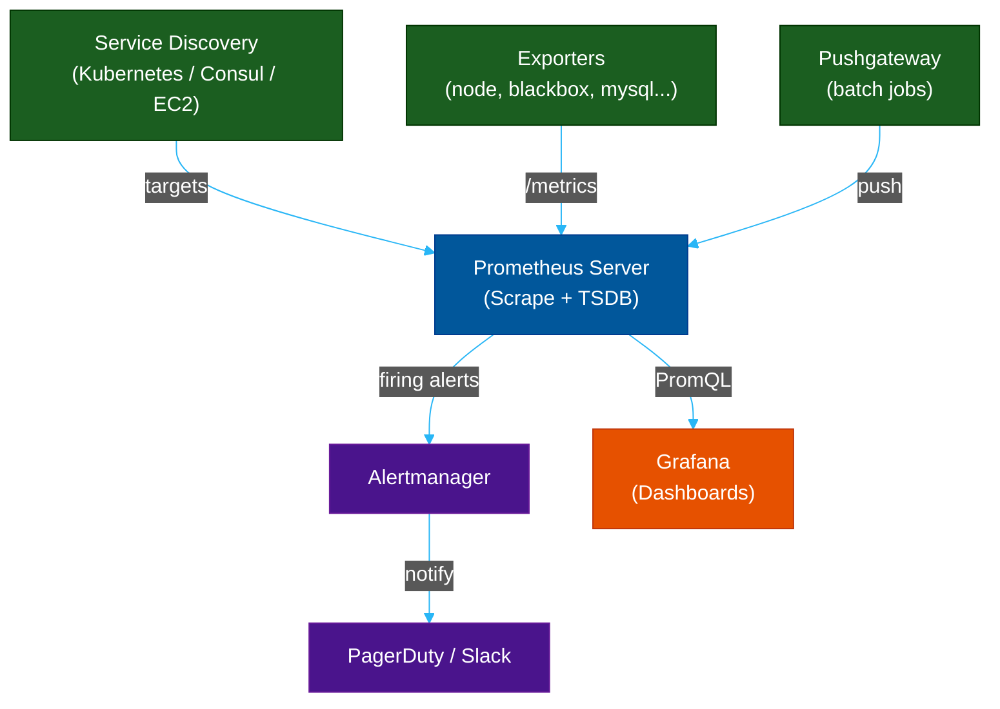
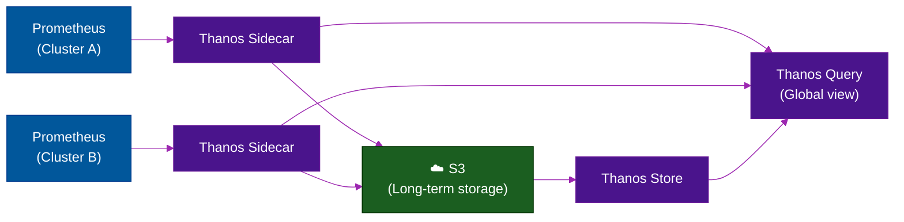

# 📈 Prometheus — Pull-Based Metrics Collection

> **Series:** Observability Engineering › Pillar 3 — Metrics · **Level:** Intermediate · **Read Time:** ~10 min

---

## 📖 Table of Contents

- [1. What Is Prometheus?](#1-what-is-prometheus)
- [2. Pull vs Push Model](#2-pull-vs-push-model)
- [3. Core Architecture](#3-core-architecture)
- [4. Data Model](#4-data-model)
- [5. PromQL — The Query Language](#5-promql-the-query-language)
- [6. Alertmanager](#6-alertmanager)
- [7. Scaling: Thanos & Mimir](#7-scaling-thanos-mimir)
- [8. When to Use Prometheus](#8-when-to-use-prometheus)

---

## 1. What Is Prometheus?

**Prometheus** is an open-source **time-series database and monitoring system** originally built at **SoundCloud** and now a **CNCF graduated project**. It is the industry standard for metrics in cloud-native and Kubernetes environments.

> **Core design:** Prometheus **scrapes** (pulls) metrics from HTTP endpoints exposed by your services, rather than having services push data to a central server.

---

## 2. Pull vs Push Model



| | Pull (Prometheus) | Push |
| :--- | :--- | :--- |
| **Discovery** | Prometheus finds targets via SD | Service must know collector address |
| **Failure detection** | ✅ Scrape failure = service down | Hard to distinguish "no data" from "down" |
| **Firewall** | Prometheus needs network access to targets | Simpler for ephemeral/batch jobs |
| **Short-lived jobs** | ❌ Hard (use Pushgateway) | ✅ Natural fit |

---

## 3. Core Architecture



| Component | Role |
| :--- | :--- |
| **Prometheus Server** | Scrapes targets, stores TSDB, evaluates rules |
| **Exporters** | Expose `/metrics` for systems that don't natively support it |
| **Pushgateway** | Accepts push from short-lived jobs |
| **Alertmanager** | Routes, deduplicates, and silences alerts |
| **Grafana** | Visualization layer querying Prometheus via PromQL |

---

## 4. Data Model

Every metric is a **time series** identified by a metric name and a set of **labels** (key-value pairs):

```
# HELP http_requests_total Total HTTP requests served
# TYPE http_requests_total counter
http_requests_total{method="GET",  route="/api/orders", status="200"} 94857
http_requests_total{method="POST", route="/api/orders", status="201"} 12034
http_requests_total{method="POST", route="/api/orders", status="500"} 47
```

**Metric Types:**

| Type | Description | Example |
| :--- | :--- | :--- |
| `Counter` | Always increasing | `http_requests_total` |
| `Gauge` | Can go up/down | `memory_usage_bytes` |
| `Histogram` | Bucketed distribution | `request_duration_seconds` |
| `Summary` | Pre-computed quantiles | `rpc_duration_seconds` |

---

## 5. PromQL — The Query Language

PromQL is a functional query language for time series:

```promql
# 5-minute request rate (requests per second)
rate(http_requests_total[5m])

# Error rate percentage
100 * rate(http_requests_total{status=~"5.."}[5m])
  / rate(http_requests_total[5m])

# P99 latency (requires histogram metric)
histogram_quantile(0.99,
  rate(http_request_duration_seconds_bucket[5m])
)

# CPU usage across all pods in a namespace
sum by (pod) (
  rate(container_cpu_usage_seconds_total{
    namespace="production"
  }[5m])
)

# Alert: high error rate
ALERT HighErrorRate
  IF rate(http_requests_total{status=~"5.."}[5m]) > 0.1
  FOR 5m
  LABELS { severity="critical" }
  ANNOTATIONS { summary = "Error rate above 10%" }
```

---

## 6. Alertmanager

Alertmanager handles alerts **fired by Prometheus rules** and routes them to the right receivers:

```yaml
# alertmanager.yml
route:
  group_by: ['alertname', 'service']
  group_wait:      30s
  group_interval:  5m
  repeat_interval: 3h
  receiver: 'team-slack'

  routes:
    - match:
        severity: critical
      receiver: 'pagerduty-critical'
    - match:
        severity: warning
      receiver: 'team-slack'

receivers:
  - name: 'team-slack'
    slack_configs:
      - channel: '#alerts'
        api_url: 'https://hooks.slack.com/services/...'

  - name: 'pagerduty-critical'
    pagerduty_configs:
      - service_key: '<PAGERDUTY_KEY>'

inhibit_rules:
  - source_match:
      severity: 'critical'
    target_match:
      severity: 'warning'
    equal: ['alertname', 'service']
```

---

## 7. Scaling: Thanos & Mimir

Prometheus has **no native clustering or long-term storage**. For production at scale, you need one of:

| Tool | Approach | Best For |
| :--- | :--- | :--- |
| **Thanos** | Sidecar → Object Storage, Global Query View | Multi-cluster federation |
| **Grafana Mimir** | Fully distributed Prometheus-compatible TSDB | Massive scale (1B+ series) |
| **VictoriaMetrics** | Drop-in Prometheus replacement, very efficient | Cost-sensitive high-volume |



---

## 8. When to Use Prometheus

| Use Case | Recommendation |
| :--- | :--- |
| Kubernetes workloads | ✅ Native integration via `kube-state-metrics` |
| Microservices metrics | ✅ Ideal pull model |
| Short-lived batch jobs | ⚠️ Use Pushgateway |
| Long-term metrics storage | ⚠️ Add Thanos / Mimir / VictoriaMetrics |
| Multi-cluster global view | ⚠️ Add Thanos Query |
| All-in-one SaaS | ❌ Consider Datadog / New Relic |

> [!TIP]
> Use the [**kube-prometheus-stack**](https://github.com/prometheus-community/helm-charts/tree/main/charts/kube-prometheus-stack) Helm chart to deploy a full production-grade Prometheus + Grafana + Alertmanager setup in minutes.

---

*← [Observability README](./README.md) · Next: [VictoriaMetrics & Thanos](./09-long-term-metrics-storage.md) →*

## Related

- [Network Protocols & API Architectures](../fundamentals/01-network-protocols-and-api-architectures.md)
- [API Gateways & Reverse Proxies](../api-gateways/README.md)
- [Error Tracking](../error-tracking/README.md)
- [Enterprise Security](../../security/README.md)
