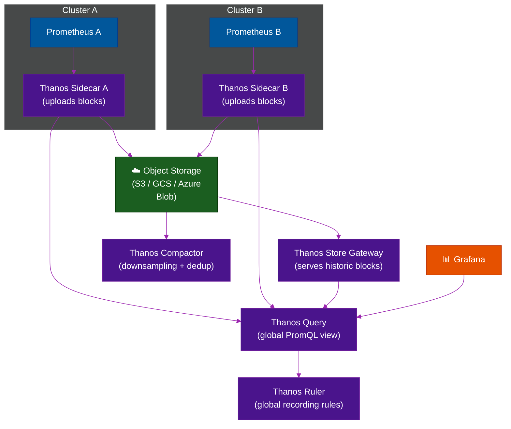
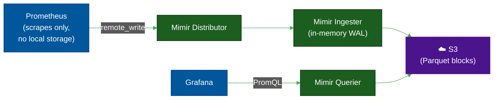

# 📈 VictoriaMetrics & Thanos — Long-Term Metrics Storage

> **Series:** Observability Engineering › Pillar 3 — Metrics · **Level:** Advanced · **Read Time:** ~10 min

---

## 📖 Table of Contents

- [1. The Problem: Prometheus Doesn't Scale Alone](#1-the-problem-prometheus-doesnt-scale-alone)
- [2. Thanos — Multi-Cluster Federation](#2-thanos-multi-cluster-federation)
- [3. Grafana Mimir — Fully Distributed TSDB](#3-grafana-mimir-fully-distributed-tsdb)
- [4. VictoriaMetrics — Efficient Drop-In Replacement](#4-victoriametrics-efficient-drop-in-replacement)
- [5. Comparison Matrix](#5-comparison-matrix)
- [6. When to Use Each](#6-when-to-use-each)

---

## 1. The Problem: Prometheus Doesn't Scale Alone

Prometheus is excellent for single-cluster, short-term metrics collection. However it has hard limits:

| Limitation | Impact |
| :--- | :--- |
| **Local storage only** | Data lost if Prometheus pod restarts |
| **No native clustering** | Can't scale horizontally |
| **No global query view** | Can't query across multiple clusters |
| **Default 15-day retention** | Limited historical analysis |
| **Single point of failure** | Downtime = gap in metrics |

Solutions like **Thanos**, **Mimir**, and **VictoriaMetrics** solve these by adding long-term, durable, distributed storage on top of or instead of Prometheus.

---

## 2. Thanos — Multi-Cluster Federation

**Thanos** is a set of components that extend Prometheus to provide **global query view**, **long-term storage**, and **high availability** via object storage.

### Architecture



### Key Components

| Component | Role |
| :--- | :--- |
| **Sidecar** | Runs next to Prometheus; uploads TSDB blocks to object storage |
| **Store Gateway** | Serves historical blocks from object storage for queries |
| **Query** | Deduplicates and fan-outs PromQL across sidecars + store |
| **Compactor** | Downsamples and deduplicates blocks in object storage |
| **Ruler** | Evaluates recording and alerting rules globally |

### Quick Start

```yaml
# thanos-sidecar deployment (alongside Prometheus)
- name: thanos-sidecar
  image: quay.io/thanos/thanos:v0.35.0
  args:
    - sidecar
    - --prometheus.url=http://localhost:9090
    - --tsdb.path=/prometheus/data
    - --objstore.config-file=/etc/thanos/objstore.yaml

# objstore.yaml
type: S3
config:
  bucket: my-thanos-metrics
  endpoint: s3.amazonaws.com
  region: ap-southeast-1
```

---

## 3. Grafana Mimir — Fully Distributed TSDB

**Grafana Mimir** is a **horizontally scalable, highly available, multi-tenant** Prometheus-compatible TSDB. Unlike Thanos (which wraps existing Prometheus instances), Mimir is a **standalone replacement** for the Prometheus storage layer.



**Mimir vs Thanos:**

| | Mimir | Thanos |
| :--- | :--- | :--- |
| **Architecture** | Fully distributed microservices | Sidecar adds to existing Prometheus |
| **Deployment complexity** | Higher | Lower (if you have Prometheus) |
| **Scale** | 1 billion+ active series | Hundreds of millions |
| **Multi-tenancy** | ✅ Native | ⚠️ Limited |
| **Remote write compatible** | ✅ Yes (Prometheus pushes to it) | ⚠️ Sidecar model only |
| **Grafana Cloud** | ✅ Backs Grafana Cloud metrics | ❌ |

---

## 4. VictoriaMetrics — Efficient Drop-In Replacement

**VictoriaMetrics** is a fast, cost-efficient, open-source time-series database designed as a **drop-in replacement for Prometheus**. It uses a custom storage format that is significantly more efficient than Prometheus's local TSDB.

**Key advantages:**
- **10x lower disk usage** vs Prometheus (better compression)
- **Handles 5–10x more active series** per CPU/RAM than Prometheus
- **Supports remote write** from Prometheus, Grafana Agent, Telegraf
- **MetricsQL** — extended PromQL with extra functions
- **vmcluster** — horizontally scalable multi-node setup
- **Single binary** for small setups (zero dependencies)

```yaml
# prometheus.yml — send to VictoriaMetrics instead of storing locally
global:
  scrape_interval: 15s

remote_write:
  - url: http://victoria-metrics:8428/api/v1/write

# Disable local storage to save disk
storage:
  tsdb:
    retention.time: 1h  # keep only 1h locally; long-term in VM
```

---

## 5. Comparison Matrix

| Feature | Prometheus alone | Thanos | Grafana Mimir | VictoriaMetrics |
| :--- | :--- | :--- | :--- | :--- |
| **Long-term storage** | ❌ Local only | ✅ Object storage | ✅ Object storage | ✅ Local or cluster |
| **Multi-cluster query** | ❌ | ✅ | ✅ | ✅ vmcluster |
| **High availability** | ❌ | ✅ | ✅ | ✅ |
| **Multi-tenancy** | ❌ | ⚠️ | ✅ Native | ✅ |
| **PromQL compatible** | ✅ Native | ✅ | ✅ | ✅ (MetricsQL superset) |
| **Disk efficiency** | Baseline | Baseline | Good | ✅ Excellent (10x) |
| **Ops complexity** | Low | Medium | High | Low–Medium |
| **Best scale** | < 5M series | < 500M series | 1B+ series | < 500M series |
| **Grafana Cloud** | ✅ | ❌ | ✅ Powers it | ❌ |

---

## 6. When to Use Each

| Scenario | Recommendation |
| :--- | :--- |
| Single Kubernetes cluster, < 1M series | ✅ **Prometheus alone** (with Loki for logs) |
| Multi-cluster, need global PromQL view | ✅ **Thanos** (sidecar pattern, lower ops burden) |
| Massive scale, 100M+ series, multi-tenant | ✅ **Grafana Mimir** (or Grafana Cloud) |
| Want Prometheus but cheaper / more efficient | ✅ **VictoriaMetrics** (drop-in, best compression) |
| High cardinality metrics (IoT, tracing exemplars) | ✅ **VictoriaMetrics** (handles high cardinality best) |

> [!TIP]
> For teams already in the Grafana ecosystem, **Mimir** (via Grafana Cloud or self-hosted) is the natural choice. For cost-sensitive teams who want simplicity, **VictoriaMetrics** single-node or cluster is often the best value.

---

*← [Prometheus](./08-prometheus.md) · Next: [StatsD & InfluxDB](./10-statsd-influxdb.md) →*

## Related

- [Network Protocols & API Architectures](../fundamentals/01-network-protocols-and-api-architectures.md)
- [API Gateways & Reverse Proxies](../api-gateways/README.md)
- [Error Tracking](../error-tracking/README.md)
- [Enterprise Security](../../security/README.md)
