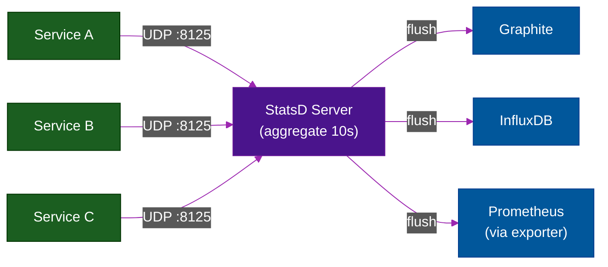

# 📊 StatsD & InfluxDB — Push-Based Metrics

> **Series:** Observability Engineering › Pillar 3 — Metrics · **Level:** Intermediate · **Read Time:** ~10 min

---

## 📖 Table of Contents

- [1. Push vs Pull Recap](#1-push-vs-pull-recap)
- [2. StatsD — The Original Push Metric Protocol](#2-statsd-the-original-push-metric-protocol)
- [3. InfluxDB — The Time-Series Database](#3-influxdb-the-time-series-database)
- [4. Telegraf — InfluxDB's Collection Agent](#4-telegraf-influxdbs-collection-agent)
- [5. InfluxQL & Flux — Query Languages](#5-influxql-flux-query-languages)
- [6. When to Use StatsD or InfluxDB](#6-when-to-use-statsd-or-influxdb)

---

## 1. Push vs Pull Recap

While **Prometheus uses pull** (it scrapes `/metrics` endpoints), **StatsD and InfluxDB use push** (applications send metrics to a collector).

```mermaid
%%{init: {'theme': 'dark', 'themeVariables': {'primaryColor': '#01579b', 'primaryTextColor': '#fff', 'lineColor': '#29b6f6', 'background': '#1e1e1e'},
  'themeCSS': 'svg { background-color: #1e1e1e !important; padding: 1rem !important; border-radius: 8px !important; } .edgeLabel rect { fill: #1e1e1e !important; } text, tspan, .messageText, .signalText, .edgeLabel, .edgeLabel span, .pointLabel, .axisLabel, .quadrantTitle, .quadrantLabel { fill: #ffffff !important; color: #ffffff !important; stroke: none !important; }'
}}%%
graph LR
    classDef app  fill:#1b5e20,stroke:#003300,color:#fff
    classDef coll fill:#01579b,stroke:#003c8f,color:#fff

    A1["App"]:::app -->|UDP push<br/>metrics.orders.total:1|c| SD["StatsD<br/>Server"]:::coll
    A2["App"]:::app -->|HTTP push<br/>LineProtocol| INF["InfluxDB<br/>/ Telegraf"]:::coll
    SD --> GR["Graphite /<br/>Prometheus"]:::coll
    INF --> GR
```

**Push model is better for:**
- **Short-lived jobs** (cron, Lambda) — they finish before Prometheus can scrape
- **High-frequency events** — StatsD UDP is fire-and-forget with near-zero overhead
- **IoT devices** — many devices, Prometheus can't reach them all
- **Client-side metrics** — browser / mobile apps can't expose `/metrics`

---

## 2. StatsD — The Original Push Metric Protocol

**StatsD** was originally created by **Etsy** and open-sourced in 2011. It defines a simple **UDP text protocol** for sending metrics from applications with minimal overhead.

### The Protocol

```
# Format: metric.name:value|type[|@sampleRate]

# Counter — increment by value
orders.placed:1|c
orders.failed:1|c|@0.1   # sampled at 10%

# Gauge — set to exact value
queue.depth:42|g
memory.usage:1073741824|g

# Timer — record duration (in ms)
payment.duration:245|ms
db.query.users:12|ms

# Set — count unique values
users.active:usr_9981|s
```

### Architecture



**Why UDP?** Fire-and-forget — if the StatsD server is down or slow, the application is **not blocked**. The metric is simply dropped.

### Sending StatsD from your app

```java
// Java (using DogStatsD client from Datadog)
StatsDClient statsd = new NonBlockingStatsDClient(
    "order-service",
    "statsd-server",
    8125
);

// Counter
statsd.incrementCounter("orders.placed");

// Timer
long start = System.currentTimeMillis();
processOrder(order);
statsd.recordExecutionTime("order.processing.time",
    System.currentTimeMillis() - start);

// Gauge
statsd.recordGaugeValue("queue.depth", queue.size());
```

```python
# Python
import statsd
c = statsd.StatsClient('statsd-server', 8125, prefix='payment')
c.incr('requests')          # payment.requests += 1
c.timing('latency', 245)    # payment.latency = 245ms
c.gauge('queue', 42)        # payment.queue = 42
```

---

## 3. InfluxDB — The Time-Series Database

**InfluxDB** is a purpose-built **time-series database** designed for high write throughput and time-range queries. It is the central component of the **TICK stack** (Telegraf, InfluxDB, Chronograf, Kapacitor).

**Key design principles:**
- **Line Protocol** — ultra-compact text format for writing data
- **Measurement + Tags + Fields** — structured data model (not label-based like Prometheus)
- **Retention Policies** — automatic data expiry
- **Continuous Queries** — automated downsampling

### InfluxDB Line Protocol

```
# measurement,tag_key=tag_value field_key=field_value timestamp_ns
http_requests,service=payment,method=POST,status=200 count=1,duration_ms=245 1716000624000000000
http_requests,service=payment,method=POST,status=500 count=1,duration_ms=12  1716000624000000000
cpu_usage,host=prod-01,core=0 usage_percent=78.5 1716000624000000000
memory,host=prod-01 used_bytes=4294967296,free_bytes=8589934592 1716000624000000000
```

### Data Model

| Concept | Description | Example |
| :--- | :--- | :--- |
| **Measurement** | The name of what you're measuring | `http_requests` |
| **Tags** | Indexed string metadata (use for filtering) | `service="payment"` |
| **Fields** | Actual values — not indexed (use for values) | `count=1, duration_ms=245` |
| **Timestamp** | Nanosecond precision time | `1716000624000000000` |

> [!WARNING]
> Tags in InfluxDB are **indexed** (like Prometheus labels). Fields are **not indexed** but stored as values. High-cardinality data (like user IDs) should always be **fields**, never tags — otherwise you'll get a "cardinality explosion" that kills performance.

---

## 4. Telegraf — InfluxDB's Collection Agent

**Telegraf** is a plugin-based metrics collection agent that feeds data into InfluxDB. It has **300+ input plugins** for collecting metrics from virtually any source.

```toml
# telegraf.conf

# Collect system metrics
[[inputs.cpu]]
  percpu = true
  totalcpu = true

[[inputs.mem]]

[[inputs.disk]]
  ignore_fs = ["tmpfs", "devtmpfs"]

# Collect from Prometheus endpoints
[[inputs.prometheus]]
  urls = ["http://app:8080/metrics"]

# Collect from StatsD
[[inputs.statsd]]
  service_address = ":8125"
  protocol = "udp"

# Collect from Kubernetes
[[inputs.kubernetes]]
  url = "https://kubernetes.default.svc"

# Send to InfluxDB
[[outputs.influxdb_v2]]
  urls = ["http://influxdb:8086"]
  token = "${INFLUX_TOKEN}"
  organization = "my-org"
  bucket = "metrics"

# Also send to Prometheus remote_write
[[outputs.prometheus_client]]
  listen = ":9273"
```

---

## 5. InfluxQL & Flux — Query Languages

**InfluxQL** (SQL-like, InfluxDB 1.x):
```sql
-- Average request latency per service per 5 minutes
SELECT MEAN(duration_ms) AS avg_latency
FROM http_requests
WHERE time > now() - 1h
  AND status = '200'
GROUP BY time(5m), service
ORDER BY time DESC

-- Count errors per minute
SELECT COUNT(count) AS error_count
FROM http_requests
WHERE status =~ /5\d\d/
  AND time > now() - 30m
GROUP BY time(1m), service
```

**Flux** (functional, InfluxDB 2.x):
```flux
// P99 latency per service
from(bucket: "metrics")
  |> range(start: -1h)
  |> filter(fn: (r) => r._measurement == "http_requests")
  |> filter(fn: (r) => r._field == "duration_ms")
  |> group(columns: ["service"])
  |> quantile(q: 0.99, column: "_value")
  |> yield(name: "p99")
```

---

## 6. When to Use StatsD or InfluxDB

| Use Case | Recommendation |
| :--- | :--- |
| Application business metrics (counters, timers) | ✅ StatsD is perfect — minimal overhead |
| Short-lived jobs, cron, Lambda | ✅ Push model (StatsD or InfluxDB) |
| IoT / embedded devices high-frequency write | ✅ InfluxDB — purpose-built |
| Already using Prometheus / Grafana stack | ⚠️ Stick with Prometheus metrics |
| Need sub-second metric resolution | ✅ InfluxDB (nanosecond timestamps) |
| Multi-cloud metrics aggregation | ✅ Telegraf → InfluxDB |
| Kubernetes workloads | ❌ Prometheus is standard; skip StatsD/InfluxDB |

> [!NOTE]
> **StatsD** is increasingly being replaced by **OpenTelemetry metrics** in new services, since OTel provides the same push model with richer context (trace correlation, resource attributes). Consider OTel first for greenfield projects.

---

*← [VictoriaMetrics & Thanos](./09-long-term-metrics-storage.md) · Next: [Jaeger & Tempo](./11-jaeger-and-tempo.md) →*

## Related

- [Network Protocols & API Architectures](../fundamentals/01-network-protocols-and-api-architectures.md)
- [API Gateways & Reverse Proxies](../api-gateways/README.md)
- [Error Tracking](../error-tracking/README.md)
- [Enterprise Security](../../security/README.md)
