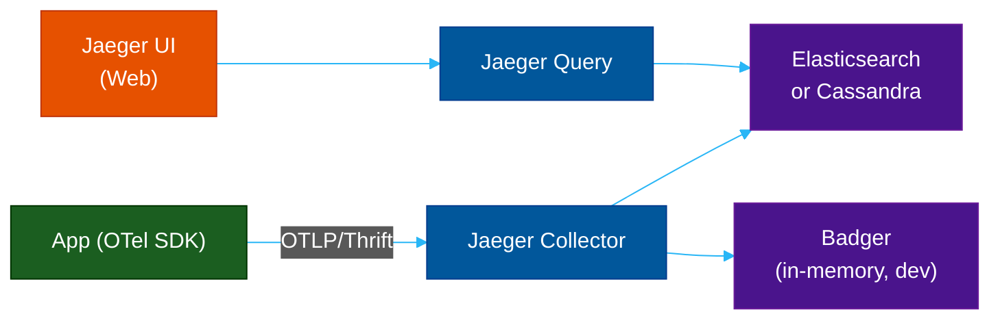
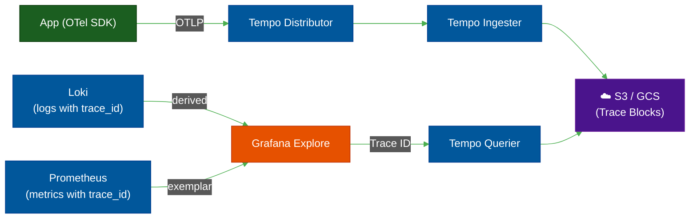

# 🔗 Jaeger & Grafana Tempo — Distributed Tracing

> **Series:** Observability Engineering › Pillar 4 — Distributed Tracing · **Level:** Intermediate · **Read Time:** ~10 min

---

## 📖 Table of Contents

- [1. What Is Distributed Tracing?](#1-what-is-distributed-tracing)
- [2. Jaeger — The Reference Implementation](#2-jaeger-the-reference-implementation)
- [3. Grafana Tempo — The Scalable Alternative](#3-grafana-tempo-the-scalable-alternative)
- [4. Zipkin — Lightweight Tracing](#4-zipkin-lightweight-tracing)
- [5. Trace Context Propagation](#5-trace-context-propagation)
- [6. Jaeger vs Tempo vs Zipkin](#6-jaeger-vs-tempo-vs-zipkin)
- [7. When to Use Each](#7-when-to-use-each)

---

## 1. What Is Distributed Tracing?

In a microservices architecture, a single user request can touch **dozens of services**. Distributed tracing records the **full journey** of that request — what services were called, in what order, and how long each step took.

```mermaid
%%{init: {'theme': 'dark', 'themeVariables': {'primaryColor': '#01579b', 'primaryTextColor': '#fff', 'lineColor': '#29b6f6', 'background': '#1e1e1e'},
  'themeCSS': 'svg { background-color: #1e1e1e !important; padding: 1rem !important; border-radius: 8px !important; } .edgeLabel rect { fill: #1e1e1e !important; } text, tspan, .messageText, .signalText, .edgeLabel, .edgeLabel span, .pointLabel, .axisLabel, .quadrantTitle, .quadrantLabel { fill: #ffffff !important; color: #ffffff !important; stroke: none !important; }'
}}%%
gantt
    title Trace: POST /checkout (total 245ms)
    dateFormat X
    axisFormat %Lms
    section API Gateway
    Auth Check          :0, 12
    section Order Service
    Validate Cart       :12, 30
    section Payment Service
    Charge Card         :30, 185
    section Inventory Service
    Reserve Items       :185, 220
    section Notification
    Send Email          :220, 245
```



**Key vocabulary:**

| Term | Meaning |
| :--- | :--- |
| **Trace** | The complete journey of one request, identified by a `trace_id` |
| **Span** | One unit of work within a trace (one service call, one DB query) |
| **Parent Span** | The span that initiated a child span |
| **Context Propagation** | Passing `trace_id` across service boundaries (HTTP headers, message queues) |
| **Sampling** | Recording only a fraction of traces to manage volume |

---

## 2. Jaeger — The Reference Implementation

**Jaeger** is an open-source distributed tracing system originally built by **Uber Technologies**, now a **CNCF graduated project**. It was one of the first systems to implement the **OpenTracing** specification (now superseded by OpenTelemetry).

### Architecture



### Key Features
- **Service Dependency Graph** — visual map of how services call each other
- **Adaptive Sampling** — dynamically adjust sampling rate per service
- **Compare Traces** — diff two traces side-by-side
- **OTel Native** — accepts OTLP data from any OTel-instrumented service

### Quick Start
```yaml
# docker-compose.yaml (all-in-one dev mode)
services:
  jaeger:
    image: jaegertracing/all-in-one:latest
    ports:
      - "16686:16686"  # Jaeger UI
      - "4317:4317"    # OTLP gRPC
      - "4318:4318"    # OTLP HTTP
    environment:
      - COLLECTOR_OTLP_ENABLED=true
```

---

## 3. Grafana Tempo — The Scalable Alternative

**Grafana Tempo** is a high-volume, cost-effective distributed tracing backend from **Grafana Labs**. Its primary differentiator: it stores traces **directly in object storage (S3)** with no search index — it only supports **lookup by Trace ID**.

This sounds limiting, but it's solved by **Grafana's correlation feature**: you find a Trace ID from a log line in Loki or a metrics spike in Prometheus, then look up the full trace in Tempo.

### Architecture



**Why Tempo is preferred in the LGTM stack:**
- Stores traces in S3 — **cost-efficient** for long retention
- Native **Grafana integration** — click a Loki log line → jump to Tempo trace
- Accepts Jaeger, Zipkin, and OTLP protocols

---

## 4. Zipkin — Lightweight Tracing

**Zipkin** is the **oldest and simplest** distributed tracing system, originally built by Twitter. It popularized the concepts that became OpenTracing and OpenTelemetry.

**Use Zipkin when:**
- You have a simple, small microservices setup
- You want the lowest-overhead tracing backend
- You are already using Spring Cloud Sleuth (which has native Zipkin support)

**Quick Start:**
```bash
docker run -d -p 9411:9411 openzipkin/zipkin
# UI at http://localhost:9411
```

---

## 5. Trace Context Propagation

Tracing only works if `trace_id` is passed across service boundaries. The **W3C Trace Context** standard defines how:

```
# HTTP Header
traceparent: 00-4bf92f3577b34da6a3ce929d0e0e4736-00f067aa0ba902b7-01
             |  |                                  |                | |
             |  trace-id (128-bit hex)              span-id         | sampled
             version                                                flag
```

**Spring Boot (auto with OTel agent):**
```java
// OTel agent auto-propagates headers — no code needed
// Just add the agent: -javaagent:opentelemetry-javaagent.jar
```

**Manual (Node.js):**
```javascript
const { context, propagation } = require('@opentelemetry/api');

// Inject context into outgoing HTTP headers
const carrier = {};
propagation.inject(context.active(), carrier);
axios.get('http://service-b/api', { headers: carrier });
```

---

## 6. Jaeger vs Tempo vs Zipkin

| Feature | Jaeger | Grafana Tempo | Zipkin |
| :--- | :--- | :--- | :--- |
| **Storage** | Elasticsearch / Cassandra / Badger | S3 / GCS / Azure Blob | In-memory / MySQL / Elasticsearch |
| **Search by Tags** | ✅ Yes | ⚠️ Requires TraceQL + Parquet | ✅ Yes |
| **Cost (scale)** | Medium-High | Very Low | Low |
| **Grafana Integration** | ✅ Plugin | ✅ Native | ✅ Plugin |
| **OTel Native** | ✅ Yes | ✅ Yes | ⚠️ Legacy (via bridge) |
| **Service Map** | ✅ Yes | ✅ Yes | ⚠️ Basic |
| **Best for** | Feature-rich tracing | LGTM stack / cost-efficient | Simple/legacy systems |

---

## 7. When to Use Each

| Scenario | Recommendation |
| :--- | :--- |
| Using LGTM stack (Grafana ecosystem) | ✅ Use **Tempo** |
| Need advanced search by tags/attributes | ✅ Use **Jaeger** with Elasticsearch |
| Legacy Spring Boot with Sleuth | ✅ Use **Zipkin** |
| High volume traces, low cost | ✅ Use **Tempo** (S3-backed) |
| Completely managed, all-in-one | ✅ Use **Datadog APM** or **New Relic** |

> [!IMPORTANT]
> All three backends support **OpenTelemetry (OTLP)** as the input protocol. Instrument your services with OTel once and switch backends without any code changes.

---

*← [Prometheus](./08-prometheus.md) · Next: [Grafana Dashboard](./15-grafana.md) →*

## Related

- [Network Protocols & API Architectures](../fundamentals/01-network-protocols-and-api-architectures.md)
- [API Gateways & Reverse Proxies](../api-gateways/README.md)
- [Error Tracking](../error-tracking/README.md)
- [Enterprise Security](../../security/README.md)
