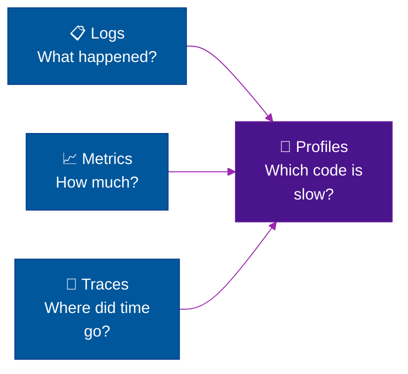
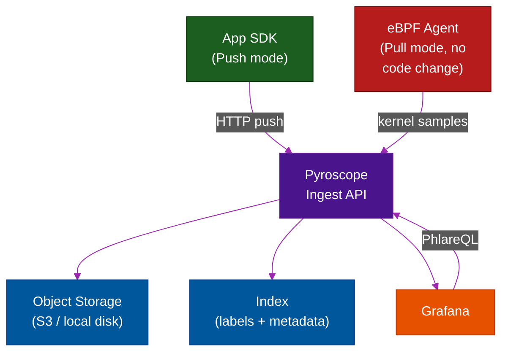

# 🧠 Pyroscope — Continuous Code Profiling

> **Series:** Observability Engineering › Pillar 5 — Continuous Profiling · **Level:** Advanced · **Read Time:** ~10 min

---

## 📖 Table of Contents

- [1. What Is Continuous Profiling?](#1-what-is-continuous-profiling)
- [2. What Is Pyroscope?](#2-what-is-pyroscope)
- [3. How Profiling Works](#3-how-profiling-works)
- [4. Profile Types](#4-profile-types)
- [5. Pyroscope Architecture](#5-pyroscope-architecture)
- [6. Quick Start](#6-quick-start)
- [7. Flame Graphs — Reading Profiles](#7-flame-graphs-reading-profiles)
- [8. Integrating with Grafana](#8-integrating-with-grafana)
- [9. When to Use Profiling](#9-when-to-use-profiling)

---

## 1. What Is Continuous Profiling?

Continuous profiling is the practice of **sampling what your code is doing at runtime** — continuously, in production — to understand where CPU time and memory are actually being spent at the **code level**.

It answers questions that logs, metrics, and traces cannot:
- "Which **specific function** is consuming 40% of my CPU?"
- "Which **line of code** is allocating 2 GB of memory?"
- "Why did this service get **slower after that deploy**?"

It is increasingly called the **"fourth pillar" of observability** (after logs, metrics, and traces).



---

## 2. What Is Pyroscope?

**Pyroscope** (now **Grafana Pyroscope** after Grafana Labs' acquisition) is an open-source **continuous profiling backend**. It collects profiling data from your applications continuously, stores it efficiently, and lets you visualize and query it via flame graphs.

**Key features:**
- Supports **CPU, memory, goroutine, mutex, block** profiling
- Works with **Java, Go, Python, Ruby, Node.js, Rust, .NET, PHP**
- Both **pull mode** (Pyroscope scrapes your app like Prometheus) and **push mode** (SDK pushes to Pyroscope)
- **eBPF-based** agent for zero-code, kernel-level profiling
- Native **Grafana integration** with `$$__range` correlation to metrics

---

## 3. How Profiling Works

Pyroscope uses **sampling profiling**: it interrupts the running program at a fixed frequency (usually 100 Hz = 100 times/second) and records the **call stack** at that moment.

```
Sample at t=0ms:   main → handleRequest → processPayment → validateCard
Sample at t=10ms:  main → handleRequest → processPayment → chargeStripe → httpClient.Do
Sample at t=20ms:  main → handleRequest → processPayment → chargeStripe → httpClient.Do
Sample at t=30ms:  main → handleRequest → processPayment → chargeStripe → httpClient.Do
Sample at t=40ms:  main → handleRequest → processPayment → updateDatabase → sql.Exec
```

After aggregation: `chargeStripe.httpClient.Do` appears 3/5 times = **60% of CPU time**. This is exactly what a flame graph visualizes.

**Overhead:** ~0.5–2% CPU. Low enough for continuous production use.

---

## 4. Profile Types

| Profile Type | What It Measures | Use Case |
| :--- | :--- | :--- |
| **CPU** | Wall-clock / on-CPU time per function | Find slow functions |
| **Alloc Objects** | Number of heap allocations | Find code creating garbage |
| **Alloc Space** | Bytes allocated per function | Find memory-hungry code |
| **Inuse Objects** | Live heap object count | Find memory leaks |
| **Inuse Space** | Live heap memory usage | Find memory leaks |
| **Goroutines** | Number of goroutines per creation point | Find goroutine leaks (Go) |
| **Mutex** | Contention on mutex locks | Find lock bottlenecks |
| **Block** | Time goroutines wait on channel/lock | Find blocking patterns |

---

## 5. Pyroscope Architecture



---

## 6. Quick Start

**Docker Compose (Pyroscope + Grafana):**
```yaml
services:
  pyroscope:
    image: grafana/pyroscope:latest
    ports:
      - "4040:4040"
    command: ["server"]

  grafana:
    image: grafana/grafana:latest
    ports:
      - "3000:3000"
    environment:
      - GF_FEATURE_TOGGLES_ENABLE=flameGraph
    volumes:
      - ./grafana/provisioning:/etc/grafana/provisioning
```

**Push profiling from Go:**
```go
import (
    "github.com/grafana/pyroscope-go"
)

func main() {
    pyroscope.Start(pyroscope.Config{
        ApplicationName: "order-service",
        ServerAddress:   "http://pyroscope:4040",
        ProfileTypes: []pyroscope.ProfileType{
            pyroscope.ProfileCPU,
            pyroscope.ProfileAllocObjects,
            pyroscope.ProfileAllocSpace,
            pyroscope.ProfileInuseObjects,
            pyroscope.ProfileInuseSpace,
        },
        Tags: map[string]string{
            "env":     "production",
            "version": "v2.1.4",
        },
    })

    // your application code
    http.ListenAndServe(":8080", router)
}
```

**Push profiling from Java (OTel-native):**
```yaml
# Add to OTel agent JVM arguments
-Dotel.javaagent.extensions=pyroscope-otel-0.10.1.jar
-Dpyroscope.application.name=order-service
-Dpyroscope.server.address=http://pyroscope:4040
-Dpyroscope.format=jfr
-Dpyroscope.profiler.event=cpu
```

---

## 7. Flame Graphs — Reading Profiles

A **flame graph** visualizes the call stack samples aggregated over a time window:

```
 ┌─────────────────────────────────────────────────────────┐
 │                       main (100%)                        │
 ├──────────────────────────────────────┬──────────────────┤
 │         handleRequest (90%)           │  healthCheck(10%)│
 ├────────────────────┬─────────────────┤                  │
 │ processPayment(70%)│ loadUser (20%)   │                  │
 ├────────────────────┤                 │                  │
 │ chargeStripe (60%) │                 │                  │
 ├──────────┬─────────┤                 │                  │
 │httpClient│parseResp│                 │                  │
 │  (50%)   │  (10%)  │                 │                  │
 └──────────┴─────────┴─────────────────┴──────────────────┘
              ↑ Wide bars = more CPU time
              ↑ Deep stacks = many nested calls
```

**How to read:**
- **Width** = how much CPU time this function consumes
- **Position** = call hierarchy (parent above, children below)
- **Widest frames at top** = biggest optimization opportunities

---

## 8. Integrating with Grafana

Pyroscope integrates with Grafana's **Explore Profiles** feature to correlate with metrics and traces:

```yaml
# grafana/provisioning/datasources/pyroscope.yaml
apiVersion: 1
datasources:
  - name: Pyroscope
    type: grafana-pyroscope-datasource
    url: http://pyroscope:4040
    jsonData:
      minStep: "15s"
```

**PhlareQL query examples:**
```
# CPU profile for payment service in production
{service_name="payment-service", env="production"}

# Compare CPU profiles: before vs after deploy
{service_name="order-service", version="v2.1.3"}
vs
{service_name="order-service", version="v2.1.4"}
```

---

## 9. When to Use Profiling

| Scenario | Recommendation |
| :--- | :--- |
| CPU usage is high but traces show short spans | ✅ Profile — latency is inside a single function |
| Memory grows over time (suspected leak) | ✅ Profile — inuse_space profile will show it |
| After a deploy, service got slower | ✅ Compare flame graphs before/after deploy |
| Random latency spikes with no obvious cause | ✅ Profile — often GC pressure or lock contention |
| Everything looks fine in traces | ⚠️ Profile anyway — profile what you can't see elsewhere |

> [!IMPORTANT]
> Profiling fills the gap that **traces cannot**: a trace shows that `chargeStripe()` took 200ms but cannot tell you *which line* inside it was slow. The profile shows the exact function and line.

> [!TIP]
> Use **eBPF-based profiling** (zero code changes) for getting started quickly — deploy the Pyroscope eBPF agent as a DaemonSet and immediately get CPU profiles from all pods on the node.

---

*← [Zipkin](./13-zipkin.md) · Next: [Grafana Dashboard](./15-grafana.md) →*

## Related

- [Network Protocols & API Architectures](../fundamentals/01-network-protocols-and-api-architectures.md)
- [API Gateways & Reverse Proxies](../api-gateways/README.md)
- [Error Tracking](../error-tracking/README.md)
- [Enterprise Security](../../security/README.md)
