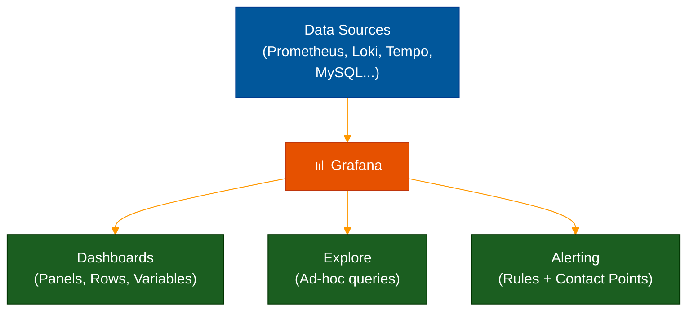

# 📊 Grafana — The Universal Observability Dashboard

> **Series:** Observability Engineering › Pillar 6 — Visualization · **Level:** Intermediate · **Read Time:** ~10 min

---

## 📖 Table of Contents

- [1. What Is Grafana?](#1-what-is-grafana)
- [2. Core Concepts](#2-core-concepts)
- [3. Data Sources](#3-data-sources)
- [4. Dashboard Panels](#4-dashboard-panels)
- [5. Grafana Explore — Ad-Hoc Debugging](#5-grafana-explore-ad-hoc-debugging)
- [6. Alerting](#6-alerting)
- [7. Grafana vs Kibana](#7-grafana-vs-kibana)
- [8. Grafana Cloud vs Self-Hosted](#8-grafana-cloud-vs-self-hosted)

---

## 1. What Is Grafana?

**Grafana** is the world's most popular **open-source observability and data visualization platform**. It turns raw data from any source (Prometheus, Loki, databases, cloud services) into **beautiful, interactive dashboards** and **unified observability workflows**.

> **Core position:** Grafana doesn't store data — it **queries and visualizes** data from your backends.

Grafana is the **G** in the LGTM stack and integrates natively with Loki (logs), Tempo (traces), and Mimir/Prometheus (metrics).

---

## 2. Core Concepts



| Concept | Description |
| :--- | :--- |
| **Data Source** | A configured connection to a backend (Prometheus, Loki, MySQL...) |
| **Dashboard** | A collection of panels arranged in rows |
| **Panel** | A single visualization (graph, table, stat, map...) |
| **Variable** | A dynamic filter applied to all panels on a dashboard |
| **Folder** | A way to organize and permission-control dashboards |

---

## 3. Data Sources

Grafana supports **150+ data source plugins**:

| Category | Data Sources |
| :--- | :--- |
| **Metrics** | Prometheus, Mimir, InfluxDB, Graphite, Datadog, CloudWatch |
| **Logs** | Loki, Elasticsearch, OpenSearch, Azure Monitor Logs |
| **Traces** | Tempo, Jaeger, Zipkin |
| **Databases** | MySQL, PostgreSQL, MSSQL, MongoDB |
| **Cloud** | AWS CloudWatch, Azure Monitor, Google Cloud Monitoring |
| **APM** | New Relic, Dynatrace, AppDynamics |

**Adding a Prometheus data source:**
```yaml
# grafana/provisioning/datasources/prometheus.yaml
apiVersion: 1
datasources:
  - name: Prometheus
    type: prometheus
    url: http://prometheus:9090
    isDefault: true
    jsonData:
      timeInterval: "15s"

  - name: Loki
    type: loki
    url: http://loki:3100
    jsonData:
      derivedFields:
        - name: TraceID
          matcherRegex: "trace_id=(\\w+)"
          url: "$${__value.raw}"
          datasourceUid: tempo

  - name: Tempo
    type: tempo
    url: http://tempo:3200
    uid: tempo
```

---

## 4. Dashboard Panels

| Panel Type | Best For |
| :--- | :--- |
| **Time Series** | Trends over time (CPU, error rate, latency) |
| **Stat** | Single current value (uptime, current RPS) |
| **Gauge** | Progress bar or speedometer for bounded values |
| **Bar Chart** | Comparing categories |
| **Table** | Structured data with sorting and filtering |
| **Heatmap** | Distribution of values over time (latency percentiles) |
| **Logs** | Log lines from Loki or Elasticsearch |
| **Node Graph** | Service dependency maps |
| **Traces** | Trace waterfall from Tempo/Jaeger |
| **Geomap** | Geographic data distribution |

**Example: The Golden Signals Dashboard**

The four **Golden Signals** (from Google SRE) every service should have:

```
┌──────────────────┬──────────────────┐
│   Latency (p50)  │   Latency (p99)  │
│   12ms           │   245ms          │
├──────────────────┼──────────────────┤
│   Error Rate     │   Traffic (RPS)  │
│   0.3%           │   1,240 req/s    │
├──────────────────┴──────────────────┤
│   Saturation                        │
│   CPU: ████████░░ 78%               │
│   Mem: ██████░░░░ 62%               │
└─────────────────────────────────────┘
```

---

## 5. Grafana Explore — Ad-Hoc Debugging

**Explore** is Grafana's dedicated space for **ad-hoc investigation** — querying logs, traces, and metrics without a pre-built dashboard.

The real power is **correlation**: clicking on a log line with a `trace_id` field instantly opens the correlated trace in Tempo.

```
[Explore: Loki]
  {app="payment-service"} |= "ERROR"
  → 2026-05-17 11:10:24 | ERROR | Payment failed | trace_id=abc123def456

                  ↓ Click trace_id

[Explore: Tempo]
  Trace abc123def456
  ├── api-gateway (12ms)
  ├── payment-service (215ms) ← SLOW
  │   ├── validate-card (8ms)
  │   └── charge-stripe (207ms) ← ROOT CAUSE
  └── notification (5ms)
```

---

## 6. Alerting

Grafana's unified alerting system supports rules evaluated against any data source:

```yaml
# Alert rule (via Grafana UI or Terraform)
Alert: High Error Rate
  Query A: rate(http_requests_total{status=~"5.."}[5m])
  Query B: rate(http_requests_total[5m])
  Expression: (A / B) * 100 > 5
  For: 5m
  Labels:
    severity: critical
    team: backend
  Contact Point: PagerDuty
```

**Contact Points supported:**
- Slack, Teams, Discord
- PagerDuty, OpsGenie, VictorOps
- Email, Webhook
- Telegram, LINE

---

## 7. Grafana vs Kibana

| Feature | Grafana | Kibana |
| :--- | :--- | :--- |
| **Primary use** | Multi-source dashboards | Elasticsearch visualization |
| **Data sources** | 150+ plugins | Elasticsearch / OpenSearch only |
| **Metrics** | ✅ Native Prometheus | ⚠️ Via Elastic Metrics |
| **Logs** | ✅ Loki, Elasticsearch | ✅ Elasticsearch only |
| **Traces** | ✅ Tempo, Jaeger | ✅ Elastic APM only |
| **Alerting** | ✅ Unified across all sources | ✅ Kibana Alerts |
| **Cost** | OSS free + Cloud paid | OSS free + Enterprise paid |
| **Best for** | Multi-backend, Kubernetes | All-Elastic environments |

---

## 8. Grafana Cloud vs Self-Hosted

| | Grafana Cloud (Free Tier) | Self-Hosted OSS |
| :--- | :--- | :--- |
| **Setup** | Instant | Requires infra setup |
| **Loki Logs** | 50 GB/month free | Unlimited (pay for storage) |
| **Metrics** | 10k series free | Unlimited |
| **Traces** | 50 GB/month free | Unlimited |
| **Alerting** | ✅ Included | ✅ Included |
| **Access** | SaaS | Your infrastructure |
| **Best for** | Startups / small teams | Privacy-sensitive / large scale |

> [!TIP]
> Start with **Grafana Cloud free tier** — it includes Loki, Tempo, and Prometheus hosted for you. When your volume exceeds free limits, migrate to self-hosted with the same Grafana frontend and your own backends.

---

*← [Jaeger & Tempo](./11-jaeger-and-tempo.md) · Next: [Platform Comparison](./23-platform-comparison.md) →*

## Related

- [Network Protocols & API Architectures](../fundamentals/01-network-protocols-and-api-architectures.md)
- [API Gateways & Reverse Proxies](../api-gateways/README.md)
- [Error Tracking](../error-tracking/README.md)
- [Enterprise Security](../../security/README.md)
