# 📊 Kibana — ELK Visualization Layer

> **Series:** Observability Engineering › Pillar 6 — Visualization · **Level:** Intermediate · **Read Time:** ~8 min

---

## 📖 Table of Contents

- [1. What Is Kibana?](#1-what-is-kibana)
- [2. Core Features](#2-core-features)
- [3. Discover — Log Exploration](#3-discover-log-exploration)
- [4. KQL — Kibana Query Language](#4-kql-kibana-query-language)
- [5. Dashboard Building](#5-dashboard-building)
- [6. Kibana vs Grafana](#6-kibana-vs-grafana)
- [7. When to Use Kibana](#7-when-to-use-kibana)

---

## 1. What Is Kibana?

**Kibana** is the visualization and analytics layer of the **ELK Stack** (Elasticsearch, Logstash, Kibana). It is a web application that connects directly to Elasticsearch and provides search, dashboards, alerting, and machine learning features.

> **One rule:** Kibana only works with Elasticsearch (or OpenSearch with its fork, OpenSearch Dashboards). It cannot connect to Prometheus, Loki, or other backends.

---

## 2. Core Features

```mermaid
%%{init: {'theme': 'dark', 'themeVariables': {'primaryColor': '#01579b', 'primaryTextColor': '#fff', 'lineColor': '#29b6f6', 'background': '#1e1e1e'},
  'themeCSS': 'svg { background-color: #1e1e1e !important; padding: 1rem !important; border-radius: 8px !important; } .edgeLabel rect { fill: #1e1e1e !important; } text, tspan, .messageText, .signalText, .edgeLabel, .edgeLabel span, .pointLabel, .axisLabel, .quadrantTitle, .quadrantLabel { fill: #ffffff !important; color: #ffffff !important; stroke: none !important; }'
}}%%
graph TD
    classDef kb   fill:#01579b,stroke:#003c8f,color:#fff
    classDef feat fill:#1b5e20,stroke:#003300,color:#fff

    KB["📊 Kibana"]:::kb --> DISC["Discover<br/>(Log search & filter)"]:::feat
    KB --> DASH["Dashboards<br/>(Custom visualizations)"]:::feat
    KB --> LENS["Lens<br/>(Drag-and-drop charts)"]:::feat
    KB --> ML["Machine Learning<br/>(Anomaly detection)"]:::feat
    KB --> SIEM["Security / SIEM<br/>(Threat hunting)"]:::feat
    KB --> APM["APM<br/>(Elastic APM integration)"]:::feat
    KB --> MAPS["Maps<br/>(GeoIP visualization)"]:::feat
    KB --> ALERT["Alerting<br/>(Rule-based + ML)"]:::feat
```



| Feature | Description |
| :--- | :--- |
| **Discover** | Ad-hoc log and document search with filters and field selection |
| **Dashboards** | Saved visualizations grouped into dashboards |
| **Lens** | Drag-and-drop chart builder (easiest way to build panels) |
| **Canvas** | Presentation-style, pixel-perfect dashboards |
| **Machine Learning** | Anomaly detection on time-series data (requires Platinum/Enterprise) |
| **SIEM / Security** | Security event timeline, threat detection rules |
| **APM** | Full application performance monitoring (with Elastic APM agents) |
| **Alerting** | Threshold-based and ML-based alerts |

---

## 3. Discover — Log Exploration

**Discover** is the primary interface for exploring log data. It shows raw documents from Elasticsearch with filtering, column selection, and time-range navigation.

```
┌──────────────────────────────────────────────────────────────────┐
│ ○ KQL Filter: service.name: "payment-service" and log.level: ERROR │
│ Time range: Last 24 hours                                          │
├─────────────────┬──────────────────────────────────────────────── │
│ FIELDS          │  DOCUMENTS (1,247 hits)                          │
│ ── Available ── │  @timestamp  | service  | message               │
│ @timestamp      │  11:10:24    | payment  | Payment failed:       │
│ service.name    │              |          | card declined          │
│ log.level       │  11:09:11    | payment  | Timeout connecting    │
│ message         │              |          | to Stripe API          │
│ trace.id        │  11:08:55    | payment  | Invalid CVV format    │
│ user.id         │                                                  │
└──────────────────────────────────────────────────────────────────┘
```

**Key capabilities:**
- **Field selection** — choose which columns to display in the document table
- **Expand document** — view all fields of a single log entry
- **Field statistics** — see top values and distribution for any field
- **Save search** — save filters to reuse in dashboards

---

## 4. KQL — Kibana Query Language

**KQL (Kibana Query Language)** is an intuitive, human-readable query language for filtering Elasticsearch data:

```kql
# Simple field match
service.name: "payment-service"

# AND / OR
service.name: "payment-service" AND log.level: ERROR

# Wildcard
message: "Payment*"

# Numeric range
http.response.status_code >= 500

# Existence check
error.stack_trace: *

# Phrase match (exact sequence)
message: "connection refused"

# Nested field
kubernetes.pod.name: "payment-*"

# Full combined query
service.name: "payment-service"
AND log.level: ERROR
AND @timestamp >= "2026-05-17T10:00:00"
AND NOT http.route: "/health"
```

---

## 5. Dashboard Building

Kibana provides multiple ways to build visualizations:

**Lens (recommended — drag and drop):**
```
1. Open Lens → New Visualization
2. Drag "@timestamp" to X-axis
3. Drag "Count" to Y-axis
4. Set breakdown by "service.name"
5. Choose "Line" chart type
6. Add to Dashboard
```

**Common visualization types:**

| Type | Best For |
| :--- | :--- |
| **Line chart** | Trends over time (error rate, latency) |
| **Bar chart** | Comparing categories (errors per service) |
| **Data table** | Top-N lists (slowest endpoints) |
| **Metric / Stat** | Single value (total errors in last hour) |
| **Pie chart** | Proportions (error types distribution) |
| **Heat map** | Latency distribution by time |
| **Tag cloud** | Frequent terms in log messages |
| **TSVB** | Time-series visual builder (complex metrics) |

---

## 6. Kibana vs Grafana

| Feature | Kibana | Grafana |
| :--- | :--- | :--- |
| **Data sources** | Elasticsearch / OpenSearch only | 150+ (Prometheus, Loki, DBs, cloud...) |
| **Log search** | ✅ Excellent (Discover) | ✅ Good (Explore) |
| **Metrics dashboards** | ⚠️ Via Elasticsearch metrics | ✅ Native Prometheus / Mimir |
| **Tracing** | ✅ Elastic APM only | ✅ Tempo, Jaeger (any backend) |
| **Machine learning** | ✅ Built-in (Enterprise tier) | ⚠️ Limited (via plugins) |
| **SIEM** | ✅ Best-in-class | ❌ Not designed for SIEM |
| **Alerting** | ✅ Integrated | ✅ Unified (any data source) |
| **Cost** | OSS (basic) + Enterprise license | OSS (free) + Cloud |
| **Best for** | All-Elastic environments | Multi-backend, Kubernetes |

---

## 7. When to Use Kibana

| Scenario | Recommendation |
| :--- | :--- |
| Using ELK / OpenSearch for logs | ✅ Use Kibana (it's included) |
| Need SIEM / security event analysis | ✅ Kibana SIEM is best-in-class |
| Using Elastic APM | ✅ Kibana APM view is native |
| Need metrics from Prometheus | ❌ Use Grafana instead |
| Multi-backend observability | ❌ Use Grafana (150+ data sources) |
| Deep log analytics with aggregations | ✅ Kibana Lens is powerful |

> [!NOTE]
> If you're using **OpenSearch** instead of Elasticsearch, use **OpenSearch Dashboards** — it is a fork of Kibana (Kibana 7.10) maintained by AWS with near-100% UI compatibility.

---

*← [Grafana](./15-grafana.md) · Next: [Alertmanager & PagerDuty](./17-alertmanager-pagerduty.md) →*

## Related

- [Network Protocols & API Architectures](../fundamentals/01-network-protocols-and-api-architectures.md)
- [API Gateways & Reverse Proxies](../api-gateways/README.md)
- [Error Tracking](../error-tracking/README.md)
- [Enterprise Security](../../security/README.md)
