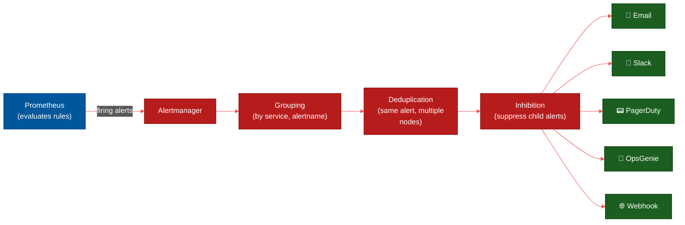
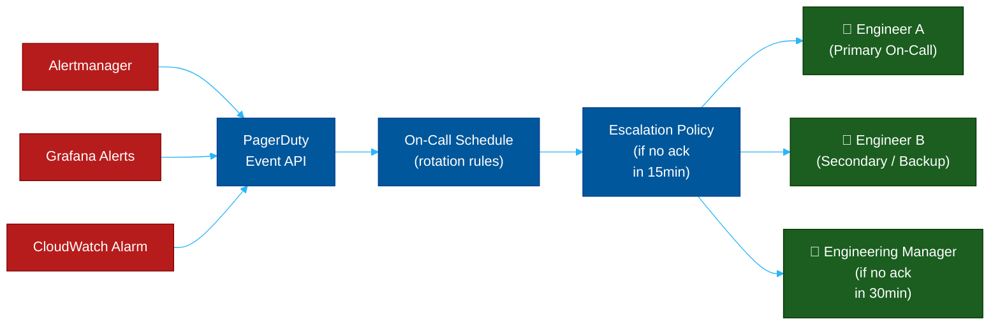

# 🚨 Alertmanager & PagerDuty — Alert Routing & Incident Management

> **Series:** Observability Engineering › Pillar 7 — Alerting & Incident Management · **Level:** Intermediate · **Read Time:** ~10 min

---

## 📖 Table of Contents

- [1. The Problem: Alert Noise](#1-the-problem-alert-noise)
- [2. Alertmanager — Prometheus Alert Routing](#2-alertmanager-prometheus-alert-routing)
- [3. Alert Routing Configuration](#3-alert-routing-configuration)
- [4. Inhibition & Silencing](#4-inhibition-silencing)
- [5. PagerDuty — On-Call Management](#5-pagerduty-on-call-management)
- [6. OpsGenie & Alternatives](#6-opsgenie-alternatives)
- [7. Alert Design Best Practices](#7-alert-design-best-practices)
- [8. The Four Golden Signals to Alert On](#8-the-four-golden-signals-to-alert-on)

---

## 1. The Problem: Alert Noise

Poorly designed alerting creates **alert fatigue** — engineers learn to ignore alerts because too many are false positives. This leads to:
- Critical incidents missed in a sea of noise
- Engineers burning out from constant interruptions
- Teams silencing alerts instead of fixing root causes

Good alerting follows one rule: **every alert that fires must be actionable by a human**.

---

## 2. Alertmanager — Prometheus Alert Routing

**Prometheus Alertmanager** receives alerts fired by Prometheus (or Grafana), deduplicates them, groups them, applies routing rules, and sends notifications to the right receivers.



**Key concepts:**

| Concept | Description |
| :--- | :--- |
| **Grouping** | Bundle multiple related alerts into one notification |
| **Deduplication** | Only fire once even if 10 nodes report the same alert |
| **Inhibition** | Suppress low-priority alerts when a high-priority one fires |
| **Silencing** | Temporarily mute alerts during maintenance |
| **Routing** | Send different alerts to different teams/channels |

---

## 3. Alert Routing Configuration

```yaml
# alertmanager.yml
global:
  resolve_timeout: 5m
  slack_api_url: "https://hooks.slack.com/services/..."

route:
  # Default receiver for unmatched alerts
  receiver: "team-slack-general"
  group_by: ["alertname", "service", "env"]
  group_wait:      30s   # wait 30s before sending first notification
  group_interval:  5m    # wait 5m before sending new alerts in same group
  repeat_interval: 3h    # repeat if alert is still firing after 3h

  routes:
    # Critical alerts → PagerDuty (wakes someone up)
    - match:
        severity: critical
      receiver: "pagerduty-prod"
      continue: true   # also send to slack

    # Warning alerts → Slack only
    - match:
        severity: warning
      receiver: "team-slack-warnings"

    # Database alerts → DBA team
    - match_re:
        alertname: "(PostgreSQL|MySQL|Redis).*"
      receiver: "team-dba"

    # Staging alerts → separate channel, lower urgency
    - match:
        env: staging
      receiver: "team-slack-staging"
      repeat_interval: 24h

receivers:
  - name: "team-slack-general"
    slack_configs:
      - channel: "#alerts"
        title: "{{ .GroupLabels.alertname }}"
        text: >-
          {{ range .Alerts }}
          *Service:* {{ .Labels.service }}
          *Severity:* {{ .Labels.severity }}
          *Message:* {{ .Annotations.summary }}
          {{ end }}
        send_resolved: true

  - name: "pagerduty-prod"
    pagerduty_configs:
      - service_key: "${PAGERDUTY_INTEGRATION_KEY}"
        description: "{{ .GroupLabels.alertname }}: {{ .CommonAnnotations.summary }}"
        severity: "{{ .CommonLabels.severity }}"

  - name: "team-dba"
    email_configs:
      - to: "dba-team@company.com"
        from: "alerts@company.com"
        smarthost: "smtp.company.com:587"

inhibit_rules:
  # If a node is down, suppress all alerts from that node
  - source_match:
      alertname: "NodeDown"
    target_match_re:
      alertname: ".*"
    equal: ["node"]

  # If there's a critical alert, suppress warnings for the same service
  - source_match:
      severity: critical
    target_match:
      severity: warning
    equal: ["service", "env"]
```

---

## 4. Inhibition & Silencing

**Inhibition** — suppresses child alerts automatically when a parent fires:
```
NodeDown fires (node=prod-01)
  → suppresses: HighCPU, HighMemory, DiskFull, PodCrash on prod-01
  → engineers only see ONE alert instead of 15
```

**Silencing** — temporarily mute an alert:
```bash
# Silence all alerts for payment-service during planned maintenance
amtool silence add \
  alertname=~".*" \
  service="payment-service" \
  --duration=2h \
  --comment="Planned maintenance window 14:00–16:00 UTC" \
  --author="ops-team"
```

---

## 5. PagerDuty — On-Call Management

**PagerDuty** is the industry standard for **on-call rotation management** and **incident response**. It receives alerts from Alertmanager, Grafana, or any webhook, and routes them to the right on-call engineer.



**PagerDuty key features:**
- **On-call schedules** — rotating shifts (weekly, daily)
- **Escalation policies** — if Engineer A doesn't ack in 15 min, page Engineer B
- **Incident timeline** — full audit trail of who was paged, when, and what they did
- **Runbooks** — attach runbook links to alert definitions
- **Post-incident review** — automatically collect MTTD, MTTR metrics
- **AIOps** — ML-based noise reduction and alert correlation

---

## 6. OpsGenie & Alternatives

| Tool | Type | Best For | Cost |
| :--- | :--- | :--- | :--- |
| **PagerDuty** | SaaS | Enterprise, complex escalation policies | $$$ |
| **OpsGenie** (Atlassian) | SaaS | Teams already on Jira / Confluence | $$ |
| **VictorOps** (Splunk) | SaaS | Splunk-heavy teams | $$ |
| **Grafana OnCall** | OSS + Cloud | Teams in Grafana ecosystem | Free (OSS) |
| **AlertSnooze / Alertik** | OSS | Self-hosted, minimal | Free |
| **ntfy / Gotify** | OSS | Self-hosted push notifications | Free |

**Grafana OnCall** is the open-source option — it integrates natively with Grafana and Alertmanager and provides on-call scheduling, escalations, and mobile push notifications.

---

## 7. Alert Design Best Practices

> [!IMPORTANT]
> **Alert on symptoms, not causes.**
> Bad: `CPUUsageAbove80%` (cause — might be fine)
> Good: `P99LatencyAbove2s` (symptom — users are affected)

| Practice | Bad Example | Good Example |
| :--- | :--- | :--- |
| **Actionable** | "CPU is high" | "Payment service P99 > 2s — check DB queries" |
| **Symptoms, not causes** | `disk_used > 80%` | `service_unavailable` |
| **Avoid flapping** | Fire immediately | Use `for: 5m` to require sustained breach |
| **Right severity** | Everything is critical | Critical = page now, Warning = fix next |
| **Include runbook** | No description | `annotations.runbook_url: "https://..."` |

```yaml
# Good alert example
- alert: PaymentServiceHighLatency
  expr: |
    histogram_quantile(0.99,
      rate(http_request_duration_seconds_bucket{
        service="payment-service"
      }[5m])
    ) > 2.0
  for: 5m
  labels:
    severity: critical
    team: backend
    service: payment-service
  annotations:
    summary: "Payment service P99 latency is {{ $value | humanizeDuration }}"
    description: "P99 latency for payment-service has exceeded 2s for 5 minutes"
    runbook_url: "https://wiki.company.com/runbooks/payment-service-latency"
    dashboard_url: "https://grafana.company.com/d/payment-service"
```

---

## 8. The Four Golden Signals to Alert On

Google SRE's **Four Golden Signals** are the minimum every service should alert on:

| Signal | Metric | Alert Threshold |
| :--- | :--- | :--- |
| **Latency** | P99 request duration | > 2s for 5m |
| **Traffic** | Requests per second | Drop > 50% vs 1h ago |
| **Errors** | HTTP 5xx rate | > 1% for 5m |
| **Saturation** | CPU / memory usage | > 85% for 10m |

> [!TIP]
> Start with just these **4 alerts per service**. A service with 4 well-designed golden-signal alerts is better than one with 50 noisy, low-quality alerts.

---

*← [Kibana](./16-kibana.md) · Next: [Datadog](./18-datadog.md) →*

## Related

- [Network Protocols & API Architectures](../fundamentals/01-network-protocols-and-api-architectures.md)
- [API Gateways & Reverse Proxies](../api-gateways/README.md)
- [Error Tracking](../error-tracking/README.md)
- [Enterprise Security](../../security/README.md)
