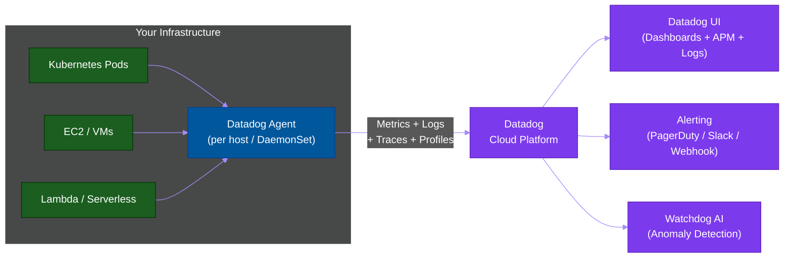

# 🏗️ Datadog — Gold Standard SaaS Observability

> **Series:** Observability Engineering › Unified Platforms · **Level:** Intermediate · **Read Time:** ~10 min

---

## 📖 Table of Contents

- [1. What Is Datadog?](#1-what-is-datadog)
- [2. Core Products](#2-core-products)
- [3. Architecture](#3-architecture)
- [4. Strengths](#4-strengths)
- [5. Weaknesses](#5-weaknesses)
- [6. Pricing Model](#6-pricing-model)
- [7. When to Choose Datadog](#7-when-to-choose-datadog)

---

## 1. What Is Datadog?

**Datadog** is the leading commercial, cloud-based observability and security platform. It provides a unified view of **infrastructure, applications, logs, traces, security, and AI/ML** across any environment — cloud, on-prem, or hybrid.

Founded in 2010, Datadog is now used by **25,000+ organizations** including Airbnb, Samsung, and Shopify. It consistently ranks as the industry benchmark for what a full-featured observability platform should deliver.

---

## 2. Core Products

```mermaid
%%{init: {'theme': 'dark', 'themeVariables': {'primaryColor': '#7c3aed', 'primaryTextColor': '#fff', 'lineColor': '#a78bfa', 'background': '#1e1e1e'},
  'themeCSS': 'svg { background-color: #1e1e1e !important; padding: 1rem !important; border-radius: 8px !important; } .edgeLabel rect { fill: #1e1e1e !important; } text, tspan, .messageText, .signalText, .edgeLabel, .edgeLabel span, .pointLabel, .axisLabel, .quadrantTitle, .quadrantLabel { fill: #ffffff !important; color: #ffffff !important; stroke: none !important; }'
}}%%
graph TD
    classDef dd   fill:#7c3aed,stroke:#5b21b6,color:#fff
    classDef core fill:#01579b,stroke:#003c8f,color:#fff
    classDef sec  fill:#b71c1c,stroke:#7f0000,color:#fff

    DD["🐶 Datadog Platform"]:::dd

    subgraph "Observability"
        INF["Infrastructure<br/>Monitoring"]:::core
        APM["APM &<br/>Distributed Tracing"]:::core
        LOG["Log Management"]:::core
        RUM["Real User<br/>Monitoring (RUM)"]:::core
        SYN["Synthetic<br/>Monitoring"]:::core
        NET["Network<br/>Performance Monitoring"]:::core
    end

    subgraph "Security"
        CSPM["Cloud Security<br/>Posture Mgmt"]:::sec
        SIEM["Security Information<br/>& Event Mgmt"]:::sec
        WAF["Application<br/>Security (WAF)"]:::sec
    end

    subgraph "AI / Automation"
        WD["Watchdog AI<br/>(Anomaly Detection)"]:::dd
        AIOPS["AIOps<br/>(Correlation)"]:::dd
        BITS["Bits AI<br/>(Copilot)"]:::dd
    end

    DD --> INF & APM & LOG & RUM & SYN & NET
    DD --> CSPM & SIEM & WAF
    DD --> WD & AIOPS & BITS
```

---

## 3. Architecture

The **Datadog Agent** is a single binary (written in Go/Python) that collects metrics, logs, traces, and profiles from the host and forwards everything to Datadog's SaaS backend.

**700+ integrations** — one-line configuration for MySQL, Redis, Nginx, Kubernetes, AWS, GCP, Azure, and more.

---

## 4. Strengths

**✅ Industry-leading correlation:**
Datadog's most powerful feature is the ability to **jump from a metric spike → correlated log lines → the trace that caused it** in one click. No other tool does this as seamlessly.

**✅ 700+ integrations:**
Everything from AWS services to databases to SaaS tools has a pre-built Datadog integration with dashboards and alerts included.

**✅ Watchdog AI:**
Automatically detects anomalies in metrics, logs, and APM — no manual alert threshold configuration required.

**✅ Real User Monitoring (RUM):**
Track real browser / mobile user experience — page load times, JavaScript errors, session replays.

**✅ Synthetic Monitoring:**
Automated tests that simulate user interactions from global PoPs to detect issues before users do.

**✅ Zero operational overhead:**
No infrastructure to manage. Spin up in minutes.

---

## 5. Weaknesses

**❌ Cost:**
Datadog pricing grows linearly with hosts, log volume, and APM traces. At scale, costs can reach **$50,000–$500,000+/year** for large engineering organizations.

**❌ Vendor lock-in:**
Your dashboards, monitors, and integrations are all inside Datadog. Migration is painful.

**❌ Log retention:**
Default log retention is 15 days. Long-term log retention is significantly more expensive.

**❌ Data residency:**
Data is sent to Datadog's SaaS — may not be acceptable for highly regulated industries (healthcare, banking) without specific regional configurations.

---

## 6. Pricing Model

Datadog charges **per host per month** for infrastructure monitoring, and **per GB** for logs and APM:

| Product | Pricing (est.) |
| :--- | :--- |
| **Infrastructure** | $15–$23/host/month |
| **APM + Tracing** | $31/host/month |
| **Log Management** | $0.10/GB ingested + $0.02/GB indexed/month |
| **Log Retention (15d)** | Included |
| **Log Retention (30d)** | Additional cost |
| **RUM** | $1.50/1000 sessions |
| **Synthetic** | $5/1000 test runs |

**Example: 50-host company, 100 GB/day logs, APM on all hosts**
- Infrastructure: 50 × $23 = $1,150/mo
- APM: 50 × $31 = $1,550/mo
- Logs (100 GB/day × 30d): ~$3,000–$5,000/mo
- **Total: ~$5,700–$7,700/mo**

vs self-hosted LGTM stack: ~$200–$300/mo

---

## 7. When to Choose Datadog

| Scenario | Recommendation |
| :--- | :--- |
| Small/medium team, speed > cost | ✅ Excellent — zero ops overhead |
| Enterprise with DevOps budget | ✅ Best all-in-one experience |
| Need log + metric + trace correlation | ✅ Best-in-class |
| Need RUM + Synthetic testing | ✅ Excellent |
| Cost-sensitive / budget-constrained | ❌ Use LGTM stack or SigNoz |
| Strict data residency requirements | ⚠️ Evaluate Datadog EU region or alternatives |
| Open-source preference | ❌ Fully commercial/SaaS |

> [!TIP]
> Start with the **Datadog free trial** (14 days, up to 5 hosts free). Use it to understand what you need before committing — many teams find they use only 20% of Datadog's features but pay for 100%.

---

*← [SigNoz](./22-signoz.md) · Next: [New Relic](./19-new-relic.md) →*

## Related

- [Network Protocols & API Architectures](../fundamentals/01-network-protocols-and-api-architectures.md)
- [API Gateways & Reverse Proxies](../api-gateways/README.md)
- [Error Tracking](../error-tracking/README.md)
- [Enterprise Security](../../security/README.md)
