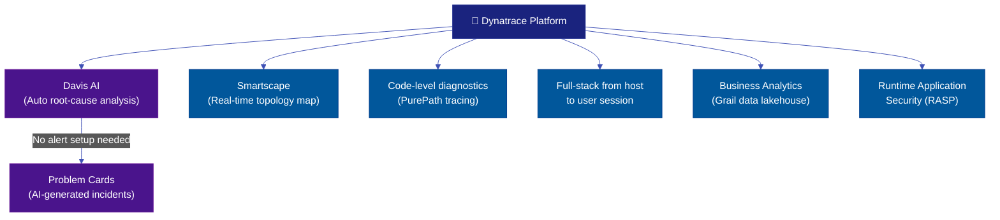
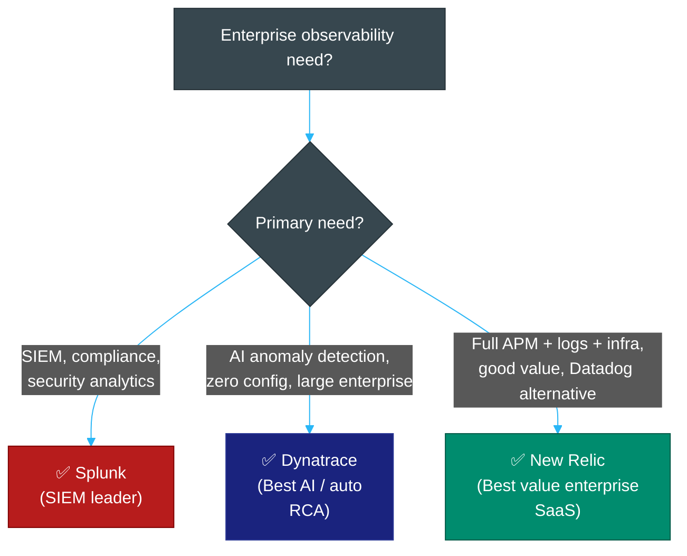

# 🏗️ New Relic, Dynatrace & Splunk — Enterprise Observability Platforms

> **Series:** Observability Engineering › Unified Platforms · **Level:** Advanced · **Read Time:** ~12 min

---

## 📖 Table of Contents

- [1. New Relic — Full-Stack APM](#1-new-relic-full-stack-apm)
- [2. Dynatrace — AI-Powered Observability](#2-dynatrace-ai-powered-observability)
- [3. Splunk — Enterprise Analytics & SIEM](#3-splunk-enterprise-analytics-siem)
- [4. Side-by-Side Comparison](#4-side-by-side-comparison)
- [5. When to Choose Each](#5-when-to-choose-each)

---

## 1. New Relic — Full-Stack APM

**New Relic** is a cloud-based observability platform offering full-stack visibility: APM, infrastructure, logs, browser monitoring, mobile, and synthetic testing. Founded in 2008, New Relic pivoted to a **data-ingest-based pricing model** in 2021 — making it more predictable and often cheaper than Datadog.

### Key Features

```mermaid
%%{init: {'theme': 'dark', 'themeVariables': {'primaryColor': '#01c09c', 'primaryTextColor': '#fff', 'lineColor': '#00e5b3', 'background': '#1e1e1e'},
  'themeCSS': 'svg { background-color: #1e1e1e !important; padding: 1rem !important; border-radius: 8px !important; } .edgeLabel rect { fill: #1e1e1e !important; } text, tspan, .messageText, .signalText, .edgeLabel, .edgeLabel span, .pointLabel, .axisLabel, .quadrantTitle, .quadrantLabel { fill: #ffffff !important; color: #ffffff !important; stroke: none !important; }'
}}%%
graph TD
    classDef nr   fill:#008c6e,stroke:#005947,color:#fff
    classDef feat fill:#01579b,stroke:#003c8f,color:#fff

    NR["🟢 New Relic Platform"]:::nr
    NR --> APM["APM & Distributed Tracing"]:::feat
    NR --> INF["Infrastructure Monitoring"]:::feat
    NR --> LOG["Log Management"]:::feat
    NR --> RUM["Browser & Mobile RUM"]:::feat
    NR --> SYN["Synthetic Monitoring"]:::feat
    NR --> NRQL["NRQL Analytics<br/>(SQL-like)"]:::feat
    NR --> AI["New Relic AI<br/>(Anomaly Detection)"]:::feat
    NR --> SEC["Vulnerability Management"]:::feat
```



### NRQL — New Relic Query Language

NRQL is SQL-like and very approachable:

```sql
-- Error rate per service
SELECT percentage(count(*), WHERE error IS TRUE)
FROM Transaction
WHERE appName = 'payment-service'
SINCE 1 hour ago
FACET name
TIMESERIES 5 minutes

-- P99 latency
SELECT percentile(duration, 99) AS 'P99 Latency (ms)'
FROM Transaction
WHERE appName IN ('payment-service', 'order-service')
SINCE 30 minutes ago
FACET appName
TIMESERIES 1 minute

-- Log error count
SELECT count(*)
FROM Log
WHERE level = 'ERROR'
SINCE 24 hours ago
FACET service
```

### Pricing (2025)
- **Free tier:** 100 GB/month data ingest + 1 full user
- **Standard:** $0.30/GB after first 100 GB
- **Data Plus:** $0.50/GB (90-day retention, FedRAMP, extended retention)
- **Users:** Full users $99/month; basic users free

**For 100 GB/day (3 TB/month):** ~$870/month base (much cheaper than Datadog)

---

## 2. Dynatrace — AI-Powered Observability

**Dynatrace** is an enterprise observability platform that differentiates itself with **Davis AI** — an AI engine that automatically detects anomalies, determines root causes, and prioritizes problems **without any manual alert configuration**. Dynatrace is the choice of large enterprises requiring zero manual tuning.

### Key Differentiators



**Davis AI — What Makes Dynatrace Unique:**

Rather than requiring you to define alert thresholds, Davis AI continuously learns baselines and automatically:
1. **Detects anomalies** — CPU spike, latency increase, error rate change
2. **Determines root cause** — "The issue started in `payment-service` at 11:10:24, caused by a slow DB query in `PostgreSQL`"
3. **Correlates impact** — "This is affecting 847 users and 3 dependent services"
4. **Creates a Problem Card** — a single alert consolidating all related issues

**Smartscape** — a real-time, automatically discovered topology map showing every host, process, service, and user session and how they connect.

### DQL — Dynatrace Query Language

```
-- Find slow traces in last 15 minutes
fetch spans
| filter service.name == "payment-service"
| filter duration > 2000000000  // 2 seconds in nanoseconds
| sort duration desc
| limit 50

-- Error rate
fetch logs
| filter loglevel == "ERROR"
| summarize count = count(), by: bin(timestamp, 5m), service.name
| sort timestamp desc
```

### Pricing
Dynatrace uses a **DEM (Digital Experience Monitoring Unit)** and **DDU (Davis Data Unit)** consumption model. Pricing is complex and typically negotiated enterprise-wide.
- **Infrastructure monitoring:** ~$21/host/month
- **Full-stack monitoring (APM):** ~$69/host/month
- **Real User Monitoring:** ~$0.00225/session

**Best for:** Enterprises with 100+ hosts willing to pay for zero-configuration AI-driven observability.

---

## 3. Splunk — Enterprise Analytics & SIEM

**Splunk** is a data platform for **enterprise security**, **IT operations**, and **analytics**. It is the dominant SIEM (Security Information and Event Management) platform and is commonly used in regulated industries (finance, healthcare, government).

### Core Capabilities

| Product | Use Case |
| :--- | :--- |
| **Splunk Enterprise / Cloud** | Log analytics, IT operations, search |
| **Splunk SIEM** | Security event detection, compliance |
| **Splunk SOAR** | Security orchestration and automated response |
| **Splunk APM** | Application performance monitoring (via SignalFx) |
| **Splunk Infrastructure** | Infrastructure metrics and dashboards |
| **Splunk IT Service Intelligence (ITSI)** | AIOps, service health scoring |

### SPL — Splunk Processing Language

SPL is one of the most powerful log query languages:

```splunk
# Find top 10 error-generating IPs in the last hour
index=web_access status>=500 earliest=-1h
| stats count by clientip, status
| sort -count
| head 10

# Calculate error rate per service
index=app_logs level=ERROR OR level=INFO earliest=-30m
| eval is_error=if(level="ERROR", 1, 0)
| stats count as total, sum(is_error) as errors by service
| eval error_rate=round(errors/total*100, 2)
| sort -error_rate

# Detect brute force login attempts
index=auth action=login earliest=-15m
| stats count by src_ip, user
| where count > 10
| sort -count
```

### Pricing
Splunk is priced by **data volume ingested per day**:
- **Splunk Enterprise:** ~$150/GB/day (licensed)
- **Splunk Cloud:** ~$200–$300/GB/day (managed SaaS)
- For 100 GB/day: ~$15,000–$30,000/month

**Splunk is expensive but justified for organizations where security analytics is mission-critical.**

---

## 4. Side-by-Side Comparison

| Feature | New Relic | Dynatrace | Splunk |
| :--- | :--- | :--- | :--- |
| **Primary strength** | Full-stack APM, good value | AI root-cause analysis | Enterprise SIEM + log analytics |
| **Pricing model** | Per GB ingested | Per host + DEM units | Per GB/day licensed |
| **Cost (100 GB/day)** | ~$870/month | ~$5,000–$20,000/month | ~$15,000–$30,000/month |
| **AI/ML** | ✅ Applied Intelligence | ✅✅ Davis AI (best-in-class) | ✅ ITSI + ML Toolkit |
| **Logs** | ✅ Good | ✅ Good | ✅✅ Excellent (SPL) |
| **Metrics** | ✅ Good | ✅ Good | ✅ Good |
| **Traces / APM** | ✅ Good | ✅✅ PurePath (best depth) | ✅ Via SignalFx/APM |
| **SIEM / Security** | ⚠️ Basic | ⚠️ Basic | ✅✅ Best-in-class |
| **Auto-instrumentation** | ✅ Good | ✅✅ OneAgent (zero config) | ✅ Via agents |
| **Multi-cloud** | ✅ Yes | ✅ Yes | ✅ Yes |
| **OTel support** | ✅ Yes | ✅ Yes | ✅ Yes |
| **Setup time** | Hours | Minutes (OneAgent) | Days |

---

## 5. When to Choose Each



| Choose | When |
| :--- | :--- |
| **New Relic** | You want Datadog-level features at 30–50% lower cost; ingest-based pricing is predictable for your volume |
| **Dynatrace** | You have 50+ hosts, want zero alert configuration, need automatic root-cause; Davis AI is worth the premium |
| **Splunk** | Security is your primary use case; you need SIEM, compliance reporting, and forensic log analytics |

> [!NOTE]
> All three platforms support **OpenTelemetry** as an ingestion pathway. You can instrument your services with OTel and send to any of them without proprietary SDK lock-in.

---

*← [Datadog](./18-datadog.md) · Next: [Platform Comparison](./23-platform-comparison.md) →*

## Related

- [Network Protocols & API Architectures](../fundamentals/01-network-protocols-and-api-architectures.md)
- [API Gateways & Reverse Proxies](../api-gateways/README.md)
- [Error Tracking](../error-tracking/README.md)
- [Enterprise Security](../../security/README.md)
