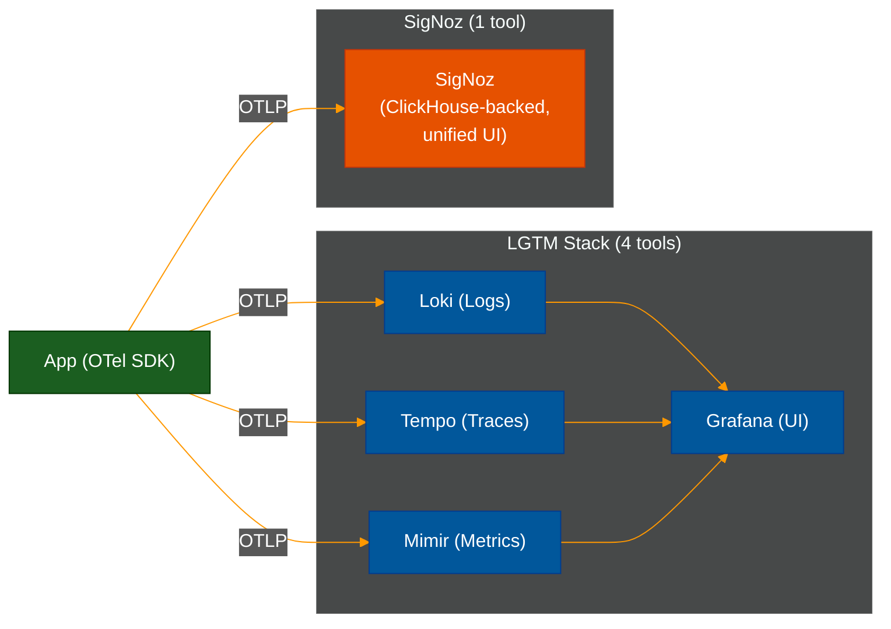
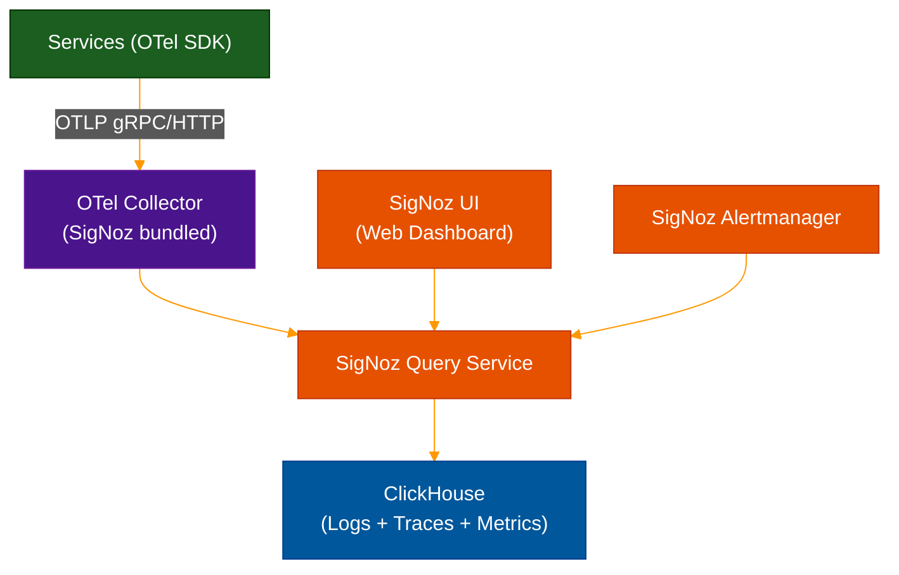

# 🏗️ SigNoz — Open-Source OTel-Native APM

> **Series:** Observability Engineering › Unified Platforms · **Level:** Intermediate · **Read Time:** ~10 min

---

## 📖 Table of Contents

- [1. What Is SigNoz?](#1-what-is-signoz)
- [2. How SigNoz Differs from the LGTM Stack](#2-how-signoz-differs-from-the-lgtm-stack)
- [3. Architecture](#3-architecture)
- [4. Core Features](#4-core-features)
- [5. Quick Start](#5-quick-start)
- [6. Strengths and Weaknesses](#6-strengths-and-weaknesses)
- [7. When to Choose SigNoz](#7-when-to-choose-signoz)

---

## 1. What Is SigNoz?

**SigNoz** is an open-source, **OpenTelemetry-native** application performance monitoring (APM) and observability platform. It is designed to be a **self-hosted alternative to Datadog or New Relic**, with native support for all three OTel signals: logs, metrics, and traces.

Unlike the LGTM stack (Loki + Grafana + Tempo + Mimir), SigNoz is a **single integrated product** — one install gives you logs, metrics, traces, and dashboards in a unified interface. No need to stitch together four separate tools.

**Key characteristics:**
- **Apache 2.0 licensed** (open-source core)
- Built on **ClickHouse** — a columnar analytics DB optimized for high-throughput queries
- **OTel-first** — accepts OTLP natively; no proprietary agent required
- **Alerts + dashboards** built in

---

## 2. How SigNoz Differs from the LGTM Stack



| | LGTM Stack | SigNoz |
| :--- | :--- | :--- |
| **Tools to manage** | 4+ (Loki, Tempo, Mimir, Grafana) | 1 |
| **Setup complexity** | High | Low |
| **Storage backend** | Object storage (S3) | ClickHouse |
| **Query languages** | LogQL, PromQL, TraceQL | Unified SigNoz UI + SQL |
| **Customization** | Very high | Medium |
| **Profiling** | Pyroscope (separate) | ❌ Not yet |
| **Grafana dashboards** | ✅ Full ecosystem | ⚠️ Own UI only |
| **License** | OSS (multiple) | Apache 2.0 |

---

## 3. Architecture



**ClickHouse** is the secret to SigNoz's performance — it is a columnar analytics database used by companies like Cloudflare, Uber, and ByteDance for high-throughput analytical queries. It provides:
- Sub-second queries over billions of rows
- Excellent compression (10–20x vs row-based DBs)
- Native support for time-series and log queries

---

## 4. Core Features

| Feature | Description |
| :--- | :--- |
| **APM** | Service maps, RED metrics (Rate, Error, Duration) per service |
| **Distributed Tracing** | Full trace view with span details and attributes |
| **Logs** | Full-text log search with trace correlation |
| **Metrics** | PromQL-compatible dashboards |
| **Exceptions** | Automatic exception tracking from traces |
| **Dashboards** | Custom dashboards with panels |
| **Alerts** | Threshold and anomaly-based alerts |
| **Pipelines** | Log processing / transformation (Enterprise) |

**Automatic Service Map:**
SigNoz automatically builds a **service dependency graph** from trace data — showing which services call which, with RED metrics on each edge.

---

## 5. Quick Start

```bash
# Install with Docker Compose (recommended for getting started)
git clone -b main https://github.com/SigNoz/signoz.git
cd signoz/deploy
docker-compose -f docker/clickhouse-setup/docker-compose.yaml up -d

# Access SigNoz UI
open http://localhost:3301
```

**Instrument your Java app:**
```bash
# Download OTel Java agent (no SigNoz-specific SDK needed)
wget https://github.com/open-telemetry/opentelemetry-java-instrumentation/releases/latest/download/opentelemetry-javaagent.jar

# Run your app with auto-instrumentation
java \
  -javaagent:opentelemetry-javaagent.jar \
  -Dotel.service.name=order-service \
  -Dotel.exporter.otlp.endpoint=http://localhost:4317 \
  -Dotel.exporter.otlp.protocol=grpc \
  -jar order-service.jar
```

**Instrument your Node.js app:**
```javascript
// tracing.js — load before your app
const { NodeSDK } = require('@opentelemetry/sdk-node');
const { OTLPTraceExporter } = require('@opentelemetry/exporter-trace-otlp-http');
const { getNodeAutoInstrumentations } = require('@opentelemetry/auto-instrumentations-node');

const sdk = new NodeSDK({
  serviceName: 'payment-service',
  traceExporter: new OTLPTraceExporter({
    url: 'http://localhost:4318/v1/traces',
  }),
  instrumentations: [getNodeAutoInstrumentations()],
});
sdk.start();
```

---

## 6. Strengths and Weaknesses

**✅ Strengths:**
- **Single install** — logs, metrics, traces in one product
- **OTel-native** — no vendor lock-in, standard instrumentation
- **ClickHouse performance** — fast analytics queries at high volume
- **Open-source** — self-host, full data control, no per-seat pricing
- **Datadog-like UX** — APM service maps, exception tracking, correlation
- **Low cost** — infra cost only (ClickHouse cluster)

**❌ Weaknesses:**
- **Less mature** than Grafana/Prometheus ecosystem
- **Grafana ecosystem integration** — can't use Grafana dashboards with SigNoz
- **No profiling** — no flame graph support (yet)
- **ClickHouse ops** — less familiar to many teams than S3-based backends
- **Smaller plugin ecosystem** vs Grafana's 150+ data source plugins

---

## 7. When to Choose SigNoz

| Scenario | Recommendation |
| :--- | :--- |
| Want Datadog features but open-source | ✅ Excellent choice |
| Team is small, wants simple setup | ✅ One tool beats 4 |
| Already deep in Grafana ecosystem | ❌ Stay with LGTM stack |
| Need continuous profiling | ❌ Add Pyroscope to LGTM instead |
| Open-source + data sovereignty required | ✅ Perfect fit |
| Need advanced Grafana dashboards/plugins | ❌ LGTM stack is more flexible |

> [!TIP]
> SigNoz is ideal for **teams of 5–50 engineers** who want a Datadog-like experience without the cost, and don't want to spend weeks configuring and connecting four separate LGTM tools.

> [!NOTE]
> **SigNoz Cloud** is available as a managed SaaS option if you don't want to manage ClickHouse yourself — it offers a 30-day free trial and is significantly cheaper than Datadog at comparable feature levels.

---

*← [Platform Comparison](./23-platform-comparison.md) · Next: [Datadog](./18-datadog.md) →*

## Related

- [Network Protocols & API Architectures](../fundamentals/01-network-protocols-and-api-architectures.md)
- [API Gateways & Reverse Proxies](../api-gateways/README.md)
- [Error Tracking](../error-tracking/README.md)
- [Enterprise Security](../../security/README.md)
