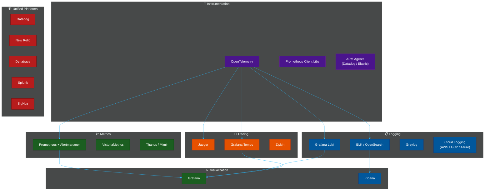
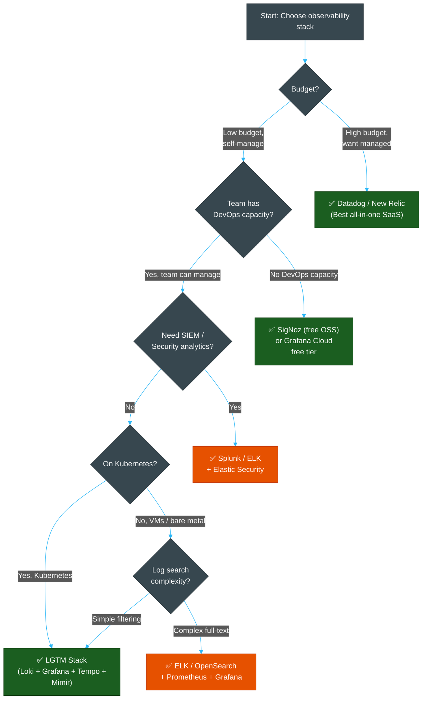
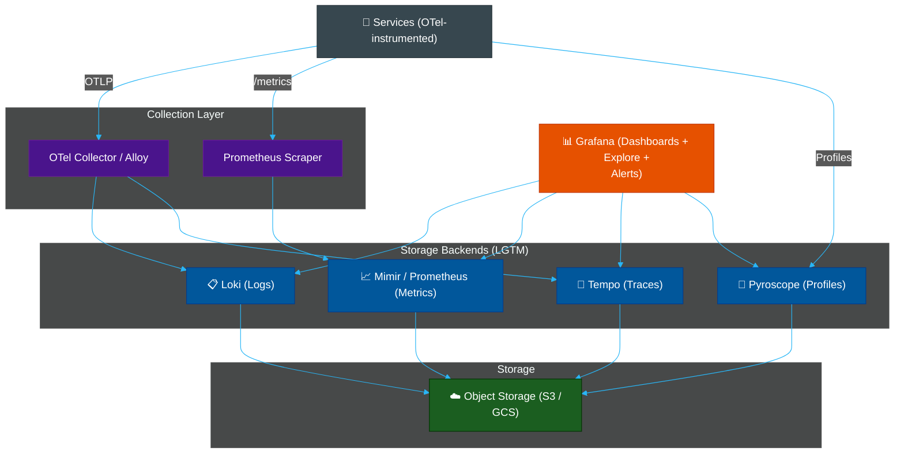

# 🏗️ Observability Platform Comparison Matrix

> **Series:** Observability Engineering › Unified Platforms · **Level:** Reference · **Read Time:** ~10 min

---

## 📖 Table of Contents

- [1. The Full Landscape](#1-the-full-landscape)
- [2. Open-Source vs Commercial](#2-open-source-vs-commercial)
- [3. Logging Tools Matrix](#3-logging-tools-matrix)
- [4. Metrics Tools Matrix](#4-metrics-tools-matrix)
- [5. Tracing Tools Matrix](#5-tracing-tools-matrix)
- [6. Unified Platforms Matrix](#6-unified-platforms-matrix)
- [7. Decision Guide](#7-decision-guide)
- [8. The Standard LGTM Stack Diagram](#8-the-standard-lgtm-stack-diagram)

---

## 1. The Full Landscape

---

## 2. Open-Source vs Commercial

| Dimension | Open-Source Stack | Commercial Platform |
| :--- | :--- | :--- |
| **Cost at low volume** | Very low (infra only) | Free tier / trial |
| **Cost at high volume** | Low (storage cost only) | Can be very high |
| **Setup complexity** | High | Very low |
| **Operational burden** | High | Zero |
| **Vendor lock-in** | None | Medium–High |
| **Feature depth** | High (with right tools) | Very high (integrated) |
| **AI/ML features** | Limited | Excellent |
| **Best for** | Teams with DevOps capacity | Product teams moving fast |

---

## 3. Logging Tools Matrix

| Tool | Type | Indexing | Storage | Full-Text Search | Cost | Best For |
| :--- | :--- | :--- | :--- | :--- | :--- | :--- |
| **Grafana Loki** | OSS | Labels only | Object (S3/GCS) | ⚠️ Line-based | 💚 Very low | Kubernetes / Grafana stack |
| **Elasticsearch** | OSS / Commercial | Full inverted index | Local SSD | ✅ Excellent | 🔴 High | Complex search, analytics |
| **OpenSearch** | OSS (Apache 2.0) | Full inverted index | Local SSD | ✅ Excellent | 🔴 High | Elasticsearch without licensing |
| **Graylog** | OSS + Enterprise | Full (uses ES) | Elasticsearch | ✅ Good | 🟡 Medium | Syslog / network log collection |
| **Splunk** | Commercial | Proprietary | Proprietary | ✅ Excellent | 🔴 Very high | Enterprise SIEM / compliance |
| **Datadog Logs** | SaaS | Full | Managed | ✅ Good | 🔴 High | All-in-one SaaS team |
| **AWS CloudWatch** | SaaS | Log groups/streams | AWS-managed | ⚠️ Limited | 🟡 Medium | AWS-native workloads |
| **GCP Cloud Logging** | SaaS | Managed | GCP-managed | ⚠️ Limited | 🟡 Medium | GCP-native workloads |

---

## 4. Metrics Tools Matrix

| Tool | Type | Model | Storage | Scale | PromQL | Best For |
| :--- | :--- | :--- | :--- | :--- | :--- | :--- |
| **Prometheus** | OSS | Pull | Local TSDB | Medium | ✅ Native | Kubernetes, standard choice |
| **Thanos** | OSS | Pull + Federation | Object (S3) | Large | ✅ Compatible | Multi-cluster Prometheus |
| **Grafana Mimir** | OSS | Pull | Object (S3) | Very Large | ✅ Compatible | Massive scale, low cost |
| **VictoriaMetrics** | OSS | Pull + Push | Local / Object | Very Large | ✅ Compatible | High cardinality, memory efficient |
| **InfluxDB** | OSS / Commercial | Push | Time-series DB | Medium | ❌ Flux/InfluxQL | IoT, high write throughput |
| **Datadog Metrics** | SaaS | Push | Managed | Unlimited | ❌ Datadog QL | All-in-one SaaS |
| **CloudWatch Metrics** | SaaS | Push (AWS) | AWS-managed | Large | ❌ CloudWatch QL | AWS services |

---

## 5. Tracing Tools Matrix

| Tool | Type | Storage | Search by Tags | OTel Support | Grafana Integration | Best For |
| :--- | :--- | :--- | :--- | :--- | :--- | :--- |
| **Jaeger** | OSS | ES / Cassandra / Badger | ✅ Yes | ✅ Native | ✅ Plugin | Feature-rich, independent |
| **Grafana Tempo** | OSS | Object (S3/GCS) | ⚠️ TraceQL only | ✅ Native | ✅ Native | LGTM stack, cost-efficient |
| **Zipkin** | OSS | In-memory / MySQL / ES | ✅ Yes | ⚠️ Bridge | ✅ Plugin | Legacy / simple setups |
| **Elastic APM** | OSS / Commercial | Elasticsearch | ✅ Yes | ✅ Yes | ⚠️ Plugin | All-Elastic environments |
| **Datadog APM** | SaaS | Managed | ✅ Yes | ✅ Yes | ❌ Not needed | Datadog ecosystem |
| **SigNoz** | OSS | ClickHouse | ✅ Yes | ✅ Native | ✅ Built-in | OTel-first, full-stack OSS |

---

## 6. Unified Platforms Matrix

| Platform | Type | Logs | Metrics | Traces | Profiling | AI/ML | Monthly Cost (est.) |
| :--- | :--- | :--- | :--- | :--- | :--- | :--- | :--- |
| **Datadog** | SaaS | ✅ | ✅ | ✅ | ✅ | ✅ | $$$$ |
| **New Relic** | SaaS | ✅ | ✅ | ✅ | ✅ | ✅ | $$$ |
| **Dynatrace** | SaaS + On-prem | ✅ | ✅ | ✅ | ✅ | ✅✅ | $$$$ |
| **Splunk** | SaaS + On-prem | ✅ | ✅ | ✅ | ❌ | ✅ | $$$$ |
| **SigNoz** | OSS / Cloud | ✅ | ✅ | ✅ | ❌ | ❌ | $ (infra) |
| **Elastic Observability** | OSS / Cloud | ✅ | ✅ | ✅ | ❌ | ⚠️ | $$ |
| **LGTM Stack (self-hosted)** | OSS | ✅ Loki | ✅ Prometheus | ✅ Tempo | ✅ Pyroscope | ❌ | $ (infra) |

---

## 7. Decision Guide

---

## 8. The Standard LGTM Stack Diagram

For **most teams building on Kubernetes**, the LGTM stack is the recommended open-source setup:

**Cost breakdown for 50-person engineering team:**

| Component | Infra Cost (est.) |
| :--- | :--- |
| OTel Collector | Free (compute ~$20/mo) |
| Loki + S3 (100 GB/day, 30d) | ~$100–$150/mo |
| Prometheus + Mimir (10k series) | ~$50–$100/mo |
| Grafana Tempo (traces, S3) | ~$30–$60/mo |
| Grafana (OSS) | Free |
| **Total** | **~$200–$310/mo** |

vs. **Datadog** for same team: **$3,000–$8,000/mo**

---

*← [Observability README](./README.md)*

## Related

- [Network Protocols & API Architectures](../fundamentals/01-network-protocols-and-api-architectures.md)
- [API Gateways & Reverse Proxies](../api-gateways/README.md)
- [Error Tracking](../error-tracking/README.md)
- [Enterprise Security](../../security/README.md)
