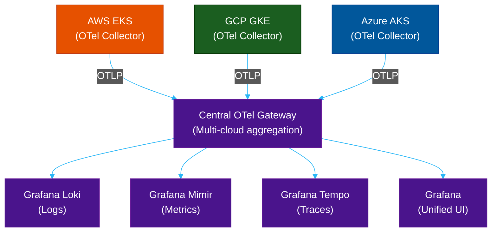

# ☁️ AWS CloudWatch, GCP Cloud Logging & Azure Monitor — Deep Dive

> **Series:** Observability Engineering › Cloud-Native Logging · **Level:** Intermediate · **Read Time:** ~10 min

---

## 📖 Table of Contents

- [1. AWS CloudWatch Deep Dive](#1-aws-cloudwatch-deep-dive)
- [2. Google Cloud Logging & Monitoring Deep Dive](#2-google-cloud-logging-monitoring-deep-dive)
- [3. Azure Monitor & Log Analytics Deep Dive](#3-azure-monitor-log-analytics-deep-dive)
- [4. Cross-Cloud Observability Patterns](#4-cross-cloud-observability-patterns)

> **Note:** For a high-level overview and initial comparison, see [Module 06 — Cloud Logging Overview](./06-cloud-logging.md). This module covers advanced configurations, integrations, and multi-cloud patterns.

---

## 1. AWS CloudWatch Deep Dive

### Log Insights Advanced Patterns

```sql
-- Correlation: find all events for a specific trace
fields @timestamp, @message, traceId
| filter traceId = "abc123def456"
| sort @timestamp asc

-- Detect cold starts in Lambda
filter @type = "REPORT"
| stats
    count() as invocations,
    sum(InitDuration) as total_cold_start_ms,
    avg(InitDuration) as avg_cold_start_ms
  by bin(5m)
| filter total_cold_start_ms > 0

-- Top slow database queries
filter @message like /SLOW QUERY/
| parse @message "Query_time: * " as query_time
| stats
    count() as occurrences,
    avg(query_time) as avg_time_s,
    max(query_time) as max_time_s
  by query
| sort avg_time_s desc
| limit 10
```

### CloudWatch Container Insights (EKS)

```yaml
# Deploy CloudWatch agent as DaemonSet on EKS
apiVersion: apps/v1
kind: DaemonSet
metadata:
  name: cloudwatch-agent
  namespace: amazon-cloudwatch
spec:
  selector:
    matchLabels:
      name: cloudwatch-agent
  template:
    spec:
      containers:
        - name: cloudwatch-agent
          image: amazon/cloudwatch-agent:latest
          env:
            - name: CW_CONFIG_CONTENT
              valueFrom:
                configMapKeyRef:
                  name: cwagentconfig
                  key: config.json
```

### CloudWatch → S3 Export (Cost Optimization)

```python
import boto3

logs = boto3.client('logs')

# Export logs older than 30 days to S3 at $0.023/GB
logs.create_export_task(
    taskName='payment-service-archive-2026-04',
    logGroupName='/app/payment-service',
    fromTime=1743465600000,  # 2026-04-01T00:00:00Z
    to=1746057600000,         # 2026-05-01T00:00:00Z
    destination='my-log-archive-bucket',
    destinationPrefix='payment-service/2026/04/'
)
```

### CloudWatch Metric Alarms

```python
import boto3

cloudwatch = boto3.client('cloudwatch', region_name='ap-southeast-1')

# Create alarm: alert when error rate > 1% for 5 minutes
cloudwatch.put_metric_alarm(
    AlarmName='payment-service-high-error-rate',
    AlarmDescription='Payment service error rate exceeds 1%',
    MetricName='5xxErrorRate',
    Namespace='AWS/ApplicationELB',
    Statistic='Average',
    Dimensions=[
        {'Name': 'LoadBalancer', 'Value': 'app/payment-alb/abc123'},
        {'Name': 'TargetGroup', 'Value': 'targetgroup/payment-tg/def456'},
    ],
    Period=300,        # 5 minutes
    EvaluationPeriods=1,
    Threshold=1.0,     # 1%
    ComparisonOperator='GreaterThanThreshold',
    TreatMissingData='notBreaching',
    AlarmActions=['arn:aws:sns:ap-southeast-1:123456789:pagerduty-critical'],
    OKActions=['arn:aws:sns:ap-southeast-1:123456789:pagerduty-critical'],
)
```

---

## 2. Google Cloud Logging & Monitoring Deep Dive

### Log-Based Metrics (Create Prometheus-style metrics from logs)

```bash
# Create a counter metric for payment errors
gcloud logging metrics create payment_errors \
  --description="Count of payment ERROR log lines" \
  --log-filter='resource.type="k8s_container"
    resource.labels.namespace_name="production"
    resource.labels.container_name="payment-service"
    severity=ERROR'

# Now use it in a Cloud Monitoring alert
gcloud alpha monitoring policies create \
  --policy-from-file=alert-policy.yaml
```

```yaml
# alert-policy.yaml
displayName: "Payment Service High Error Rate"
conditions:
  - displayName: "Error count > 10 in 5 minutes"
    conditionThreshold:
      filter: |
        metric.type="logging.googleapis.com/user/payment_errors"
        resource.type="k8s_container"
      comparison: COMPARISON_GT
      thresholdValue: 10
      duration: 300s
      aggregations:
        - alignmentPeriod: 60s
          perSeriesAligner: ALIGN_RATE
notificationChannels:
  - projects/my-project/notificationChannels/pagerduty-channel
```

### Cloud Trace — Distributed Tracing

```python
# Python — OTel auto-instrumentation for GCP
from opentelemetry import trace
from opentelemetry.sdk.trace import TracerProvider
from opentelemetry.exporter.cloud_trace import CloudTraceSpanExporter
from opentelemetry.sdk.trace.export import BatchSpanProcessor

provider = TracerProvider()
provider.add_span_processor(
    BatchSpanProcessor(CloudTraceSpanExporter())
)
trace.set_tracer_provider(provider)

tracer = trace.get_tracer(__name__)

with tracer.start_as_current_span("process-payment") as span:
    span.set_attribute("order.id", "ord_4421")
    span.set_attribute("user.id", "usr_9981")
    process_payment(order)
```

### BigQuery Export for Long-Term Analytics

```sql
-- Analyze error patterns over the last 90 days in BigQuery
SELECT
  DATE(timestamp) as date,
  JSON_EXTRACT_SCALAR(jsonPayload, '$.service') as service,
  JSON_EXTRACT_SCALAR(jsonPayload, '$.level') as level,
  COUNT(*) as count
FROM `my-project.logs.cloudrun_googleapis_com_requests_*`
WHERE
  _TABLE_SUFFIX BETWEEN FORMAT_DATE('%Y%m%d', DATE_SUB(CURRENT_DATE(), INTERVAL 90 DAY))
                    AND FORMAT_DATE('%Y%m%d', CURRENT_DATE())
  AND severity = 'ERROR'
GROUP BY date, service, level
ORDER BY date DESC, count DESC
```

---

## 3. Azure Monitor & Log Analytics Deep Dive

### KQL — Advanced Queries

```kql
// Detect gradual latency degradation (not a spike, but a slow trend)
AppRequests
| where TimeGenerated > ago(2h)
| summarize p99 = percentile(DurationMs, 99) by bin(TimeGenerated, 5m), AppRoleName
| where AppRoleName == "payment-service"
| order by TimeGenerated asc
| extend trend = series_slope(p99)
| where trend > 50  // p99 increasing by >50ms per 5-min bucket

// Find users affected by errors
exceptions
| where timestamp > ago(1h)
| join kind=inner (
    requests
    | where timestamp > ago(1h)
    | project operation_Id, user_Id
) on operation_Id
| summarize error_count = count() by user_Id
| where error_count > 3
| order by error_count desc

// Correlation: join logs with traces
union AppTraces, AppRequests
| where TimeGenerated > ago(30m)
| where OperationId == "abc123def456"
| project TimeGenerated, Type, Message, DurationMs, ResultCode
| order by TimeGenerated asc
```

### Application Insights — APM Integration

Application Insights is Azure Monitor's APM product. Auto-instrument with the SDK:

```xml
<!-- Spring Boot (Maven) -->
<dependency>
  <groupId>com.microsoft.azure</groupId>
  <artifactId>applicationinsights-spring-boot-starter</artifactId>
  <version>2.6.4</version>
</dependency>
```

```yaml
# application.yaml
azure:
  application-insights:
    instrumentation-key: "${APPINSIGHTS_INSTRUMENTATIONKEY}"
    web:
      enabled: true
    logger:
      level: WARN
```

### Azure Monitor Workbooks — Advanced Dashboards

Workbooks are interactive, parameterized reports that combine KQL queries with text, charts, and grids — more powerful than simple dashboards:

```json
{
  "version": "Notebook/1.0",
  "items": [
    {
      "type": 9,
      "content": {
        "version": "KqlParameterItem/1.0",
        "parameters": [
          {
            "id": "service-param",
            "version": "KqlParameterItem/1.0",
            "name": "Service",
            "type": 2,
            "query": "AppRequests | summarize by AppRoleName | project value = AppRoleName"
          }
        ]
      }
    },
    {
      "type": 3,
      "content": {
        "version": "KqlItem/1.0",
        "query": "AppRequests | where AppRoleName == '{Service}' | summarize count() by bin(TimeGenerated, 5m) | render timechart"
      }
    }
  ]
}
```

---

## 4. Cross-Cloud Observability Patterns

When running workloads across multiple clouds, you need a **neutral aggregation layer**:



**Pattern:** Deploy an **OTel Collector** in each cloud region. Configure each Collector to forward OTLP data to a **central Gateway Collector** (or directly to your observability backends). This gives you a single Grafana pane of glass across all clouds.

**Alternative:** Use **Datadog, New Relic, or Dynatrace** — all three provide native multi-cloud agents that automatically aggregate telemetry without any OTel configuration.

---

*← [Platform Comparison](./23-platform-comparison.md) · [Back to Observability README](./README.md) →*

## Related

- [Network Protocols & API Architectures](../fundamentals/01-network-protocols-and-api-architectures.md)
- [API Gateways & Reverse Proxies](../api-gateways/README.md)
- [Error Tracking](../error-tracking/README.md)
- [Enterprise Security](../../security/README.md)
