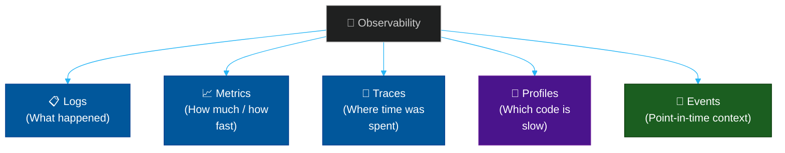

# 🔭 Observability Engineering

A comprehensive reference library covering the four pillars of modern observability: **Logging**, **Metrics**, **Tracing**, and **Profiling** — from collection and instrumentation through to analysis, alerting, and visualization.

---

## 📖 Table of Contents

- [🔭 Observability Engineering](#observability-engineering)
  - [📖 Table of Contents](#table-of-contents)
  - [What Is Observability?](#what-is-observability)
  - [📚 Module Index](#module-index)
    - [🧩 Pillar 1 — Instrumentation \& Collection](#-pillar-1--instrumentation--collection)
    - [📋 Pillar 2 — Logging](#pillar-2-logging)
    - [📈 Pillar 3 — Metrics](#pillar-3-metrics)
    - [🔗 Pillar 4 — Distributed Tracing](#pillar-4-distributed-tracing)
    - [🧠 Pillar 5 — Continuous Profiling](#pillar-5-continuous-profiling)
    - [📊 Pillar 6 — Visualization \& Dashboarding](#-pillar-6--visualization--dashboarding)
    - [🚨 Pillar 7 — Alerting \& Incident Management](#-pillar-7--alerting--incident-management)
    - [🏗️ Unified Platforms](#️-unified-platforms)
    - [☁️ Cloud-Native Logging](#️-cloud-native-logging)

---

## What Is Observability?

Observability is the ability to understand the **internal state** of a system by examining its **external outputs**. It is not the same as monitoring.

| Concept | Monitoring | Observability |
| :--- | :--- | :--- |
| **Question** | "Is the system down?" | "Why is the system slow?" |
| **Approach** | Pre-defined metrics and alerts | Free-form data exploration |
| **Coverage** | Known unknowns | Unknown unknowns |
| **Output** | Dashboard + alert | Root cause insight |

The **four pillars** (and a growing fifth) of modern observability:

---

## 📚 Module Index

### 🧩 Pillar 1 — Instrumentation & Collection

| Module | Title | Level | Read Time |
| :--- | :--- | :--- | :--- |
| **01** | [OpenTelemetry — The Universal Standard](./01-opentelemetry.md) | Intermediate | ~12 min |
| **02** | [Agents, Collectors & Sidecars](./02-agents-and-collectors.md) | Advanced | ~10 min |

### 📋 Pillar 2 — Logging

| Module | Title | Level | Read Time |
| :--- | :--- | :--- | :--- |
| **03** | [Grafana Loki — Label-Based Log Aggregation](./03-grafana-loki.md) | Intermediate | ~10 min |
| **04** | [ELK Stack — Elasticsearch, Logstash, Kibana](./04-elk-stack.md) | Advanced | ~12 min |
| **05** | [Graylog & OpenSearch — Open-Source Alternatives](./05-graylog-opensearch.md) | Intermediate | ~10 min |
| **06** | [Cloud Logging — AWS CloudWatch, GCP Logging, Azure Monitor](./06-cloud-logging.md) | Intermediate | ~10 min |
| **07** | [Logging Tool Comparison Matrix](./07-logging-comparison.md) | Reference | ~8 min |

### 📈 Pillar 3 — Metrics

| Module | Title | Level | Read Time |
| :--- | :--- | :--- | :--- |
| **08** | [Prometheus — Pull-Based Metrics Collection](./08-prometheus.md) | Intermediate | ~10 min |
| **09** | [VictoriaMetrics & Thanos — Long-Term Storage](./09-long-term-metrics-storage.md) | Advanced | ~10 min |
| **10** | [StatsD & InfluxDB — Push-Based Metrics](./10-statsd-influxdb.md) | Intermediate | ~10 min |

### 🔗 Pillar 4 — Distributed Tracing

| Module | Title | Level | Read Time |
| :--- | :--- | :--- | :--- |
| **11** | [Jaeger, Tempo & Zipkin — Distributed Tracing](./11-jaeger-and-tempo.md) | Intermediate | ~10 min |

### 🧠 Pillar 5 — Continuous Profiling

| Module | Title | Level | Read Time |
| :--- | :--- | :--- | :--- |
| **14** | [Pyroscope — Continuous Code Profiling](./14-pyroscope.md) | Advanced | ~10 min |

### 📊 Pillar 6 — Visualization & Dashboarding

| Module | Title | Level | Read Time |
| :--- | :--- | :--- | :--- |
| **15** | [Grafana — The Universal Dashboard](./15-grafana.md) | Intermediate | ~10 min |
| **16** | [Kibana — ELK Visualization Layer](./16-kibana.md) | Intermediate | ~8 min |

### 🚨 Pillar 7 — Alerting & Incident Management

| Module | Title | Level | Read Time |
| :--- | :--- | :--- | :--- |
| **17** | [Alertmanager & PagerDuty — Alert Routing](./17-alertmanager-pagerduty.md) | Intermediate | ~10 min |

### 🏗️ Unified Platforms

| Module | Title | Level | Read Time |
| :--- | :--- | :--- | :--- |
| **18** | [Datadog — Gold Standard SaaS Observability](./18-datadog.md) | Intermediate | ~10 min |
| **19–21** | [New Relic, Dynatrace & Splunk — Enterprise Platforms](./19-21-enterprise-platforms.md) | Advanced | ~12 min |
| **22** | [SigNoz — Open-Source OTel-Native APM](./22-signoz.md) | Intermediate | ~10 min |
| **23** | [Platform Comparison Matrix](./23-platform-comparison.md) | Reference | ~10 min |

### ☁️ Cloud-Native Logging

| Module | Title | Level | Read Time |
| :--- | :--- | :--- | :--- |
| **24–26** | [AWS, GCP & Azure — Cloud Logging Deep Dive](./24-26-cloud-logging-deepdive.md) | Intermediate | ~10 min |

---

*Last updated: 2026-05-17*
