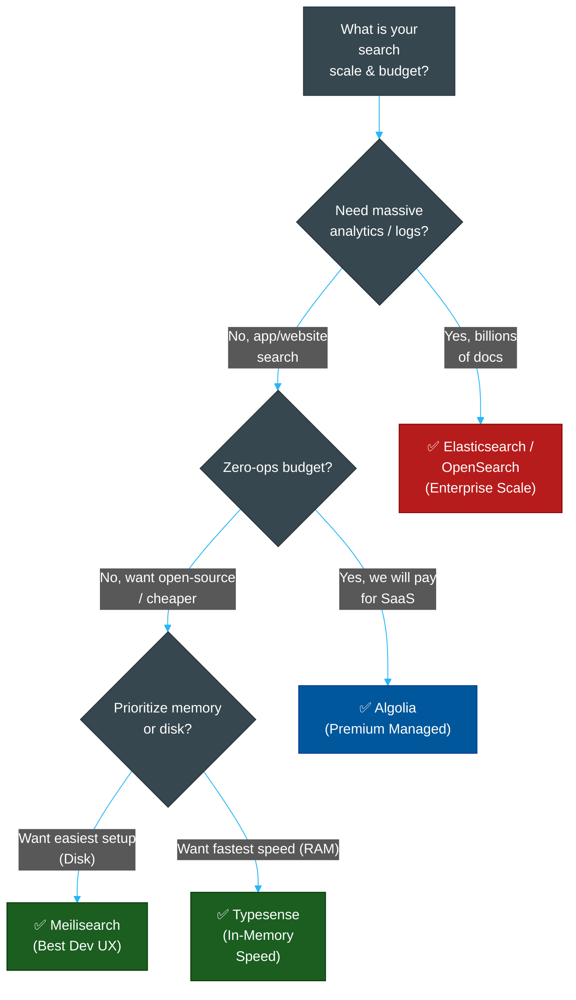

# 🔎 Search Engine Tool Comparison

> **Series:** DevOps › Search Engines & Discovery · **Level:** Reference · **Read Time:** ~10 min

---

## 📖 Table of Contents

- [1. The Search Landscape](#1-the-search-landscape)
- [2. Algolia — The Managed Premium Choice](#2-algolia-the-managed-premium-choice)
- [3. Meilisearch — The Developer-Friendly OSS](#3-meilisearch-the-developer-friendly-oss)
- [4. Typesense — The Performance-First Engine](#4-typesense-the-performance-first-engine)
- [5. Elasticsearch — The Enterprise Powerhouse](#5-elasticsearch-the-enterprise-powerhouse)
- [6. Feature Comparison Matrix](#6-feature-comparison-matrix)
- [7. Decision Guide](#7-decision-guide)

---

## 1. The Search Landscape

When building search functionality (e.g., for an e-commerce store, documentation site, or SaaS app), developers face a choice:
1. **Search-as-a-Service (SaaS):** Fully managed, proprietary APIs. High cost, zero maintenance.
2. **Open-Source / Self-Hosted:** Free software you can run yourself, often with a managed cloud tier available.
3. **Heavy-Duty Analytics:** Distributed clusters designed for billions of documents.

---

## 2. Algolia — The Managed Premium Choice

**Algolia** is a fully managed, proprietary search platform. It is the gold standard for e-commerce and media sites that need instant, typo-tolerant, "search-as-you-type" experiences.

### Key Strengths
- **Zero Ops:** You only interact with an API. There are no servers or clusters to manage.
- **AI & Personalization:** Offers NeuralSearch (AI vector search) and personalizes results based on user behavior (clicks, conversions).
- **UI Libraries:** `InstantSearch.js` makes building React/Vue/Vanilla search UIs incredibly fast.

### Drawbacks
- **Cost:** Pricing is usage-based (per 1,000 requests) and can become exorbitantly expensive at scale.
- **Vendor Lock-in:** Proprietary algorithms and APIs.

---

## 3. Meilisearch — The Developer-Friendly OSS

**Meilisearch** is an open-source (Rust-based) search engine designed to be drop-in simple. It provides an Algolia-like experience but gives you control over your data.

### Key Strengths
- **Out-of-the-Box Experience:** Sensible defaults mean you rarely have to configure complex ranking rules to get good typo-tolerant search.
- **Predictable Pricing:** You can self-host for free or use Meilisearch Cloud, which has predictable monthly pricing based on compute, not requests.
- **Developer UX:** Excellent SDKs and very clear documentation.

### Drawbacks
- **Massive Scale:** Not designed for clusters of billions of documents (unlike Elasticsearch).

---

## 4. Typesense — The Performance-First Engine

**Typesense** is an open-source (C++ based) search engine that stores the entire index **in memory** (RAM) to achieve ultra-low latency. It is often cited as the best middle ground between Algolia's speed and Elasticsearch's control.

### Key Strengths
- **Raw Speed:** Because indexes are kept in memory, queries reliably return in <50ms.
- **Hybrid Search:** Native support for combining keyword search and semantic vector search.
- **High Availability:** Built-in Raft-based clustering for high availability.

### Drawbacks
- **RAM Heavy:** Because the index lives in RAM, infrastructure costs scale linearly with your dataset size (RAM is more expensive than disk).

---

## 5. Elasticsearch — The Enterprise Powerhouse

**Elasticsearch** (and its open-source fork, **OpenSearch**) is a distributed, RESTful search and analytics engine. It is the underlying technology for countless enterprise search implementations.

### Key Strengths
- **Infinite Scale:** Sharded architecture allows scaling to petabytes of data and billions of documents.
- **Complex Analytics:** Supports massive aggregations, geographical queries, and deep analytics.
- **Flexibility:** You can tweak every single aspect of the ranking algorithm (TF-IDF / BM25).

### Drawbacks
- **High Operational Complexity:** Managing Elasticsearch clusters (shards, replicas, heap sizes) requires dedicated DevOps expertise.
- **"Overkill":** It is usually too heavy and complex for a simple e-commerce or documentation search bar.

---

## 6. Feature Comparison Matrix

| Feature | Algolia | Meilisearch | Typesense | Elasticsearch |
| :--- | :--- | :--- | :--- | :--- |
| **Model** | Managed SaaS | Open Source (Rust) | Open Source (C++) | Open Source / SSPL (Java) |
| **Best For** | Zero-ops, E-commerce | Ease of setup, Dev UX | Ultra-low latency | Big data, Analytics |
| **Setup Effort** | Zero | Very Low | Low | High |
| **Typo Tolerance** | ✅ Excellent | ✅ Excellent | ✅ Excellent | ⚠️ Requires config |
| **Vector / Semantic** | ✅ NeuralSearch | ✅ Supported | ✅ Excellent | ✅ Supported |
| **Pricing Model** | Usage-based (Requests) | Compute-based | Compute-based | Infrastructure |
| **Primary Resource** | N/A | Disk + RAM | RAM (In-Memory) | RAM (Heap) + Disk |

---

## 7. Decision Guide

### Strategic Recommendation
1. **If you have the budget and want zero maintenance:** Choose **Algolia**. It is unbeatable for out-of-the-box e-commerce and app search.
2. **If you want an open-source Algolia alternative:** Choose **Meilisearch** for a fantastic developer experience, or **Typesense** if you specifically need in-memory speed and advanced vector search capabilities.
3. **If you are building a log analytics platform or massive data lake:** Use **Elasticsearch** (or OpenSearch). Do not use the others for logging.

## Related

- [Databases](../databases/README.md)
- [Observability & Monitoring](../observability/README.md)
- [API Gateways & Reverse Proxies](../api-gateways/README.md)
