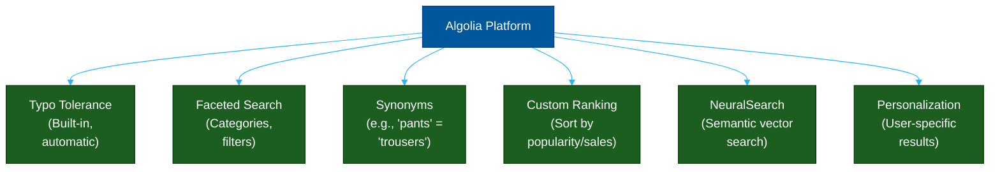

# 🛒 Algolia — Managed Search

> **Series:** DevOps › Search Engines & Discovery · **Level:** Intermediate · **Read Time:** ~10 min

---

## 📖 Table of Contents

- [1. What Is Algolia?](#1-what-is-algolia)
- [2. Core Features](#2-core-features)
- [3. Indexing Data](#3-indexing-data)
- [4. InstantSearch.js — Building the UI](#4-instantsearchjs-building-the-ui)
- [5. NeuralSearch (AI & Vectors)](#5-neuralsearch-ai-vectors)
- [6. Pricing & When to Use](#6-pricing-when-to-use)

---

## 1. What Is Algolia?

**Algolia** is a proprietary, fully managed Search-as-a-Service platform. It provides a RESTful API that allows developers to add search to their websites and applications without managing any infrastructure. It is the industry standard for e-commerce search, documentation search (DocSearch), and media discovery.

Algolia’s primary promise is **speed**: queries reliably return in under 50ms, enabling "search-as-you-type" experiences.

---

## 2. Core Features



### Tie-Breaking Algorithm
Unlike traditional search engines that use TF-IDF/BM25 scoring, Algolia uses a **tie-breaking algorithm**. It applies rules in a strict sequence:
1. Number of typos
2. Number of matching words
3. Proximity of words
4. Custom ranking attribute (e.g., `sales_count` DESC)

---

## 3. Indexing Data

You do not connect Algolia directly to your database. Instead, you **push JSON objects** to an Algolia Index whenever your data changes.

```javascript
// Node.js example: pushing data to Algolia
const algoliasearch = require("algoliasearch");

const client = algoliasearch("YOUR_APP_ID", "YOUR_ADMIN_API_KEY");
const index = client.initIndex("products");

const products = [
  {
    objectID: "prod_1",
    name: "iPhone 15 Pro",
    brand: "Apple",
    category: "Smartphones",
    price: 999,
    popularity: 9800
  },
  {
    objectID: "prod_2",
    name: "Galaxy S24 Ultra",
    brand: "Samsung",
    category: "Smartphones",
    price: 1199,
    popularity: 8500
  }
];

// Save to Algolia
index.saveObjects(products).then(({ objectIDs }) => {
  console.log("Indexed:", objectIDs);
});
```

---

## 4. InstantSearch.js — Building the UI

Algolia's biggest developer advantage is **InstantSearch**, an open-source library of UI widgets (available for React, Vue, Angular, iOS, and Android).

```jsx
// React InstantSearch Example
import algoliasearch from 'algoliasearch/lite';
import { InstantSearch, SearchBox, Hits, RefinementList } from 'react-instantsearch-dom';

const searchClient = algoliasearch('YOUR_APP_ID', 'YOUR_SEARCH_ONLY_API_KEY');

const ProductHit = ({ hit }) => (
  <div className="product">
    <h4>{hit.name}</h4>
    <p>${hit.price}</p>
  </div>
);

function App() {
  return (
    <InstantSearch searchClient={searchClient} indexName="products">
      <div className="search-container">
        {/* The Search Bar */}
        <SearchBox />
        
        {/* Faceted Sidebar */}
        <div className="sidebar">
          <h3>Brands</h3>
          <RefinementList attribute="brand" />
        </div>
        
        {/* Results Grid */}
        <div className="results">
          <Hits hitComponent={ProductHit} />
        </div>
      </div>
    </InstantSearch>
  );
}
```

---

## 5. NeuralSearch (AI & Vectors)

Traditional keyword search fails when users search for concepts rather than exact words (e.g., searching "warm winter coat" and missing a product named "Thermal Parka"). 

Algolia's **NeuralSearch** combines keyword search with vector (semantic) search in a single query, automatically understanding the *meaning* of the user's query without requiring developers to generate or manage their own embeddings.

---

## 6. Pricing & When to Use

### Pricing Model
Algolia charges based on **Requests** and **Records**:
- **Free Tier:** 10k requests/month, 10k records (Requires "Search by Algolia" logo)
- **Pay-as-you-go:** ~$1.00 per 1,000 requests; ~$0.40 per 1,000 records/month
- **Enterprise:** Custom negotiated contracts (often required for NeuralSearch)

### When to Choose Algolia
✅ You are building an e-commerce site where search directly impacts revenue.
✅ You want a world-class search UI up and running in one day.
✅ You have the budget to pay for a premium SaaS product.
✅ You do not want to manage any infrastructure.

### When to Avoid Algolia
❌ You have a massive dataset (millions of records) but a low budget.
❌ You require on-premise or self-hosted deployment for compliance.
❌ You are doing log analytics or complex aggregations (use Elasticsearch).

---

*← [Search Engine Comparison](./01-search-engines-comparison.md) · Next: [Meilisearch](./03-meilisearch.md) →*

## Related

- [Databases](../databases/README.md)
- [Observability & Monitoring](../observability/README.md)
- [API Gateways & Reverse Proxies](../api-gateways/README.md)
