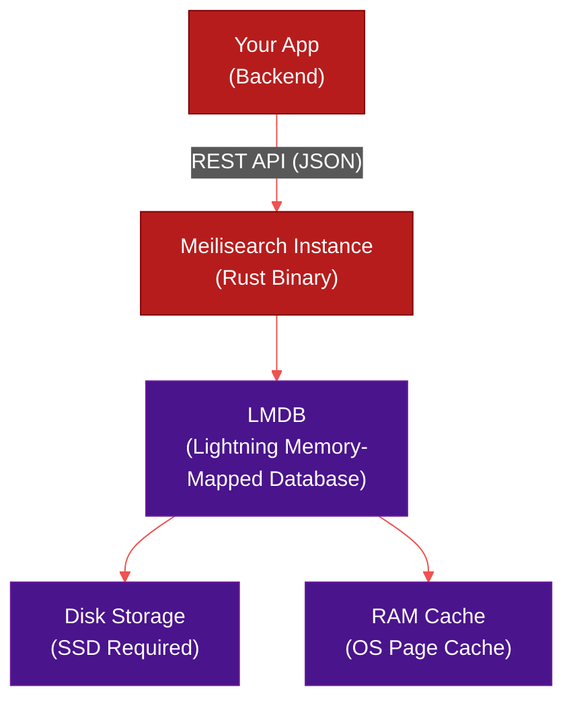

# 🦀 Meilisearch — Open-Source Search

> **Series:** DevOps › Search Engines & Discovery · **Level:** Intermediate · **Read Time:** ~10 min

---

## 📖 Table of Contents

- [1. What Is Meilisearch?](#1-what-is-meilisearch)
- [2. Core Features](#2-core-features)
- [3. Architecture & Storage](#3-architecture-storage)
- [4. Quick Start](#4-quick-start)
- [5. Front-End Integration](#5-front-end-integration)
- [6. Pricing & When to Use](#6-pricing-when-to-use)

---

## 1. What Is Meilisearch?

**Meilisearch** is an open-source, lightning-fast search engine written in **Rust**. It was specifically designed to be the easiest, most developer-friendly alternative to Algolia. 

Unlike Elasticsearch, which requires extensive configuration to get good "search-as-you-type" results, Meilisearch provides perfect typo-tolerance and relevance out-of-the-box with zero configuration.

---

## 2. Core Features

| Feature | Description |
| :--- | :--- |
| **Typo Tolerance** | Understands typos instantly (e.g., "btman" → "batman"). |
| **Synonyms** | Map words to each other (e.g., "sneakers" = "shoes"). |
| **Faceted Search** | Easy grouping for sidebar filters (Brands, Colors, Sizes). |
| **Vector Search** | Built-in support for semantic search and embeddings. |
| **Multi-Tenant** | Tenant tokens allow secure, user-specific search keys. |
| **Drop-in Simple** | Sane defaults mean you don't need a PhD in search algorithms. |

---

## 3. Architecture & Storage



Meilisearch uses **LMDB** (Lightning Memory-Mapped Database) under the hood. 
- It stores the index on **Disk** (SSD is highly recommended).
- It relies on the operating system's page cache to keep frequently accessed data in **RAM**.
- This makes it more memory-efficient than strictly in-memory engines like Typesense, while still being incredibly fast.

---

## 4. Quick Start

**1. Run Meilisearch via Docker:**
```bash
docker run -it --rm \
  -p 7700:7700 \
  -e MEILI_MASTER_KEY='my-secret-key' \
  -v $(pwd)/meili_data:/meili_data \
  getmeili/meilisearch:latest
```

**2. Add Documents (via cURL):**
```bash
curl \
  -X POST 'http://localhost:7700/indexes/movies/documents' \
  -H 'Content-Type: application/json' \
  -H 'Authorization: Bearer my-secret-key' \
  --data-binary '[
    { "id": 1, "title": "Batman Begins", "genres": ["Action"] },
    { "id": 2, "title": "The Dark Knight", "genres": ["Action", "Crime"] }
  ]'
```

**3. Search (with a typo):**
```bash
curl \
  -X POST 'http://localhost:7700/indexes/movies/search' \
  -H 'Content-Type: application/json' \
  -H 'Authorization: Bearer my-secret-key' \
  --data-binary '{ "q": "batmen" }'
```

---

## 5. Front-End Integration

Meilisearch is completely compatible with Algolia's open-source `InstantSearch` libraries. You just swap out the Algolia client for the Meilisearch client.

```javascript
import { instantMeiliSearch } from '@meilisearch/instant-meilisearch';
import { InstantSearch, SearchBox, Hits } from 'react-instantsearch-dom';

// Swap Algolia client with Meilisearch!
const searchClient = instantMeiliSearch(
  'http://localhost:7700',
  'my-search-only-key'
);

function App() {
  return (
    <InstantSearch indexName="movies" searchClient={searchClient}>
      <SearchBox />
      <Hits />
    </InstantSearch>
  );
}
```

This means you can migrate from Algolia to Meilisearch without rewriting your entire frontend UI!

---

## 6. Pricing & When to Use

### Deployment Options
1. **Self-Hosted (OSS):** 100% free. You only pay for your own AWS/DigitalOcean server.
2. **Meilisearch Cloud:** Fully managed. Predictable pricing based on compute (e.g., ~$30/month for a basic production instance with 100k documents), unlike Algolia's request-based pricing.

### When to Choose Meilisearch
✅ You want an Algolia-like experience but want to host it yourself or control costs.
✅ You want a search engine that works perfectly in 5 minutes with zero configuration.
✅ Your dataset fits comfortably on a single server (e.g., < 10 million documents).

### When to Avoid Meilisearch
❌ You are building a massive data lake (billions of logs/documents) — use Elasticsearch.
❌ You absolutely must have multi-node high availability (Meilisearch clustering is still in early development, though cloud handles HA).
❌ You need extreme in-memory performance at all costs (consider Typesense).

---

*← [Algolia](./02-algolia.md) · Next: [Typesense](./04-typesense.md) →*

## Related

- [Databases](../databases/README.md)
- [Observability & Monitoring](../observability/README.md)
- [API Gateways & Reverse Proxies](../api-gateways/README.md)
