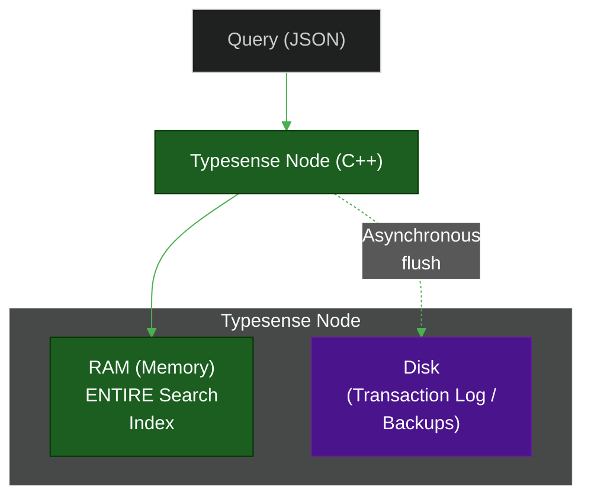

# ⚡ Typesense — In-Memory Search

> **Series:** DevOps › Search Engines & Discovery · **Level:** Advanced · **Read Time:** ~10 min

---

## 📖 Table of Contents

- [1. What Is Typesense?](#1-what-is-typesense)
- [2. In-Memory Architecture](#2-in-memory-architecture)
- [3. Core Capabilities](#3-core-capabilities)
- [4. Vector & Semantic Search](#4-vector-semantic-search)
- [5. High Availability (Raft)](#5-high-availability-raft)
- [6. Pricing & When to Use](#6-pricing-when-to-use)

---

## 1. What Is Typesense?

**Typesense** is an open-source, typo-tolerant search engine that focuses intensely on **performance and high availability**. Written in **C++**, it is designed to be an ultra-fast alternative to Elasticsearch and Algolia.

The defining characteristic of Typesense is that it stores its entire index **in RAM (memory)**. This guarantees sub-50ms latency for almost any query, making it arguably the fastest search engine available.

---

## 2. In-Memory Architecture



Because the entire index is in RAM:
1. **Queries are instant:** No disk I/O bottlenecks.
2. **Predictable latency:** You don't have to worry about cache misses.
3. **Cost model:** Infrastructure costs scale directly with your dataset's RAM footprint.

---

## 3. Core Capabilities

Like Algolia and Meilisearch, Typesense supports out-of-the-box features required for modern search:
- **Typo Tolerance:** Configurable per field.
- **Faceted Search:** Filtering by categories, price ranges, etc.
- **Geo-Search:** "Find coffee shops within 5km of this latitude/longitude".
- **Synonyms & Overrides:** Curating specific results for specific queries.
- **Drop-in UI:** Also supports an adapter for Algolia's `InstantSearch.js`.

**Schema Requirement:**
Unlike Meilisearch (which is schemaless), Typesense requires you to define a **Schema** when creating a collection. This enforces strict typing and improves memory efficiency.

```json
// Creating a Typesense Collection Schema
{
  "name": "products",
  "fields": [
    {"name": "title", "type": "string" },
    {"name": "price", "type": "float", "facet": true },
    {"name": "brand", "type": "string", "facet": true }
  ],
  "default_sorting_field": "price"
}
```

---

## 4. Vector & Semantic Search

Typesense has excellent built-in support for **Vector Search**. It can either:
1. Store embeddings generated by your backend (e.g., from OpenAI).
2. Generate embeddings **on the fly** using built-in ML models.

```json
// Define a vector field
{
  "name": "description_embedding",
  "type": "float[]",
  "num_dim": 1536
}
```

You can then perform **Hybrid Search**, which combines exact keyword matches with semantic meaning:
```bash
# Search for the keyword "coat", but prioritize results semantically similar to the provided vector
curl 'http://localhost:8108/collections/products/documents/search' \
  -G \
  --data-urlencode 'q=coat' \
  --data-urlencode 'vector_query=description_embedding:([0.14, 0.52, ...], k:10)'
```

---

## 5. High Availability (Raft)

Typesense was built with distributed, highly-available clustering in mind from day one. 

It uses the **Raft consensus algorithm** to manage clusters. You can deploy a 3-node or 5-node cluster, and Typesense will automatically replicate data and elect a new leader if a node fails, ensuring zero downtime for mission-critical search.

---

## 6. Pricing & When to Use

### Deployment Options
1. **Self-Hosted (OSS):** 100% free. You manage the servers (and ensure you have enough RAM).
2. **Typesense Cloud:** Fully managed. Pricing is based entirely on RAM/Compute nodes (e.g., a cluster with 4GB RAM costs ~$60/month).

### When to Choose Typesense
✅ You need the absolute lowest possible latency and want an in-memory engine.
✅ You want built-in, highly available clustering (Raft) right out of the box.
✅ You need to perform complex Hybrid Search (Keyword + Vector) efficiently.
✅ You prefer strict schema definitions over schemaless designs.

### When to Avoid Typesense
❌ Your dataset is massive (e.g., terabytes) and keeping it entirely in RAM would be prohibitively expensive.
❌ You want a completely zero-config setup without defining schemas (use Meilisearch).

---

*← [Meilisearch](./03-meilisearch.md) · Next: [Elasticsearch](./05-elasticsearch.md) →*

## Related

- [Databases](../databases/README.md)
- [Observability & Monitoring](../observability/README.md)
- [API Gateways & Reverse Proxies](../api-gateways/README.md)
