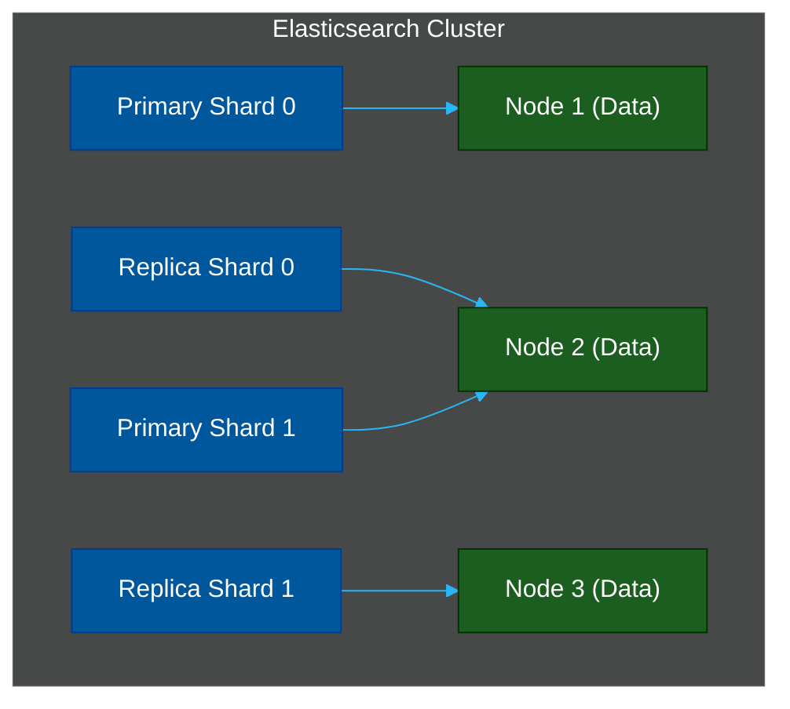

# 🐘 Elasticsearch & OpenSearch — Enterprise Search

> **Series:** DevOps › Search Engines & Discovery · **Level:** Advanced · **Read Time:** ~12 min

---

## 📖 Table of Contents

- [1. What Is Elasticsearch?](#1-what-is-elasticsearch)
- [2. The Inverted Index (Lucene)](#2-the-inverted-index-lucene)
- [3. Distributed Architecture](#3-distributed-architecture)
- [4. Query DSL & Aggregations](#4-query-dsl-aggregations)
- [5. OpenSearch vs Elasticsearch](#5-opensearch-vs-elasticsearch)
- [6. When to Use Elasticsearch](#6-when-to-use-elasticsearch)

---

## 1. What Is Elasticsearch?

**Elasticsearch** is a highly scalable, distributed, RESTful search and analytics engine. Built on top of **Apache Lucene** (a Java search library), it is the industry standard for enterprise search, log analytics, and massive data lakes.

While Algolia, Meilisearch, and Typesense are designed for application search (e-commerce, websites), Elasticsearch is designed to handle **petabytes of data** and billions of documents.

---

## 2. The Inverted Index (Lucene)

At its core, Elasticsearch does not scan documents like a traditional database. It uses an **Inverted Index**. 

When a document is indexed, Elasticsearch tokenizes the text and maps every unique word back to the documents that contain it.

**Document 1:** "The quick brown fox"
**Document 2:** "The fast brown dog"

**Inverted Index:**
| Term | Documents |
| :--- | :--- |
| quick | [Doc 1] |
| fast | [Doc 2] |
| brown | [Doc 1, Doc 2] |
| fox | [Doc 1] |
| dog | [Doc 2] |

When you search for "brown fox", Elasticsearch instantly looks up "brown" (Doc 1, Doc 2) and "fox" (Doc 1), intersects the sets, and returns Doc 1.

---

## 3. Distributed Architecture

Elasticsearch achieves massive scale by sharding data across multiple nodes in a cluster.



- **Node:** A single server running the JVM process.
- **Index:** A logical namespace for documents (like a table).
- **Shard:** An index is split into multiple shards. Each shard is a self-contained Lucene index. Shards allow Elasticsearch to distribute data across multiple nodes.
- **Replica:** Copies of primary shards to provide high availability and increase read throughput.

---

## 4. Query DSL & Aggregations

Elasticsearch uses a powerful JSON-based **Query DSL (Domain Specific Language)**. It is much more verbose than modern engines, but infinitely more flexible.

**Search Query:**
```json
GET /products/_search
{
  "query": {
    "bool": {
      "must": [
        { "match": { "title": "laptop" } }
      ],
      "filter": [
        { "range": { "price": { "gte": 500, "lte": 1500 } } }
      ]
    }
  }
}
```

**Aggregations (Analytics):**
Elasticsearch excels at aggregations—calculating metrics and building data buckets on the fly.
```json
// Find the average price of laptops, bucketed by brand
GET /products/_search
{
  "size": 0,
  "aggs": {
    "brands": {
      "terms": { "field": "brand.keyword" },
      "aggs": {
        "avg_price": { "avg": { "field": "price" } }
      }
    }
  }
}
```

---

## 5. OpenSearch vs Elasticsearch

In 2021, Elastic changed its license from Apache 2.0 to the Server Side Public License (SSPL) to prevent cloud providers (like AWS) from offering managed Elasticsearch.

In response, AWS forked Elasticsearch 7.10 and created **OpenSearch**, keeping it strictly Apache 2.0 open-source.

| Feature | Elasticsearch | OpenSearch |
| :--- | :--- | :--- |
| **License** | SSPL / Elastic License | Apache 2.0 (Open Source) |
| **Corporate Backer** | Elastic | AWS + Community |
| **Managed Service** | Elastic Cloud | Amazon OpenSearch Service |
| **Security Features**| Paid (Advanced features) | 100% Free / Open |
| **Dashboard** | Kibana | OpenSearch Dashboards |

> **Recommendation:** If you are deploying on AWS, or if you strictly require open-source licensing without corporate restrictions, use **OpenSearch**. If you want the absolute latest features from the creators, use **Elasticsearch**.

---

## 6. When to Use Elasticsearch

### When to Choose Elasticsearch / OpenSearch
✅ You are building a log analytics platform (e.g., the ELK stack).
✅ You have billions of documents and need distributed sharding.
✅ You need to run complex analytical aggregations across massive datasets.
✅ You need absolute control over the scoring algorithm (TF-IDF / BM25 tweaking).

### When to Avoid Elasticsearch
❌ You just need a simple search bar for a website or mobile app (use Algolia, Meilisearch, or Typesense).
❌ Your team lacks DevOps resources. Managing Elasticsearch heap memory, shard balancing, and index lifecycle management is practically a full-time job.
❌ You want typo-tolerance and "search-as-you-type" to work instantly without spending weeks configuring custom analyzers and edge-n-grams.

---

*← [Typesense](./04-typesense.md) · [Back to Series Overview](./README.md) →*

## Related

- [Databases](../databases/README.md)
- [Observability & Monitoring](../observability/README.md)
- [API Gateways & Reverse Proxies](../api-gateways/README.md)
