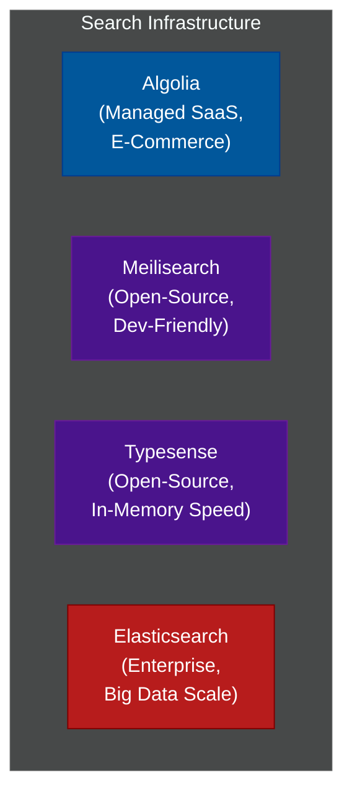

# 🔎 Search Engines & Discovery

A comprehensive series exploring modern search infrastructure, from managed search-as-a-service platforms to scalable open-source engines.

---

## 📖 Table of Contents

- [The Role of a Search Engine](#the-role-of-a-search-engine)
- [📚 Module Index](#module-index)
- [The Search Engine Landscape](#the-search-engine-landscape)

---

## The Role of a Search Engine

Relational databases (like PostgreSQL or MySQL) are excellent at structured queries, but they struggle with:
1. **Full-text search:** Searching for words inside long paragraphs.
2. **Typo tolerance:** Handling misspelled queries (e.g., "iphne" → "iphone").
3. **Faceted search:** Returning categories and counts for filtering (e.g., "Size: M (42)").
4. **Ranking & Relevance:** Sorting results by how closely they match the user's intent.

Search engines use **Inverted Indexes** (mapping words to documents) and, increasingly, **Vector Databases** (mapping meaning to documents) to solve these problems at millisecond speeds.

---

## 📚 Module Index

| Module | Title | Level | Read Time | Key Topics |
| :--- | :--- | :--- | :--- | :--- |
| **01** | [Search Engine Comparison Matrix](./01-search-engines-comparison.md) | Reference | ~10 min | Algolia, Meilisearch, Typesense, Elasticsearch |
| **02** | [Algolia — Managed Search](./02-algolia.md) | Intermediate | ~10 min | E-commerce, NeuralSearch, InstantSearch |
| **03** | [Meilisearch — Open-Source Search](./03-meilisearch.md) | Intermediate | ~10 min | Rust, developer experience, self-hosted |
| **04** | [Typesense — In-Memory Search](./04-typesense.md) | Advanced | ~10 min | C++, RAM optimization, vector search |
| **05** | [Elasticsearch — Enterprise Search](./05-elasticsearch.md) | Advanced | ~12 min | Sharding, Lucene, aggregations, scale |

---

## The Search Engine Landscape

